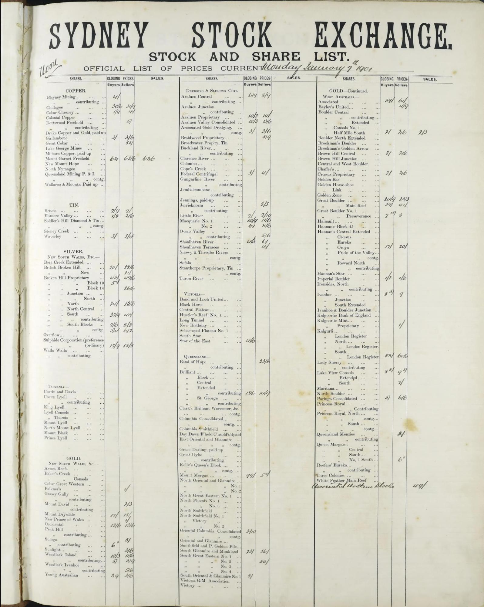
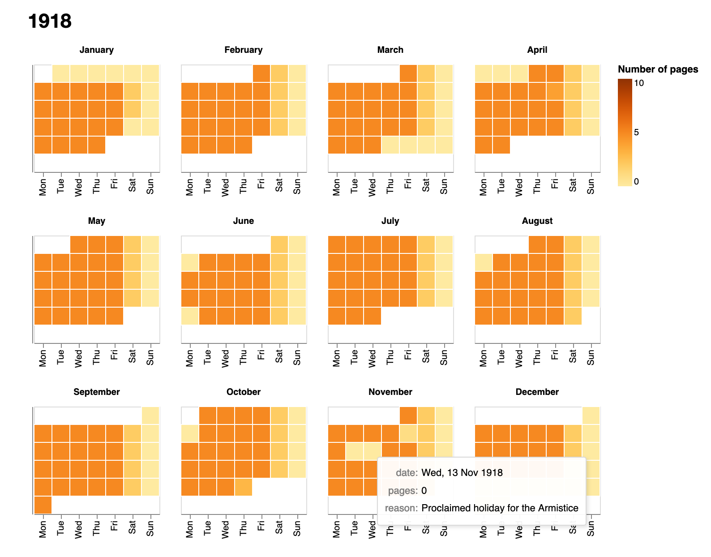
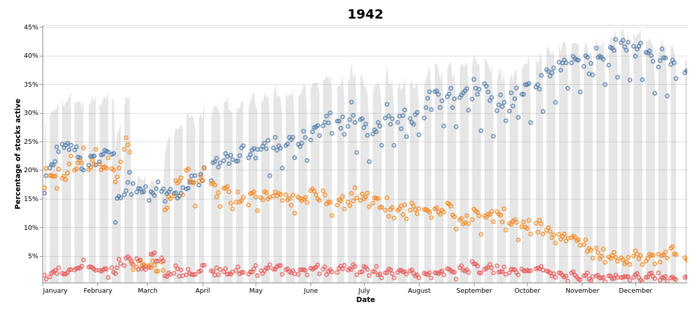

# ANU Archives

{{ git_latest_tag() }}

[](https://mybinder.org/v2/gh/GLAM-Workbench/anu-archives/master?urlpath=lab/tree/index.ipynb)

## Sydney Stock Exchange records

The aim of this project is to try and extract useful data from the [Sydney Stock exchange stock and share lists](http://archivescollection.anu.edu.au/index.php/or59j) held by the ANU Archives. As the content note indicates:

> These are large format bound volumes of the official lists that were posted up for the public to see - 3 times a day - forenoon, noon and afternoon - at the close of the trading session in the call room at the Sydney Stock Exchange. The closing prices of stocks and shares were entered in by hand on pre-printed sheets.

There are 199 volumes covering the period from 1901 to 1950, containing more than 70,000 pages. Each page is divided into columns. The number of columns varies across the collection. Each column is divided into rows labelled with printed company or stock names. The prices are written alongside the company names.



We're currently working on ways of extracting company and share names, as well as the handwritten prices, from the digitised images. For more information see [this repository](https://github.com/wragge/sydney-stock-exchange). The notebooks below provide ways of navigating, visualising, and using the digitised pages.

### Summary information about volumes

This notebook collates links and metadata relating to the 199 bound volumes in the Sydney Stock Exchange collection. It includes links to archival descriptions, records and PDFs in the research repository, and collections of individual page images stored on CloudStor. It also generates a CSV file with metadata for each page in the volume. For each volume a calculation of its completeness is attempted – this is done by comparing the number of pages for each date with the expected number of pages and adding up the results.

* [Download from GitHub](https://github.com/GLAM-Workbench/anu-archives/blob/master/stock-exchange-details-by-volume.ipynb)
* [View using NBViewer](https://nbviewer.jupyter.org/github/GLAM-Workbench/anu-archives/blob/master/stock-exchange-details-by-volume.ipynb)
* [Run live on Binder](https://mybinder.org/v2/gh/GLAM-Workbench/anu-archives/master?urlpath=lab/tree/stock-exchange-details-by-volume.ipynb)

### Calendar view of the complete collection

This notebook helps you see the number of stock and share sheets in the bound volumes from the Sydney Stock Exchange for each day from 1901 to 1950. You can pick out major changes such as when the number of sheets per day changed, and when Saturday trading finished. However, the bound volumes are not always complete. You'll notice some days have fewer sheets than expected or none at all. In using these records it's important to be aware of the gaps.

* [Download from GitHub](https://github.com/GLAM-Workbench/anu-archives/blob/master/stock-exchange-pages-calendar.ipynb)
* [View using NBViewer](https://nbviewer.jupyter.org/github/GLAM-Workbench/anu-archives/blob/master/stock-exchange-pages-calendar.ipynb)
* [Run live on Binder](https://mybinder.org/v2/gh/GLAM-Workbench/anu-archives/master?urlpath=lab/tree/stock-exchange-pages-calendar.ipynb)



### Display information about a single day's trading

Select a date and this notebook will display information about any sheets that are available from this day. It notes where pages seem to be missing, and loads images of the pages for examination.

* [Download from GitHub](https://github.com/GLAM-Workbench/anu-archives/blob/master/view-pages-by-date.ipynb)
* [View using NBViewer](https://nbviewer.jupyter.org/github/GLAM-Workbench/anu-archives/blob/master/view-pages-by-date.ipynb)
* [Run live on Binder in Voila](https://mybinder.org/v2/gh/GLAM-Workbench/anu-archives/HEAD?urlpath=voila%2Frender%2Fview-pages-by-date.ipynb)

### Display details of pages within a date range

Select a date range and this notebook will display information about available sheets from all the days within the range. It notes where pages seem to be missing, and provides links to download page images.

* [Download from GitHub](https://github.com/GLAM-Workbench/anu-archives/blob/master/view-pages-by-date-range.ipynb)
* [View using NBViewer](https://nbviewer.jupyter.org/github/GLAM-Workbench/anu-archives/blob/master/view-pages-by-date-range.ipynb)
* [Run live on Binder in Voila](https://mybinder.org/v2/gh/GLAM-Workbench/anu-archives/HEAD?urlpath=voila%2Frender%2Fview-pages-by-date-range.ipynb)

### Visualise page data

This notebook explores the aggregated page metadata from all 199 volumes.

* [Download from GitHub](https://github.com/GLAM-Workbench/anu-archives/blob/master/pages_viz.ipynb)
* [View using NBViewer](https://nbviewer.jupyter.org/github/GLAM-Workbench/anu-archives/blob/master/pages_viz.ipynb)
* [Run live on Binder](https://mybinder.org/v2/gh/GLAM-Workbench/anu-archives/master?urlpath=lab/tree/pages_viz.ipynb)


### Visualise activity

This notebook visualises the amount of activity each day of trading by looking at the proportion of stocks that have prices recorded against them either in the 'Buyers', 'Sellers', or 'Business done' columns. Each point is linked to an [online database](https://sydney-stock-exchange-xqtkxtd5za-ts.a.run.app), so you can explore in detail what was happening on any day.



* [Download from GitHub](https://github.com/GLAM-Workbench/anu-archives/blob/master/visualise_activity.ipynb)
* [View using NBViewer](https://nbviewer.jupyter.org/github/GLAM-Workbench/anu-archives/blob/master/visualise_activity.ipynb)
* [Run live on Binder](https://mybinder.org/v2/gh/GLAM-Workbench/anu-archives/master?urlpath=lab/tree/visualise_activity.ipynb)
* [View the output of this notebook as an HTML page](/examples/visualise_activity.html)

### Data files

* [CSV-formatted list of all 70,000+ pages](https://github.com/GLAM-Workbench/anu-archives/blob/master/complete_page_list.csv) in the bound volumes including their date and session (Morning, Noon, Afternoon). Duplicate images are excluded.
* [CSV-formatted list of all dates](https://github.com/GLAM-Workbench/anu-archives/blob/master/complete_date_list.csv) within the period of the volumes. Includes the number of pages available for each date, and the number of pages expected (the number of pages produced each day changes across the collection). On dates with no pages, the `reason` field is used to record details of holidays or other interruptions to trading (some with links to Trove).
* [CSV-formatted list of holidays](https://github.com/GLAM-Workbench/anu-archives/blob/master/nsw_holidays_1900_1950.csv) in NSW from 1901 to 1950.
* Full data about missing, misplaced, and duplicated pages is saved in [`page_data_master.py`](https://github.com/GLAM-Workbench/anu-archives/blob/master/page_data_master.py). This data is combined with the holiday data to generate the complete page and date lists above.
* Print and handwritten data extracted from the images using Amazon Textract have been saved in a [series of CSV files available from Cloudstor](https://cloudstor.aarnet.edu.au/plus/s/RwRrCpisBac7N38). There's one file per year, and each row in the CSV represents a single column row. This data is in the process of being checked and cleaned, and is likely to change. The easiest way to explore this data is through the [Datasette interface](https://sydney-stock-exchange-xqtkxtd5za-ts.a.run.app) which provides fulltext and structured searching.

## Run these notebooks

There are a number of different ways to use these notebooks. Binder is quickest and easiest, but it doesn't save your data. I've listed a number of options below from easiest to most complicated (requiring more technical knowledge). See the [running Jupyter notebooks](https://glam-workbench.net/running-notebooks/) page for more details and additional options.

### Using Binder

[](https://mybinder.org/v2/gh/GLAM-Workbench/anu-archives/master/?urlpath=lab)

Click on the button above to launch the notebooks in this repository using the [Binder](https://mybinder.org/) service (it might take a little while to load). This is a free service, but note that sessions will close if you stop using the notebooks, and no data will be saved. Make sure you download any changed notebooks or harvested data that you want to save.

See [Using Binder](https://glam-workbench.net/using-binder/) for more information.

### Using Reclaim Cloud

[](https://app.my.reclaim.cloud/?manifest=https://raw.githubusercontent.com/GLAM-Workbench/anu-archives/master/reclaim-manifest.jps)

[Reclaim Cloud](https://reclaim.cloud/) is a paid hosting service, aimed particularly at supported digital scholarship in the humanities. Unlike Binder, the environments you create on Reclaim Cloud will save your data – even if you switch them off! To run this repository on Reclaim Cloud for the first time:

* Create a [Reclaim Cloud](https://reclaim.cloud/) account and log in.
* Click on the button above to start the installation process.
* A dialogue box will ask you to set a password, this is used to limit access to your Jupyter installation.
* Sit back and wait for the installation to complete!
* Once the installation is finished click on the 'Open in Browser' button of your newly created environment (note that you might need to wait a few minutes before everything is ready).

See [Using Reclaim Cloud](https://glam-workbench.net/using-reclaim-cloud/) for more information.

### Using Docker

You can use Docker to run a pre-built computing environment on your own computer. It will set up everything you need to run the notebooks in this repository. This is free, but requires more technical knowledge – you'll have to install Docker on your computer, and be able to use the command line.

* Install [Docker Desktop](https://docs.docker.com/get-docker/).
* Create a new directory for this repository and open it from the command line.
* From the command line, run the following command:  
  ```
  docker run -p 8888:8888 --name anu-archives -v "$PWD":/home/jovyan/work quay.io/glamworkbench/anu-archives repo2docker-entrypoint jupyter lab --ip 0.0.0.0 --NotebookApp.token='' --LabApp.default_url='/lab/tree/index.ipynb'
  ```
* It will take a while to download and configure the Docker image. Once it's ready you'll see a message saying that Jupyter Notebook is running.
* Point your web browser to `http://127.0.0.1:8888`

See [Using Docker](https://glam-workbench.net/using-docker/) for more information.

## Contributors

{{ repo_contributors() }}

## Cite as

{{ zenodo_citation() }}