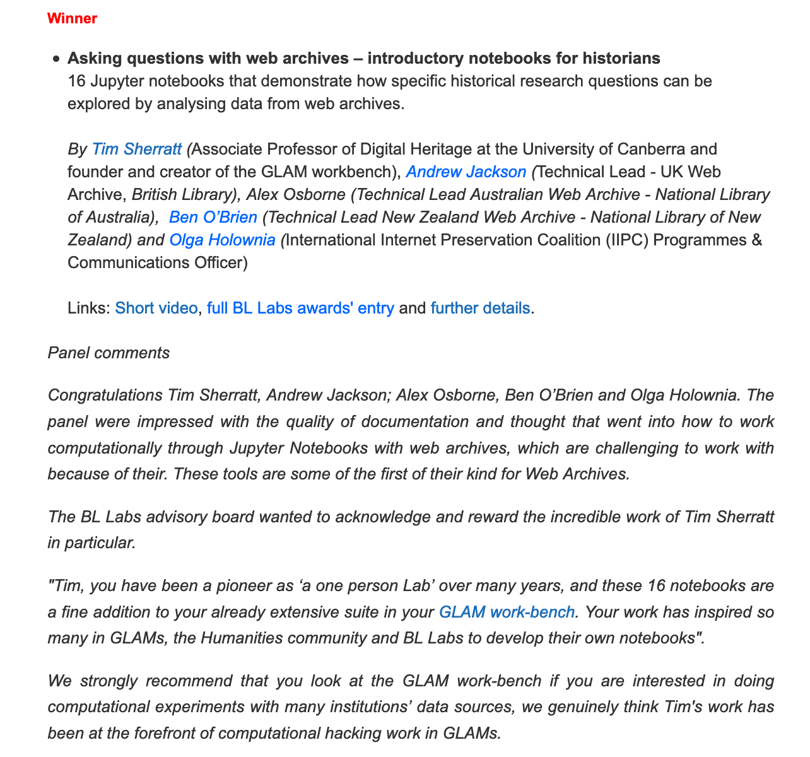

## British Library Lab Awards 2020

The [Web Archives](/web-archives) section of the GLAM Workbench [won the British Library Labs Research Award](https://blogs.bl.uk/digital-scholarship/2020/12/bl-labs-awards-symposium-2020-rewind-reflections-box-sets-seasons-greetings.html) in December 2020!

See the 30 second video we made for the public voting: [Exploring Web Archives with Jupyter Notebooks through the GLAM workbench](https://youtu.be/qhaRQ0LxNAo)

## Asking questions with web archives – introductory notebooks for historians

[Grant awarded](https://netpreserve.org/projects/jupyter-notebooks-for-historians/) in 2019 under the International Internet Preservation Consortium's Discretionary Funding Program for the development of the [Web Archives](/web-archives) section of the GLAM Workbench.
