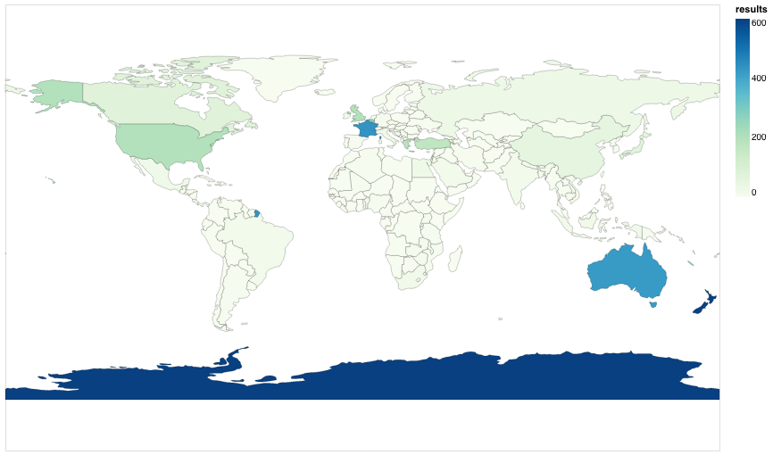

# DigitalNZ

{{ git_latest_tag() }}

[DigitalNZ](https://digitalnz.org/) aggregates collections from across New Zealand and makes the aggregated metadata available [through an API](https://digitalnz.org/developers).

You'll need an [API key](https://digitalnz.org/developers/getting-started) to work with DigitalNZ data.

[](https://mybinder.org/v2/gh/GLAM-Workbench/digitalnz/master?urlpath=lab/tree/index.ipynb)

## Exploring the API

### Build a DigitalNZ API search query

This notebook creates a form that you can use to experiment with the DigitalNZ search API.

* [Download from GitHub](https://github.com/GLAM-Workbench/digitalnz/blob/master/build_api_query.ipynb)
* [View using NBViewer](https://nbviewer.jupyter.org/github/GLAM-Workbench/digitalnz/blob/master/build_api_query.ipynb)
* [Run as an app live on Binder using Voila](https://mybinder.org/v2/gh/GLAM-Workbench/digitalnz/master?urlpath=voila%2Frender%2Fbuild_api_query.ipynb)

### Getting some top-level data from the DigitalNZ API  

This notebook pokes around at the top-level of DigitalNZ, mainly using facets to generate some collection overviews and summaries.

* [Download from GitHub](https://github.com/GLAM-Workbench/digitalnz/blob/master/Top-level-data-in-DigitalNZ.ipynb)
* [View using NBViewer](https://nbviewer.jupyter.org/github/GLAM-Workbench/digitalnz/blob/master/Top-level-data-in-DigitalNZ.ipynb)
* [Run live on Binder](https://mybinder.org/v2/gh/GLAM-Workbench/digitalnz/master?urlpath=lab/tree/Top-level-data-in-DigitalNZ.ipynb)

## Harvesting data

### Harvest facet data from DigitalNZ

This notebook explores what facets are available from the DigitalNZ API and demonstrates how to harvest data from them. It generates a summary of all available facets, as well as saving the full set of values from each facet as a CSV file.

* [Download from GitHub](https://github.com/GLAM-Workbench/digitalnz/blob/master/harvest_facet_data.ipynb)
* [View using NBViewer](https://nbviewer.jupyter.org/github/GLAM-Workbench/digitalnz/blob/master/harvest_facet_data.ipynb)
* [Run live on Binder](https://mybinder.org/v2/gh/GLAM-Workbench/digitalnz/master?urlpath=lab/tree/harvest_facet_data.ipynb)

### Harvest data from Papers Past  

This notebook lets you harvest large amounts of data from [Papers Past](https://paperspast.natlib.govt.nz/) (via DigitalNZ) for further analysis. It saves the results as a CSV file that you can open in any spreadsheet program. It currently includes the OCRd text of all the newspaper articles.

* [Download from GitHub](https://github.com/GLAM-Workbench/digitalnz/blob/master/Harvest-data-from-PapersPast.ipynb)
* [View using NBViewer](https://nbviewer.jupyter.org/github/GLAM-Workbench/digitalnz/blob/master/Harvest-data-from-PapersPast.ipynb)
* [Run live on Binder](https://mybinder.org/v2/gh/GLAM-Workbench/digitalnz/master?urlpath=lab/tree/Harvest-data-from-PapersPast.ipynb)

## Visualising collections

### QueryPic DigitalNZ

QueryPic helps you explore your search results in Papers Past by showing you how they change over time – aggregating the number of articles matching your query by year.

* [Download from GitHub](https://github.com/GLAM-Workbench/digitalnz/blob/master/querypic_papers_past.ipynb)
* [View using NBViewer](https://nbviewer.jupyter.org/github/GLAM-Workbench/digitalnz/blob/master/querypic_papers_past.ipynb)
* [Run live on Binder in Voila](https://mybinder.org/v2/gh/GLAM-Workbench/digitalnz/master?urlpath=voila/render/querypic_papers_past.ipynb)

### Visualise a search in Papers Past

Start with some keywords you want to search for in [Papers Past](https://paperspast.natlib.govt.nz/), then create a simple visualisation showing the distribution over time and by newspaper.  

* [Download from GitHub](https://github.com/GLAM-Workbench/digitalnz/blob/master/Visualise-a-search-in-PapersPast.ipynb)
* [View using NBViewer](https://nbviewer.jupyter.org/github/GLAM-Workbench/digitalnz/blob/master/Visualise-a-search-in-PapersPast.ipynb)
* [Run live on Binder](https://mybinder.org/v2/gh/GLAM-Workbench/digitalnz/master?urlpath=lab/tree/Visualise-a-search-in-PapersPast.ipynb)


### Papers Past newspapers in DigitalNZ

A subset of the digitised newspapers in Papers Past can be searched through DigitalNZ. Using data from the DigitalNZ API we can look at what's available.

* [Download from GitHub](https://github.com/GLAM-Workbench/digitalnz/blob/master/papers_past_newspapers.ipynb)
* [View using NBViewer](https://nbviewer.jupyter.org/github/GLAM-Workbench/digitalnz/blob/master/papers_past_newspapers.ipynb)
* [Run live on Binder](https://mybinder.org/v2/gh/GLAM-Workbench/digitalnz/master?urlpath=lab/tree/papers_past_newspapers.ipynb)
* [View the results](/digitalnz-views/papers_past_newspapers.html)

### Visualising open collections in DigitalNZ

DigitalNZ's `usage` facet tells you what you can do with a record. A `usage` value of 'Use commercially' indicates that the record is 'open', according to the [open licence definitions](https://opendefinition.org/licenses/). So by harvesting data from the `usage` facet, we can explore how much of DigitalNZ is open. This notebook assembles data relating to the `usage` status of each `primary_collection` associated with a `content_partner`. It then attempts to visualise the data in a suitably colourful burst of fireworks!

* [Download from GitHub](https://github.com/GLAM-Workbench/digitalnz/blob/master/visualise_open_collections.ipynb)
* [View using NBViewer](https://nbviewer.jupyter.org/github/GLAM-Workbench/digitalnz/blob/master/visualise_open_collections.ipynb)
* [Run live on Binder](https://mybinder.org/v2/gh/GLAM-Workbench/digitalnz/master?urlpath=lab/tree/visualise_open_collections.ipynb)
* [View the results](/digitalnz-views/open_collections_digitalnz.html)


## Tips and tricks

### Select a random(ish) record from DigitalNZ

The DigitalNZ API doesn't provide a random sort option. You can jump to a randomly selected page of results, but you can't do any deeper than 100,000 pages into a results set (that's 1,000,000 records if you set the per_page value to 100). So we need to find some way of filtering the results until there's less than 1,000,000, then we can grab a random page and record. This notebook examines the available facets, then uses them to reduce the size of the results set until it's possible to select a random record. It provides a series of examples of retrieving random records using different filters and facets.

* [Download from GitHub](https://github.com/GLAM-Workbench/digitalnz/blob/master/select_a_random_record.ipynb)
* [View using NBViewer](https://nbviewer.jupyter.org/github/GLAM-Workbench/digitalnz/blob/master/select_a_random_record.ipynb)
* [Run live on Binder](https://mybinder.org/v2/gh/GLAM-Workbench/digitalnz/master?urlpath=lab/tree/select_a_random_record.ipynb)


### Find results by country in DigitalNZ
Many items in DigtalNZ include location information. This can include a country, but as far as I can see there's no direct way to search for results relating to a particular country using the API. You can, however, search for geocoded locations using bounding boxes. This notebook shows how you can use this to search for countries.

* [Download from GitHub](https://github.com/GLAM-Workbench/digitalnz/blob/master/Results-by-country-in-DigitalNZ.ipynb)
* [View using NBViewer](https://nbviewer.jupyter.org/github/GLAM-Workbench/digitalnz/blob/master/Results-by-country-in-DigitalNZ.ipynb)
* [Run live on Binder](https://mybinder.org/v2/gh/GLAM-Workbench/digitalnz/master?urlpath=lab/tree/Results-by-country-in-DigitalNZ.ipynb)



## Data

### Data harvested from facets

Harvested: 22 January 2021

The repository includes CSV formatted versions of the data harvested from the 'Harvest facet data' notebook above. Of course, if you want to do something with this data, you might want to run a fresh harvest to make sure it's up-to-date. But they're saved here to get an overview of the available facets, and understand the range of values in each.

Summary of facets:

* [facets.csv](https://github.com/GLAM-Workbench/digitalnz/blob/master/facets/facets.csv)

Individual facets:

* [collection.csv](https://github.com/GLAM-Workbench/digitalnz/blob/master/facets/category.csv)
* [creator.csv](https://github.com/GLAM-Workbench/digitalnz/blob/master/facets/creator.csv)
* [subject.csv](https://github.com/GLAM-Workbench/digitalnz/blob/master/facets/subject.csv)
* [format.csv](https://github.com/GLAM-Workbench/digitalnz/blob/master/facets/format.csv)
* [placename.csv](https://github.com/GLAM-Workbench/digitalnz/blob/master/facets/placename.csv)
* [decade.csv](https://github.com/GLAM-Workbench/digitalnz/blob/master/facets/decade.csv)
* [content_partner.csv](https://github.com/GLAM-Workbench/digitalnz/blob/master/facets/content_partner.csv)
* [language.csv](https://github.com/GLAM-Workbench/digitalnz/blob/master/facets/language.csv)
* [century.csv](https://github.com/GLAM-Workbench/digitalnz/blob/master/facets/century.csv)
* [usage.csv](https://github.com/GLAM-Workbench/digitalnz/blob/master/facets/usage.csv)
* [rights.csv](https://github.com/GLAM-Workbench/digitalnz/blob/master/facets/rights.csv)
* [year.csv](https://github.com/GLAM-Workbench/digitalnz/blob/master/facets/year.csv)
* [copyright.csv](https://github.com/GLAM-Workbench/digitalnz/blob/master/facets/copyright.csv)
* [dc_type.csv](https://github.com/GLAM-Workbench/digitalnz/blob/master/facets/dc_type.csv)
* [category.csv](https://github.com/GLAM-Workbench/digitalnz/blob/master/facets/category.csv)
* [primary_collection.csv](https://github.com/GLAM-Workbench/digitalnz/blob/master/facets/primary_collection.csv)

Combining `content_partner` and `primary_collection` facets:

* [collections_by_partner.csv](https://github.com/GLAM-Workbench/digitalnz/blob/master/facets/collections_by_partner.csv)

Combining `content_partner`, `primary_collection`, and `usage` facets (this data was assembled by the 'Visualising open collections' notebook):

* [usage_by_collection_and_partner.csv](https://github.com/GLAM-Workbench/digitalnz/blob/master/facets/collections_by_partner.csv)

## Run these notebooks

There are a number of different ways to use these notebooks. Binder is quickest and easiest, but it doesn't save your data. I've listed the options below from easiest to most complicated (requiring more technical knowledge).

### Using Binder

[](https://mybinder.org/v2/gh/GLAM-Workbench/digitalnz/master/?urlpath=lab/tree/index.ipynb)

Click on the button above to launch the notebooks in this repository using the [Binder](https://mybinder.org/) service (it might take a little while to load). This is a free service, but note that sessions will close if you stop using the notebooks, and no data will be saved. Make sure you download any changed notebooks or harvested data that you want to save.

See [Using Binder](https://glam-workbench.net/using-binder/) for more details.

### Using Reclaim Cloud

[](https://app.my.reclaim.cloud/?manifest=https://raw.githubusercontent.com/GLAM-Workbench/digitalnz/master/reclaim-manifest.jps)

[Reclaim Cloud](https://reclaim.cloud/) is a paid hosting service, aimed particularly at supported digital scholarship in hte humanities. Unlike Binder, the environments you create on Reclaim Cloud will save your data – even if you switch them off! To run this repository on Reclaim Cloud for the first time:

* Create a [Reclaim Cloud](https://reclaim.cloud/) account and log in.
* Click on the button above to start the installation process.
* A dialogue box will ask you to set a password, this is used to limit access to your Jupyter installation.
* Sit back and wait for the installation to complete!
* Once the installation is finished click on the 'Open in Browser' button of your newly created environment (note that you might need to wait a few minutes before everything is ready).

See [Using Reclaim Cloud](https://glam-workbench.net/using-reclaim-cloud/) for more details.

### Using the Nectar Cloud

{width="600"}

The [Nectar Research Cloud](https://ardc.edu.au/services/nectar-research-cloud/) (part of the Australian Research Data Commons) provides cloud computing services to researchers in Australian and New Zealand universities. University-affiliated researchers can log on to Nectar and receive [up to 6 months of free cloud computing time](https://tutorials.rc.nectar.org.au/allocation-management/03-account-and-trial). And if you need more, you can [apply for a specific project allocation](https://tutorials.rc.nectar.org.au/allocation-management/04-allocation-and-projects).

The GLAM Workbench is available in the Nectar Cloud as a pre-configured application. This means you can get it up and going without worrying about the technical infrastructure – just fill in a few details and you're away! To create an instance of this repository in the Nectar Cloud:

* Log in to the [Nectar Dashboard](https://dashboard.rc.nectar.org.au/) using your university credentials.
* From the Dashboard choose **Applications -> Browse Local**.
* Enter 'GLAM' in the filter box and hit Enter, you should see the GLAM Workbench application.
* Click on the GLAM Workbench application's  **Quick Deploy** button.
* Step through the various [configuration options](https://glam-workbench.net/using-nectar/#setting-up-your-own-glam-workbench-repository). Some options are only available if you have a dedicated project allocation.
* When asked to select a GLAM Workbench repository, choose 'DigitalNZ' from the dropdown list.
* Complete the configuration and deploy your GLAM Workbench instance.
* The url to access your instance will be displayed once it's ready. Click on the url!

See [Using Nectar](https://glam-workbench.net/using-nectar/) for more information.

### Using Docker

You can use Docker to run a pre-built computing environment on your own computer. It will set up everything you need to run the notebooks in this repository. This is free, but requires more technical knowledge – you'll have to install Docker on your computer, and be able to use the command line.

* Install [Docker Desktop](https://docs.docker.com/get-docker/).
* Create a new directory for this repository and open it from the command line.
* From the command line, run the following command:  
  ```
  docker run -p 8888:8888 --name digitalnz -v "$PWD":/home/jovyan/work quay.io/glamworkbench/digitalnz repo2docker-entrypoint jupyter lab --ip 0.0.0.0 --NotebookApp.token='' --LabApp.default_url='/lab/tree/index.ipynb'
  ```
* It will take a while to download and configure the Docker image. Once it's ready you'll see a message saying that Jupyter Notebook is running.
* Point your web browser to `http://127.0.0.1:8888`

See [Using Docker](https://glam-workbench.net/using-docker/) for more details.

### Setting up on your own computer

If you know your way around the command line and are comfortable installing software, you might want to set up your own computer to run these notebooks.

Assuming you have recent versions of Python and Git installed, the steps might be something like:

* Create a virtual environment, eg: `python -m venv digitalnz`
* Open the new directory" `cd digitalnz`
* Activate the environment `source bin/activate`
* Clone the repository: `git clone https://github.com/GLAM-Workbench/digitalnz.git notebooks`
* Open the new `notebooks` directory: `cd notebooks`
* Install the necessary Python packages: `pip install -r requirements.txt`
* Run Jupyter: `jupyter lab`

See [Getting started](https://glam-workbench.net/getting-started/#using-python-on-your-own-computer) for more details.

## Contributors

{{ repo_contributors() }}

## Cite as

{{ zenodo_citation() }}

