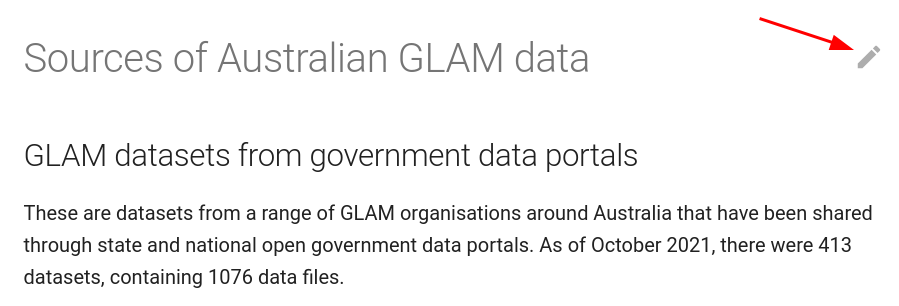

# Add links to related resources

Within the GLAM Workbench are lists of useful resources, for example:

* [Sources of Australian GLAM data](../glam-data-list.md)
* [More GLAM tools and interfaces](../glam-tools-interfaces.md)
* [GLAM Jupyter resources](../more-glam-notebooks.md)

It's easy to submit additions or corrections to these lists. Just look for the pencil icon to the right of the page title. 

If you haven't already, you'll need to [set up a free account](https://docs.github.com/en/get-started/signing-up-for-github/signing-up-for-a-new-github-account) on GitHub.

* Click on the pencil icon to open the page for editing on GitHub.
* [Follow these instructions](https://docs.github.com/en/repositories/working-with-files/managing-files/editing-files#editing-files-in-another-users-repository) to enter, preview, and save your suggested changes.

When you click on the pencil icon, GitHub automatically creates a copy of the repository in your own account. Once you've finished making your changes it'll prompt you to create a pull request, to feed the changes back to the main GLAM Workbench repository. Each pull request is reviewed before the changes go live.

