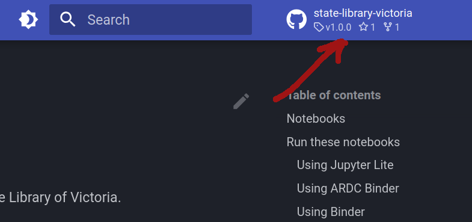
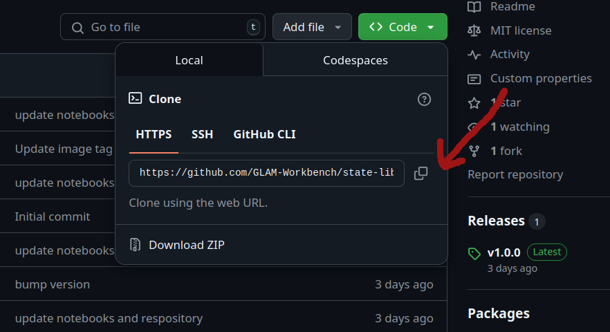

# Contribute code to a GLAM Workbench repository

If you want to improve the GLAM Workbench's Jupyter notebooks, or add new notebooks to an existing repository, you can contribute your code by setting up a local development environment.

## Setting up your local environment

I use [pyenv](https://github.com/pyenv/pyenv), [pyenv-virtualenv](https://github.com/pyenv/pyenv-virtualenv), and [pip-tools](https://github.com/jazzband/pip-tools) to create and manage Python versions and environments. If you prefer other tools for managing Python environments, adjust the steps below as required.

GLAM Workbench repositories currently use Python 3.10.12, but later versions should be ok. You can install multiple Python versions using pyenv:
```
pyenv install 3.10.12
```
Go to the GitHub repository of the GLAM Workbench section you're interested in. There's a link to the repository in the top-right navigation bar of each GLAM Workbench section.



Click on the repository's green **Code** button and copy the web url used for cloning.



In a terminal, use `git clone` command to create a local version of the GLAM Workbench repository:
```
git clone https://github.com/GLAM-Workbench/[REPO NAME].git`
```

For example:
```
git clone https://github.com/GLAM-Workbench/state-library-victoria.git`
```

Use `cd` to move into the newly-cloned folder:
```
cd [REPO NAME]
```

For example:
```
cd state-library-victoria
```

Create and activate a Python virtual environment (I find it easiest to name the environment after the repository):
```
pyenv virtualenv 3.10.12 [YOUR ENVIRONMENT NAME]
pyenv local
```

For example:
```
pyenv virtualenv 3.10.12 state-library-victoria
pyenv local
```

Install [pip-tools](https://github.com/jazzband/pip-tools) in the new virtual environment:
```
pip install pip-tools
```

If you undertaking development work, you probably want to install the latest versions of the required Python packages. First delete the old `requirements.txt` file and create a new one using `pip-compile`.:

```
rm requirements.txt
pip-compile requirements.in
```

Repeat this for `dev-requirements.in` to add the additional packages necessary for local development:

```
rm dev-requirements.txt
pip-compile dev-requirements.in
```

Install all the required packages using `pip-sync`:
```
pip-sync requirements.txt dev-requirements.txt
```

Set up the Git pre-commit hooks. These do some testing and linting of the notebook code when you add new commits.
```
pre-commit install
```

## Running Jupyter Lab

1. On the command line, run `jupyter lab` – to start Jupyter.
2. A browser window should open automatically. If not, copy and paste the url from the command line to your web browser.
3. Make your changes!
4. To shut down your Jupyter Lab session hit ++ctrl+c++.

## Uploading your changes

1. Don't forget to add your  details to the `creators` section of the `.zenodo.json` file. This will ensure you're added as an author to the next released version uploaded to Zenodo. (I'm planning to automate this process in the future.)
2. On the command line, use `git` to add and commit your changes.
3. On the command line, use `git push` to upload your changes to your forked repository.
4. Use the GitHub web interface to [create a pull request](https://docs.github.com/en/pull-requests/collaborating-with-pull-requests/proposing-changes-to-your-work-with-pull-requests/creating-a-pull-request-from-a-fork) from your forked repository to the original GLAM Workbench repository.

Creating a pull request will run a GitHub action that tries to build and cache the repository on Binder. If it works, a comment will be added to the pull request with a button to run your updated version on Binder. This lets you test to make sure things will run as expected on Binder and other cloud services.

Your pull request will be reviewed, and if it all looks good it will be merged into the main repository.

## Testing and formatting

I've started adding additional configuration files to repositories to help developers set up semi-automated formatting and testing of notebooks. If the repository you're working with includes files named `requirements-dev.txt`, `pyproject.toml`, and `.pre-commit-config.yaml` then you can follow the steps below to set things up. If the files aren't present, then skip this section.

1. On the command line, run `pip install pip-tools` to install [pip tools](https://github.com/jazzband/pip-tools).
1. On the command line, run `pip-sync requirements.txt requirements-dev.txt` – to install the latest versions of required packages
2. On the command line, run `pre-commit install` to set up the Git pre-commit hooks.

For information on how to use these tools, see [testing and testing notebooks](developing-repositories.md/#testing-and-formatting-notebooks) on the [Developing a new repository](developing-repositories.md) page.

## Adding new Python packages

If you're creating a new notebook, you might need to install some additional Python packages. The process for this is described in the [Adding new Python packages](developing-repositories.md/#adding-new-python-packages) section of [Developing a new repository](developing-repositories.md). However, not all repositories currently have a `requirements.in` file, as I'm still updating them to use pip-tools. If this is the case, [raise an issue](https://github.com/GLAM-Workbench/glam-workbench.github.io/issues) and I'll help you set it up.

## Contributors

Contributors will be listed on the site's [contributors](../contributors.md) page.