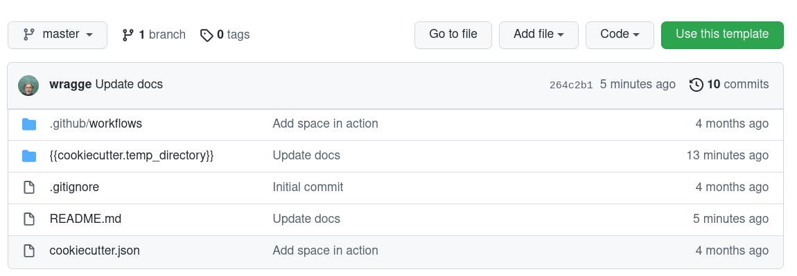

# Develop a new GLAM Workbench repository

Perhaps you're a GLAM organisation that wants to highlight the research possibilities of their collection data. Or a researcher who wants to share their detailed knowledge of a particular GLAM collection. Why not create your very own GLAM Workbench repository?

This page contains information for people or organisations who want to develop repositories for inclusion in the GLAM Workbench. By following these instructions you can create and share a set of Jupyter notebooks that will run in a variety of computing environments, including [Binder](../using-binder.md), [Reclaim Cloud](../using-reclaim-cloud.md), [Nectar](../using-nectar.md), and [Docker](../using-docker.md).

I'm assuming that anyone interested in creating new repositories will have some familiarity with `git` and be able to use the command line. Let me know if this is not the case!

## Join the team!

If you're planning on contributing a new repository to the GLAM Workbench, send an email to <glamworkbench@timsherratt.org> that includes your GitHub username. I can then add you to the [GLAM Workbench organisation](https://github.com/GLAM-Workbench), and give you the necessary permissions to create new repositories.

## Create a new repository using the GLAM Workbench template

To make it easy to create a repository with all the necessary bibs and bobs, I've created a [GLAM Workbench template](https://github.com/GLAM-Workbench/glam-workbench-template). Just follow the instructions below to get started.

### Think of a name!

Before you go any further, it's a good idea to think about what your new repository will be called. In general, I've named repositories after GLAM collections. In the instructions below you'll be asked for:

* a GitHub repository name – all lowercase or numeric, with hyphens or underscores instead of spaces (a requirement for [Docker](https://docs.docker.com/docker-hub/repos/#creating-repositories)), eg: 'trove-newspapers'
* a project name – the human-friendly version, used in headings, eg: 'Trove newspapers'

### Create the repository



1. Go to the [template repository](https://github.com/GLAM-Workbench/glam-workbench-template) and click on the big green **Use this template** button.
2. Enter a name for your new repository (see above) and click **Create repository from template**. If you've been made a member of the GLAM Workbench organisation, you should be able to create the repository within the GLAM Workbench by choosing it from the dropdown list. 
3. Head over to your newly-created repository to complete the setup.

### Configure authentication

In order to complete the setup process you'll need to create a personal access token and attach it to the new repository.

1. From your GitHub account's dropdown menu (top right of screen) go to **Settings** > **Developer settings** > **Personal access tokens**.
2. Click on the **Generate new token** button.
3. In the 'Note' field, give your key a meaningful label like 'GW repo setup'.
4. Check the box next to 'Workflow'.
5. Click on the green **Generate token** buttom at the bottom of the screen.
6. Your new token will be displayed – copy it!
7. Go to the new repository you created above.
8. From the repository's **Settings** menu, select **Secrets** > **Actions**.
9. Click on the **New repository secret** button.
10. In the 'Name' field enter `REPO_SETUP_TOKEN`.
11. In the 'Value' field paste your token from above.
12. Click on the green **Add secret** button.

That's it. The set up process will use the token, then delete the secret when it's finished.

### Complete repository setup

1. In the new repository, click on the `cookiecutter.json` file to open it, then click on the pencil icon to start editing.
2. Add the necessary configuration settings (see below) to `cookiecutter.json`.
3. When you've finished, click on the green **Commit changes** button.
4. The 'Setup Repository Action' will be triggered to complete the configuration of your repository. Click on the 'Actions' tab to see what's happening.
5. Once the action completes, you're ready to go!

!!! note

    Completing the repository setup will also fire the 'Docker push' action. This runs any time you merge new changes into the repository. However, until you [add Quay.io configuration details](#configuring-the-github-repository-for-integration-with-quayio), this action will fail. Don't worry about it! It doesn't do any damage, and there's no point building a Docker image until you've added your own notebooks anyway. The 'Docker push' action will also create an `index.ipynb` notebook in the repository. This is automatically generated from the `README.md` file, so you can just ignore it.

This template is based on @stefanbuck's [cookiecutter-template](https://github.com/stefanbuck/cookiecutter-template).

### Configuration settings

There's a few values that you need to set in `cookiecutter.json`.

* `project_name` – this will be the name of the corresponding section in the GLAM Workbench and will probably be either the name of a GLAM organisation, or a specific collection, eg: 'Trove newspapers', 'National Museum of Australia'.
* `project_description` – a brief description for the README
* `creators` – add your name and ORCID id to the nested `creators_list`. This is used to pre-populate the `.zenodo.json` metadata file and can be changed later.

The other values can be left as they are.

### Your new repository

Your new repository will contain the following files, updated by `cookiecutter` to use the config values you supplied via `cookiecutter.json`:

* `README.md` – a README template, edit as required
* `LICENSE`
* `CONTRIBUTING.md` – this file
* `requirements.in` – a list of Python packages needed to run notebooks
* `dev-requirements.in` – additional packages needed for development
* `runtime.txt` – set Python version
* `sample_notebook.ipynb` – a basic example notebook
* `jupyter_config.json` – configuration for Voilá
* `metadata.json` – a file containing your repository configuration values
* `.zenodo.json` – metadata for integration with Zenodo
* `reclaim-manifest.jps` – config file to allow one-click installation on Reclaim Cloud
* `.github/cache_pull_request.yml` – GitHub action that runs when a pull request is created, and builds and caches an image for testing on Binder
* `.github/docker_push.yml` – GitHub action that runs on merge/push, generates a Docker image and uploads it to Quay.io
* `update_version.sh` – development utility script to update version numbers (see below for usage)
* `pyproject.toml` – configuration for development environment
* `.pre-commit-config.yaml` – configuration for development environment
* `list_imports.py` – development utility script (see below for usage)
* `test_and_lint.sh` – development utility script (see below for usage)
* `index.ipynb` – if the 'Docker push' action has run (see the note above) this file will have been automatically generated from the `README.md` file. You don't need to edit this file. It will be automatically updated when you push changes to the repository. Edit the `README.md` file instead.

## Setting up your local environment

You've created a brand new GLAM Workbench repository on GitHub, but to start adding notebooks you need to set up a local development environment on your computer.

1. Create and activate a Python virtual environment (Python >= 3.8 should be ok). I use [pyenv](https://github.com/pyenv/pyenv) and [pyenv-virtualenv](https://github.com/pyenv/pyenv-virtualenv) to create and manage Python versions and environments.
2. Use `git clone` to create a local version of your new repository, eg. `git clone https://github.com/GLAM-Workbench/my-new-museum.git`
3. Use `cd` to move into the newly-cloned folder, eg. `cd my-new-museum`
4. Run `pip install pip-tools` to install `pip-tools`.
5. Run `pip-compile requirements.in` – generates a `requirements.txt` file containing all the packages needed for your notebooks
6. Run `pip-compile dev-requirements.in` – generates a `dev-requirements.txt` file containing all the packages needed for development
7. Run `pip-sync requirements.txt dev-requirements.txt` – to install the latest versions of required packages
8. Run `pre-commit install` to set up the Git pre-commit hooks.

## Creating notebooks

1. It's probably best to switch to a new git branch for development work – `git checkout -b update`.
2. Run `jupyter lab` – to start Jupyter.
3. Make notebooks!

## Testing and formatting notebooks

The GLAM Workbench uses [nbQA](https://github.com/nbQA-dev/nbQA), [isort](https://github.com/PyCQA/isort), [Black](https://github.com/psf/black), and [Flake8](https://flake8.pycqa.org/en/latest/) to check and format the code in Jupyter notebooks. It also uses [pytest](https://docs.pytest.org/en/7.0.x/) and [nbval](https://github.com/computationalmodelling/nbval) to test that the notebooks run as expected.

### Preparing for testing

At this stage I'm using `--nbval-lax` option for testing notebooks. This simply makes sure that all the cells in the notebook run without generating exceptions.

If your notebook contains cells that take a long time to run or write files to the filesystem, you might want to exclude them from testing. To do this:

1. In Jupyter Lab, open your notebook's 'Property Inspector' by clicking on the cog icon in the right -hand menu bar.
2. Add a new tag labelled `skip-nbval`.

If your notebook needs private information, such as API keys, to run, I'd suggest you install [python-dotenv](https://github.com/theskumar/python-dotenv) and store your secrets in a `.env` file. Then, in your notebook, include a cell to load the contents of `.env` as environment variables:

``` python
%%capture
# Load variables from the .env file if it exists
# Use %%capture to suppress messages
%load_ext dotenv
%dotenv
```

You can then do something like this to give users the option of inserting their own values, but falling back to the environment variable if it exists.

``` python
# Insert your Trove API key
API_KEY = "YOUR API KEY"

# Use api key value from environment variables if it is available
if os.getenv("TROVE_API_KEY"):
    API_KEY = os.getenv("TROVE_API_KEY")
```

This will alow you to test your notebook without having to manually copy in your API key, and avoid the (all too familiar) situation where you forget to delete your key before sharing the notebook!

### Formatting and linting

To check and format your code, use `nbqa` with `isort`, `Black`, and `Flake8`. 

* `nbqa isort` – organises your imports (this will automatically update the notebook)
* `nbqa black` – formats your code (this will automatically update the notebook)
* `nbqa flake8` – checks for other problems (this gives warnings, but doesn't update anything)

For example, to check and reformat `mynotebook.ipynb`, run the following:

``` shell
nbqa isort mynotebook.ipynb
nbqa black mynotebook.ipynb
nbqa flake8 mynotebook.ipynb
```

These checks are also included as `pre-commit` hooks, so they are run whenever you use `git commit` on a notebook. This means you can be sure your notebooks are correctly formatted before pushing them to GitHub.

### Running tests

To test a single notebook use `pytest` with the `--nbval-lax` flag. As noted, this will run every cell, except for those tagged with `skip-nbval`. The test will fail if an exception is raised. For example:

``` shell
pytest --nbval-lax mynotebook.ipynb
```

To test all notebooks in the current folder:

``` shell
pytest --nbval-lax
```
To exclude notebooks from testing, add them under `[tool.pytest.ini_options]` in `pyproject.toml`. Currently, any notebook with a name starting with 'Untitled' or 'draft' will be ignored.

For more fine-grained testing, you can use `nbval` to look for specific values in the cell's output. See the nbval documentation for examples.

### Do everything at once

If you want to check and test a notebook in one hit, you can use the `test_and_lint.sh` script:

``` shell
./test_and_lint.sh mynotebook.ipynb
```

Before you run this script the first time, you might want to change the permissions to make sure it's executable:

``` shell
chmod a+x test_and_lint.sh
```

## Adding new Python packages

As you develop your notebooks, you'll probably want to add some more Python packages.

* Add required package name to `requirements.in`
* Run `pip-compile requirements.in` – to update `requirements.txt`
* Run `pip-sync requirements.txt` – to install new packages

If you've been using `pip` to install things directly rather than `pip-tools`, you might have lost track of which packages you've imported into your notebooks. The `list_imports.py` script looks for imports in notebooks and creates a `requirements-tocheck.in` file that you can check and copy into `requirements.in` as required. This won't include packages that aren't directly imported, and others where the package name is different to the import.

## Updating Python packages

Every now and then you'll want to update your Python packages to keep everything up-to-date.

* Run `pip-compile --upgrade`
* Run `pip-sync`

## Pushing to GitHub

If you have a `binder` directory in the local copy of your repository, use `git rm binder` to delete it. This is a pointer to the latest Docker image, if you don't delete it, you won't be able to test your changes on Binder. It gets generated automatically when a new Docker image is created.

* Add and commit your changes.
* As noted above, `git commit` will trigger code checks. If there are any failures, correct them in the notebooks, then add and commit again.
* Assuming you're working in a branch named 'update', run `git push origin update` to push changes to the 'update' branch on Github
* Click on the 'Pull requests' tab in your GitHub repository and [create a pull request](https://docs.github.com/en/pull-requests/collaborating-with-pull-requests/proposing-changes-to-your-work-with-pull-requests/creating-a-pull-request) based on the commits you just made to the update branch.
* A Github Action will run that uses `repo2docker` to build and cache an image of the repository on Binder. A button will be added as a comment on the pull request that points Binder to the current branch/commit. This enables you to test your changes using Binder before merging them into the master branch.
* At this stage it would be good to add me ([wragge](https://github.com/wragge)) [as a reviewer](https://docs.github.com/en/pull-requests/collaborating-with-pull-requests/proposing-changes-to-your-work-with-pull-requests/requesting-a-pull-request-review) on your pull request. In particular, I'll need to configure the new repository with the credentials it needs to upload images to quay.io. Over time, I'm hoping we'll develop some guidelines for peer review of new notebooks.
* If everything seems ok, then merge the pull request.
* A GitHub action runs that uses `repo2docker` to generate a Docker image and upload it to the [GLAM Workbench organisation](https://quay.io/organization/glamworkbench) on quay.io. A tag pointing to the image is added to the repo so that Binder will use the pre-built image. The action also creates an `index.ipynb` notebook from `README.md`.

## Configuring the GitHub repository for integration with quay.io

As noted above, I'll need to add credentials to the new repository so that Docker images can be uploaded to the GLAM Workbench account on [quay.io](https://quay.io/). If, however, you're creating your very own GLAM Workbench, and have your own quay.io account, here's what you need to do.

To allow GitHub actions to push Docker images to quay.io, you need to create the follow GitHub secrets:

* `QUAY_USERNAME`: user name of the quay.io robot account
* `QUAY_PASSWORD`: password of the quay.io robot account

See the [repo2Docker GitHub Action](https://github.com/marketplace/actions/repo2docker-action) documentation for more information on setting up a robot account.

To write the repository description (extracted from the `README`) to quay.io, you also need to set the following secret:

* `API_KEY__QUAY_IO`: quay.io API token

See the [Update Container Description](https://github.com/christian-korneck/update-container-description-action ) documentation for more information.

## Creating a new release

See these [notes on version numbering](https://github.com/GLAM-Workbench/glam-workbench.github.io/discussions/11). 

To have versions automatically archived in Zenodo, you have to [give Zenodo access to your GitHub account](https://docs.github.com/en/repositories/archiving-a-github-repository/referencing-and-citing-content), and configure it to listen for any new releases from the repository.

The `update_versions.sh` script helps you update various files so that you're ready to create a new release on GitHub. Just give it the name of the new version, eg: `./update_versions v0.1.0.`.

* Make sure notebooks are listed in `README.md`
* Run the `update_versions.sh` script, supplying the tag of the new version. This will update `README.md` and `zenodo.json` with the new version details.
* Push changes to GitHub as above.
* Go to GitHub and create a new release, using the version name as the release name and the tag.

## Contributors

Contributors will be listed at the bottom of each section and on the site's [contributors](../contributors.md) page.
