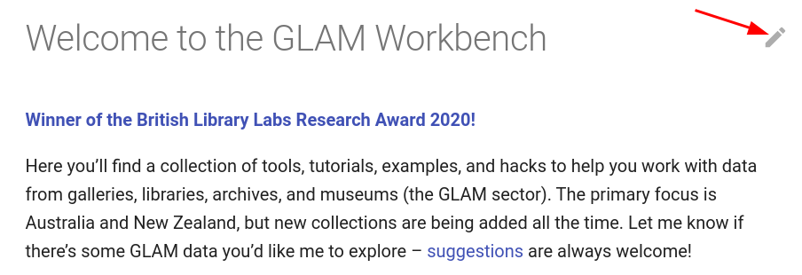

# Editing the GLAM Workbench documentation

The code for the GLAM Workbench documentation site (that's the site you're using right now) is [all available from GitHub](https://github.com/GLAM-Workbench/glam-workbench.github.io). You're very welcome to submit changes or additions.

If you haven't already, you'll need to [set up a free account](https://docs.github.com/en/get-started/signing-up-for-github/signing-up-for-a-new-github-account) on GitHub.

## Quick fixes

You can edit any page in the GLAM Workbench documentation just by clicking on the pencil icon. You'll find it to the right of the page title.

* Click on the pencil icon to open the page for editing on GitHub.
* [Follow these instructions](https://docs.github.com/en/repositories/working-with-files/managing-files/editing-files#editing-files-in-another-users-repository) to enter, preview, and save your suggested changes.

When you click on the pencil icon, GitHub automatically creates a copy of the repository in your own account. Once you've finished making your changes it'll prompt you to create a pull request, to feed the changes back to the main GLAM Workbench repository. Each pull request is reviewed before the changes go live.

## Other minor changes

If you're making changes to multiple pages, you might want to separate the process out into its different stages:

* [Fork](https://docs.github.com/en/get-started/quickstart/fork-a-repo) the documentation repository.
* [Make changes](https://docs.github.com/en/repositories/working-with-files/managing-files/editing-files) using the GitHub file editor.
* [Create a pull request](https://docs.github.com/en/pull-requests/collaborating-with-pull-requests/proposing-changes-to-your-work-with-pull-requests/creating-a-pull-request-from-a-fork) to share your changes back with the main repository.

## Major changes

If you're making major changes, such as adding a new section, you'll want to set up your own local version of the documentation for editing and testing:

* [Fork](https://docs.github.com/en/get-started/quickstart/fork-a-repo) the repository.
* [Clone](https://docs.github.com/en/repositories/creating-and-managing-repositories/cloning-a-repository) the forked repository to your own computer.
* Create and activate a Python virtual environment. I use [pyenv](https://github.com/pyenv/pyenv) and [pyenv-virtualenv](https://github.com/pyenv/pyenv-virtualenv) to create and manage Python versions and environments.
* Move to the `site` directory: `cd glam-workbench.github.io/site`
* Install `pip-tools`: `pip install pip tools`
* Install requirements: `pip-sync`
* Run the documentation site: `mkdocs serve`. The site will be available at http://127.0.0.1:8000/.
* Create or edit pages in the `docs` directory. See [MkDocs](https://www.mkdocs.org/) and [Material for MkDocs](https://squidfunk.github.io/mkdocs-material/) documentation for more information.

Any changes to markdown files in the `docs` directory should trigger a rebuild and reload of the site. If you make changes to templates, or to the `mkdocs.yml` config file, you'll probably need to stop and restart the server. Once you've finished you can `git push` the changes back to your fork, and [create a pull request](https://docs.github.com/en/pull-requests/collaborating-with-pull-requests/proposing-changes-to-your-work-with-pull-requests/creating-a-pull-request-from-a-fork).

Note that the main site is built using [Material for MkDocs Insiders](https://squidfunk.github.io/mkdocs-material/insiders/) which is a private repository that can only be accessed through sponsorship. The instructions above will install the public version of [Material for MkDocs](https://github.com/squidfunk/mkdocs-material). The site will look and act much the same, but some extended features, such as search and tagging won't be available.

## Contributors

Contributors will be listed on the site's [contributors](../contributors.md) page.