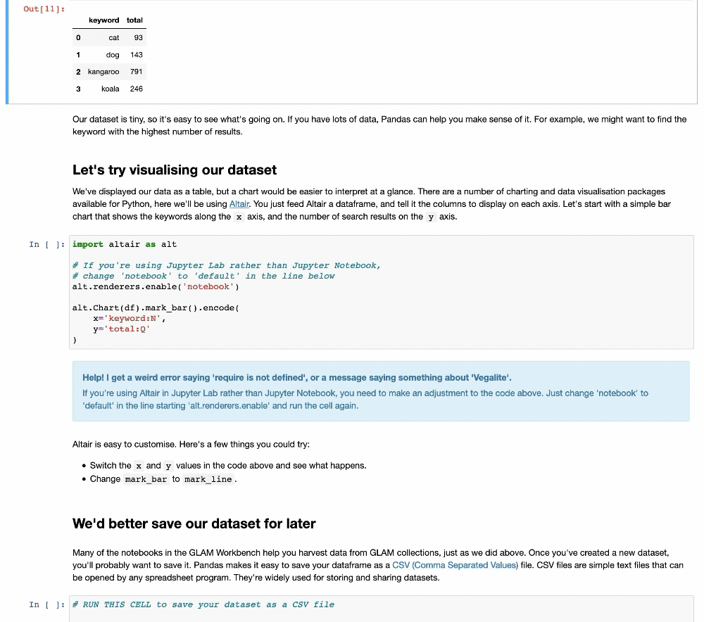

## Introducing Jupyter notebooks

This GLAM Workbench includes many [Jupyter](https://jupyter.org/) notebooks. Jupyter lets you combine text, images, and live code within a single web page. So not only can you read about GLAM collections data, you can download it, analyse it, and visualise it – all within your browser!

If you'd like to dive straight in and see what Jupyter notebooks can do, I've created an introductory notebook that walks you through the basic conventions and lets you play with some data from the National Museum of Australia. **Don't let the code make you nervous!** No programming knowledge is needed to use this notebook, or many of the other notebooks in the GLAM Workbench.



* [Click here to launch this notebook](https://mybinder.org/v2/gh/GLAM-Workbench/getting-started/master?filepath=Using_Jupyter_notebooks.ipynb)

When you click on the link above you'll be transferred to [Binder](https://mybinder.org/), a service that loads Jupyter notebooks in the cloud. Binder will set up a customised computing environment that includes all the software you'll need to run the notebook in your browser. It can take 30 seconds or more to load everything, so be patient. Once the notebook has loaded, just follow the instructions!

For a more detailed introduction to Jupyter notebooks and why they're of use to researchers in the humanities, see [this tutorial by Quinn Dombrowski, Tassie Gniady, and David Kloster](https://programminghistorian.org/en/lessons/jupyter-notebooks) in *The Programming Historian*.

!!! tip "Jupyter notebook quick tips"
    *   Code cells have boxes around them.
    *   To run a code cell click on the cell and then hit **Shift+Enter**. The **Shift+Enter** combo will also move you to the next cell, so it’s a quick way to work through the notebook.
    *   While a cell is running a **\*** appears in the square brackets next to the cell. Once the cell has finished running the asterix will be replaced with a number.
    *   In most cases you’ll want to start from the top of notebook and work your way down running each cell in turn. Later cells might depend on the results of earlier ones.
    *   To edit a code cell, just click on it and type stuff. Remember to run the cell once you’ve finished editing.

## Static or live – different ways of viewing and using Jupyter notebooks

Underneath the descriptions of most notebooks included in the GLAM Workbench you'll find a series of links. All the links take you to a copy of the notebook, but what you can do with the notebook varies according to the environment in which it's loaded. A typical set of links might include:

* Download from GitHub
* View on NBViewer
* Run live on Binder

The links to GitHub and NBViewer take you to *static* versions that you can read and download, but you can't run any of the code. The link to Binder loads a *live* version in a customised computing environment. More details of each of these are included below.


Let's say you're exploring the [Trove newspapers](https://glam-workbench.github.io/trove-newspapers/) section of the GLAM Workbench and notice the [visualise Trove newspaper searches over time](https://glam-workbench.github.io/trove-newspapers/#visualise-trove-newspaper-searches-over-time) notebook. You might first click on the [NBViewer link](https://nbviewer.jupyter.org/github/GLAM-Workbench/trove-newspapers/blob/master/visualise-searches-over-time.ipynb) to browse the contents of the notebook. If you decide it looks interesting and want to try running some of the examples live you could click on the [Binder link](https://mybinder.org/v2/gh/GLAM-Workbench/trove-newspapers/master?filepath=visualise-searches-over-time.ipynb). After a while you might decide you want to create your own customised version of this notebook. You could then use the [GitHub link](https://github.com/GLAM-Workbench/trove-newspapers/blob/master/visualise-searches-over-time.ipynb) to download the source code.

### Download from GitHub

Each section of the GLAM Workbench has its own [GitHub](https://github.com) repository where the notebooks and any related data files are stored. If you have Jupyter set up on your own computer and you want to play around with one of the notebooks, then you probably want to download it from GitHub and run it locally. GitHub also shows you the history of a notebook – so you can check if anything has changed. When you open a Jupyter notebook in GitHub, it tries to display a nicely formatted *static* version. But it doesn't always work, and the formatting can be a bit off. If all you want to do is view the contents of a notebook, then you're probably better off using NBViewer.

### View on NBViewer

[NBViewer](https://nbviewer.jupyter.org/) displays a nicely formatted copy of a Jupyter notebook. It's the quickest and most reliable way of examining the content of a notebook. However, this is a *static* view. The interactive Jupyter notebook has been turned into an HTML file. You can't run code cells or edit the contents of the notebook. You can look, but you can't do. If you want to try running the code in a Jupyter notebook (and that's what they're for), then you might want to give Binder a try.

### Run live on Binder

[Binder](https://mybinder.org/) is a cloud-based service for running Jupyter notebooks. When you click on the link, Binder opens the notebook within a customised computing environment with all the software you'll need ready to go. This can take a little while — just be patient. Once Binder is ready, you'll be able to use the notebook live within your web browser. However, if you make any changes or harvest any data, Binder won't save them for you. You'll have to make sure you download any files you want to keep. In many cases the notebooks themselves will generate download links to make it easy for you to save your results. Binder sessions will also stop responding after after a period of inactivity — just start a new session.


### Running notebooks as apps

You might also come across links that open notebooks using [Appmode](https://github.com/oschuett/appmode) or [Voilà](https://voila.readthedocs.io/en/stable/). These are live versions that hide the notebook's code and run all the cells automatically. This means you can make a notebook available with a nice clean interface for those who might be a little intimidated by a page full of code.


## Running notebooks on your own computer

### Using Python 3

It's best to keep your GLAM Workbench repositories in separate virtual environments. This means you can install the software versions that you need without upsetting anything else. For example, if you wanted to set up your own version of the [Trove newspapers](https://glam-workbench.github.io/trove-newspapers/) repository, you'd start by creating a new virtual environment.

``` bash
python3 -m venv trove-newspapers
cd trove-newspapers
source bin/activate
```

You can then clone the GitHub repository into your virtual environment.

``` bash
git clone https://github.com/GLAM-Workbench/trove-newspapers.git
```

!!! tip "Finding the clone url"

    To get the url you need to `clone` one of the GLAM Workbench's GitHub repositories, just do the following:

    * Go to the section of the GLAM Workbench you want to clone.
    * Click on the repository link in the top menu bar (look for the Octocat! <svg viewBox="0 0 24 24" width="20" height="20"><use xlink:href="#__github" width="24" height="24"></use></svg>)
    * Click on the green **Clone or download** button and copy the link.

Each repository in the GLAM Workbench contains a `requirements.txt` file that lists all of the Python packages needed to run the notebooks. Use `cd` to move into the cloned folder and then use `pip` to install everything you need.

``` bash
cd trove-newspapers
pip install -r requirements.txt
```

### Using Anaconda

~~~ Coming soon ~~~
