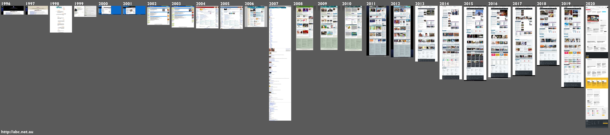

# Welcome to the GLAM Workbench

[**Winner of the British Library Labs Research Award 2020!**](/awards/#british-library-lab-awards-2020)

Here you’ll find a collection of tools, tutorials, examples, and hacks to help you work with data from galleries, libraries, archives, and museums (the GLAM sector). The primary focus is Australia and New Zealand, but new collections are being added all the time. Let me know if there’s some GLAM data you’d like me to explore – [suggestions](/suggest-a-topic/) are always welcome!

<iframe src="https://slides.com/wragge/gw-highlights/embed?byline=hidden&share=hidden" width="100%" height="420" scrolling="no" frameborder="0" webkitallowfullscreen mozallowfullscreen allowfullscreen></iframe>

## Quick start

The resources in the GLAM Workbench are created and shared as [Jupyter](https://jupyter.org/) notebooks. Jupyter lets you combine narrative text and live code in an environment that encourages you to learn and explore. Jupyter notebooks run in your browser, and you can get started without installing any software!

If you want to dive straight in, just have a look around the site and click on one of the links that says **'Run live on Binder'**. This will open the notebook, ready to use, in a customised computing environment using the [Binder](https://mybinder.org/) service.

If that seems too scary, here's some [first steps](/getting-started/#first-steps) to get you started.

You'll find more information in the [Getting Started](https://glam-workbench.github.io/getting-started/) section. If you have any questions, or strike any problems, head to the [OzGLAM Help](https://ozglam.chat/c/glam-workbench/8) site.

## Finding GLAM data

<figure>
  
  <figcaption><a href="/digitalnz/#visualising-open-collections-in-digitalnz">Open collections in DigitalNZ</a></figcaption>
</figure>

When we talk about GLAM data we’re usually referring to the collections held by cultural institutions &ndash; books, manuscripts, photographs, objects, and much more. We’re used to exploring these collections through online search interfaces or finding aids, but sometimes we want to do more &ndash; instead of a list of search results on a web page, we want access to the underlying collection data for analysis, enrichment, or visualisation. We want [collections as data](https://collectionsasdata.github.io/).

This GLAM Workbench shows you how to create your own research datasets from a variety of GLAM collections. In some cases cultural institutions provide direct access to collection data through APIs (Application Programming Interfaces) or data downloads. In other cases we have to find ways of extracting data from web interfaces &ndash; a process known as screen-scraping. Here you’ll find examples of all these approaches, as well as links to a number of pre-harvested datasets. For example:

### Harvesting data
* [Trove Newspaper and Gazette Harvester](/trove-harvester/)
* [Get OCRd text from a digitised journal in Trove](/trove-journals/#get-ocrd-text-from-a-digitised-journal-in-trove)
* [Harvest parliament press releases from Trove](/trove-journals/#harvest-parliament-press-releases-from-trove)
* [Harvest data from Papers Past](/digitalnz/#harvest-data-from-papers-past)
* [Harvest items from a search in RecordSearch](/recordsearch/#harvest-items-from-a-search-in-recordsearch)
* [Harvesting collections of text from archived web pages](/web-archives/#harvesting-collections-of-text-from-archived-web-pages)

### Data sources
* [Sources of Australian GLAM data](/glam-data-list/)
* [Commonwealth Hansard XML repository](/hansard/)
* [Australian Women's Weekly front covers, 1933 to 1982](/trove-newspapers/#australian-womens-weekly-front-covers-1933-to-1982)
* [ABC Radio National Programs](/trove-music/#abc-radio-national-programs)

## Asking different questions

<figure>
  
  <figcaption><a href="/web-archives/#using-screenshots-to-visualise-change-in-a-page-over-time">Using screenshots to visualise change in a web page over time</a></figcaption>
</figure>

What can you do with GLAM data?

* **Shift scales** – from individual items to big pictures
* **Find patterns** – change over time, distribution through space
* **Extract features** – find people, places, words, images
* **Make connections** – link within and between collections
* **Get creative** – reuse collections in unexpected ways

The GLAM Workbench demonstrates a variety of tools and techniques that you can use to ask different questions of your data. For example:

* [Visualise Trove newspaper searches over time](/trove-newspapers/#visualise-trove-newspaper-searches-over-time)
* [Convert a year's worth of Historic Hansard into a dataframe for analysis](/hansard/#convert-a-years-worth-of-historic-hansard-into-a-dataframe-for-analysis)
* [Exploring subdomains in the whole of gov.au](/web-archives/#exploring-subdomains-in-the-whole-of-govau)
* [Explore places associated with NMA collection objects](/nma/#explore-places-associated-with-collection-objects)
* [Finding faces in the SLNSW Tribune collection](/facial-detection/#finding-faces-in-the-tribune-collection)
* [Create 'scissors and paste' messages from Trove newspaper articles](/trove-newspapers/#create-scissors-and-paste-messages-from-trove-newspaper-articles)

## Hacking heritage

<figure>
  
  <figcaption><a href="/trove-newspapers/#create-large-composite-images-from-snipped-words">Create large composite images from snipped words</a></figcaption>
</figure>

Digital access means more than just putting stuff online. What you can actually *do* with collections is constrained by the design of interfaces, the quality of documentation, the format of the data, and many other factors. The GLAM Workbench provides hacks and workarounds that help you peek behind the search box, and do what you want to do with online collections. For example:

* [Save a Trove newspaper article as an image](/trove-newspapers/#save-a-trove-newspaper-article-as-an-image)
* [Finding non-English newspapers in Trove](/trove-newspapers/#finding-non-english-newspapers-in-trove)
* [Random items from Trove](/trove-random/)
* [Download an image from SLV using the IIIF server and a Handle url](/slv/#download-an-image-using-the-iiif-server-and-a-handle-url)
* [Select a random(ish) record from DigitalNZ](/digitalnz/#select-a-randomish-record-from-digitalnz)

## Bringing documentation alive

The way Jupyter notebooks combine text and code into a 'computational narrative', makes them ideal for documentating GLAM data sources. You don't just have to describe how an API works, you can show it in action. The GLAM Workbench leads you through a range of GLAM data sources, asking questions, offering examples, and demonstrating both the possibilities and limitations.

* [A random item from Museums Victoria's collections!](/museumsvictoria/#a-random-item-from-museums-victorias-collections)
* [Exploring the Te Papa collection API](/tepapa/#exploring-the-te-papa-collection-api)
* [Timegates, Timemaps, and Mementos](/web-archives/#timegates-timemaps-and-mementos)
* [Build a DigitalNZ API search query](/digitalnz/#build-a-digitalnz-api-search-query)
* [More fun with IIIF](/slv/#more-fun-with-iiif)

## Do I need to be able to code?

No, you can use the Jupyter notebooks within the workbench without any coding experience &ndash; just edit and click where indicated. But every time you do edit one of the notebooks, you *are* coding. The notebooks provide an opportunity to gain confidence and experiment. They might not turn you into a coder, but they will show you how to do useful things with code.

Go to the [getting started](/getting-started/) page for more information about using Jupyter notebooks.
