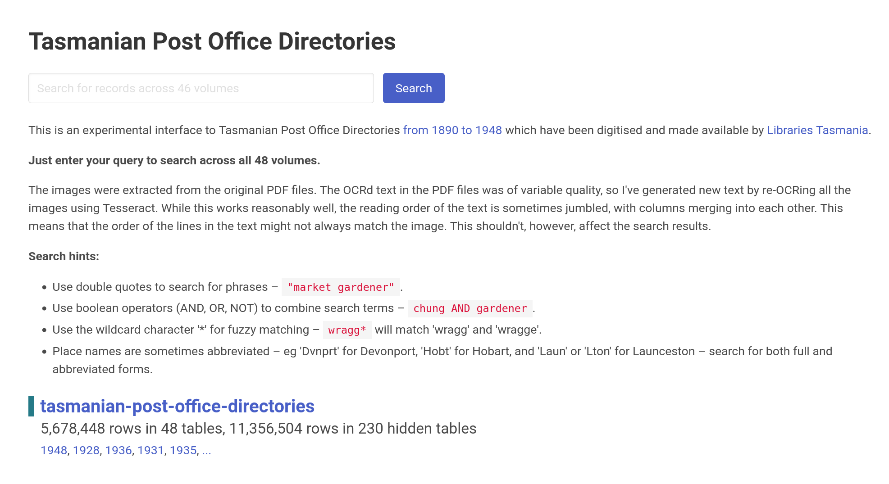

{{ git_latest_tag() }}

A collection of tools and examples for working with data from [Libraries Tasmania](https://www.libraries.tas.gov.au/).

You might also find the [Zotero translator for the Libraries Tasmania catalogue](https://updates.timsherratt.org/2022/07/14/calling-all-tasmanian.html) useful.

## Tasmanian Post Office Directories

The [Tasmanian Post Office Directories from 1890 to 1948](https://stors.tas.gov.au/ILS/SD_ILS-981598) have been digitised and made available by Libraries Tasmania for download as PDFs. These notebooks document a workflow that extracts text and images from the PDFs to build a [searchable database of their contents](https://glam-workbench.net/tasmanian-post-office-directories/).

[**Search for people and places in Tasmania**](https://glam-workbench.net/tasmanian-post-office-directories/)

### [:material-notebook-outline: Download and process Tasmanian Post Office Directory PDFs](tas-pod-save-text-images.md) 
This notebook downloads all 48 Tasmanian Post Office Directory PDFs, then extracts images and text from the PDFs using PyMuPDF.

### [:material-notebook-outline: Upload Tasmanian Post Office Directory images to Amazon s3 for IIIF](tas-pod-upload-images.md) 
This notebook converts the images extracted from the Post Office Directory PDFs into pyramidal TIFFs using pyvips and then uploads them to an Amazon s3 bucket for delivery via IIIF.

### [:material-notebook-outline: Extract text from PDF images using Tesseract](tas-pod-ocr-with-tesseract.md) 
This notebook uses Tesseract (OCR) to extract text directly from the images in the Tasmanian Post Office Directory PDFs.

### [:material-notebook-outline: Add content from the Tasmanian Post Office Directories to an SQLite database](tas-pod-add-to-datasette.md)  
This notebook brings everything together text and images from the Tasmanian Post Office Directories in an SQLite database ready for delivery through Datasette.

See the [GLAM Workbench for more details](https://glam-workbench.github.io/libraries-tasmania/).

<!-- START RUN INFO -->



<!-- END RUN INFO -->

## Contributors

{{ repo_contributors() }}

## Cite as

{{ zenodo_citation() }}