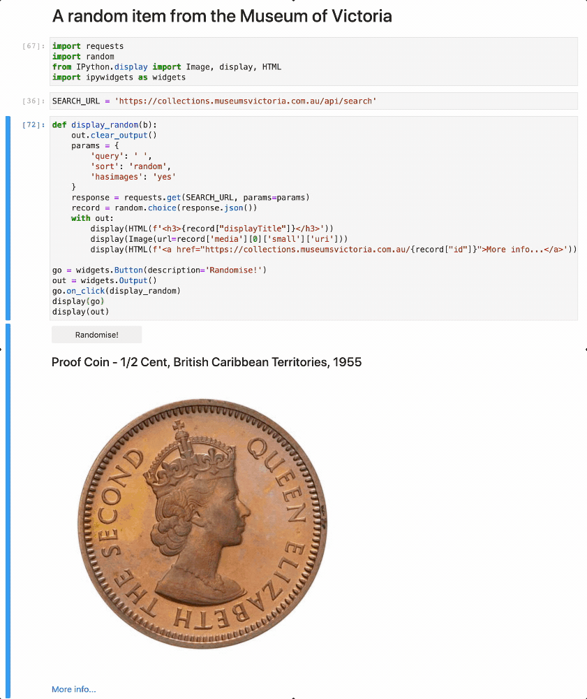

# Museums Victoria collection

Museums Victoria provides access to its [collection data through an API](https://collections.museumsvictoria.com.au/developers). No API key is required making it very easy to get started.

## Tips, tools, and examples

### A random item from Museums Victoria's collections!

The Museums Victoria API includes a random `sort` option and a `hasimages` parameter. Putting these together we can easily create a random collection image viewer.

* [Download from GitHub](https://github.com/GLAM-Workbench/museums-victoria/blob/master/museumvic-random-item.ipynb)
* [View using NBViewer](https://nbviewer.jupyter.org/github/GLAM-Workbench/museums-victoria/blob/master/museumvic-random-item.ipynb)
* [Run live on Binder](https://mybinder.org/v2/gh/GLAM-Workbench/museums-victoria/master?urlpath=lab%2Ftree%2Fmuseumvic-random-item.ipynb)

### Get a list of species records from the Museums Victoria collection

The Museums Victoria collection API accepts four `recordtype` values: 'article', 'item', 'species', and 'specimen'. In this notebook we'll build a simple harvester to download all the 'species' records.

* [Download from GitHub](https://github.com/GLAM-Workbench/museums-victoria/blob/master/museumvic-get-a-list-of-species.ipynb)
* [View using NBViewer](https://nbviewer.jupyter.org/github/GLAM-Workbench/museums-victoria/blob/master/museumvic-get-a-list-of-species.ipynb)
* [Run live on Binder](https://mybinder.org/v2/gh/GLAM-Workbench/museums-victoria/master?urlpath=lab%2Ftree%2Fmuseumvic-get-a-list-of-species.ipynb)

### Find how many specimens of each species are in the Museums Victoria collection

In another notebook we harvested a list of species from the Museum of Victoria using their collection API and saved the results as a CSV file. Here we'll search for specimens matching each of the species and save the total number of records.

* [Download from GitHub](https://github.com/GLAM-Workbench/museums-victoria/blob/master/museumvic-find-specimens-of-each-species.ipynb)
* [View using NBViewer](https://nbviewer.jupyter.org/github/GLAM-Workbench/museums-victoria/blob/master/museumvic-find-specimens-of-each-species.ipynb)
* [Run live on Binder](https://mybinder.org/v2/gh/GLAM-Workbench/museums-victoria/master?urlpath=lab%2Ftree%2Fmuseumvic-find-specimens-of-each-species.ipynb)

### DOWNLOAD ALL THE ANTECHINUSES!

In another notebook we discovered there are 2,883 Antechinus specimens in the Museum of Victoria. Let's see how many pictures we can find of them.

* [Download from GitHub](https://github.com/GLAM-Workbench/museums-victoria/blob/master/museumvic-download-the-antechinuses.ipynb)
* [View using NBViewer](https://nbviewer.jupyter.org/github/GLAM-Workbench/museums-victoria/blob/master/museumvic-download-the-antechinuses.ipynb)
* [Run live on Binder](https://mybinder.org/v2/gh/GLAM-Workbench/museums-victoria/master?urlpath=lab%2Ftree%2Fmuseumvic-download-the-antechinuses.ipynb)

