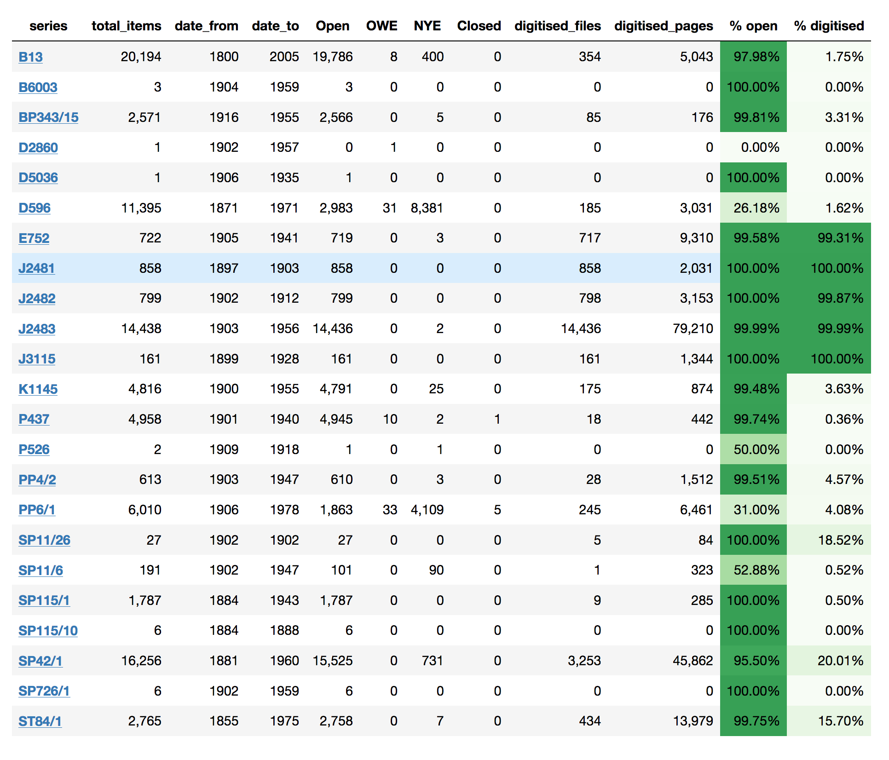

# Series in the National Archives of Australia relating to the White Australia Policy

This repository includes item-level metadata from 23 series harvested from the National Archives online database RecordSearch. The complete code for harvesting and processing the data is included, as are some examples of how the data can be analysed. The harvested metadata is available as CSV-formatted files (one for each series) in the [RecordSearch/data](https://github.com/GLAM-Workbench/ozglam-workbench-naa-wap/tree/master/RecordSearch/data) directory.

## Tools, tips, and examples

### [Harvesting series](https://nbviewer.jupyter.org/github/GLAM-Workbench/ozglam-workbench-naa-wap/blob/master/RecordSearch/1.%20Harvesting%20series.ipynb)  
Code to harvest item-level data and digitised images from series.

### [Analyse a series](https://nbviewer.jupyter.org/github/GLAM-Workbench/ozglam-workbench-naa-wap/blob/master/RecordSearch/2.%20Analyse%20a%20series.ipynb)  
Some ways of exploring and visualising the item level data.

### [Summarise series data](https://nbviewer.jupyter.org/github/GLAM-Workbench/ozglam-workbench-naa-wap/blob/master/RecordSearch/Summarise%20series%20data.ipynb)  
Summarise the data from all harvested series.

### [Summarise series](https://nbviewer.jupyter.org/github/GLAM-Workbench/ozglam-workbench-naa-wap/blob/master/RecordSearch/series-summary.ipynb)  
Summarise the data from a single series.

## Data

### Harvest May 2018

To browse information about the harvested series start with the [summary of all harvested series notebook](https://nbviewer.jupyter.org/github/GLAM-Workbench/ozglam-workbench-naa-wap/blob/master/RecordSearch/Summary%20of%20all%20harvested%20series.ipynb). There you'll find a live version of the table below with links to individual series summaries and visualisations.

.
