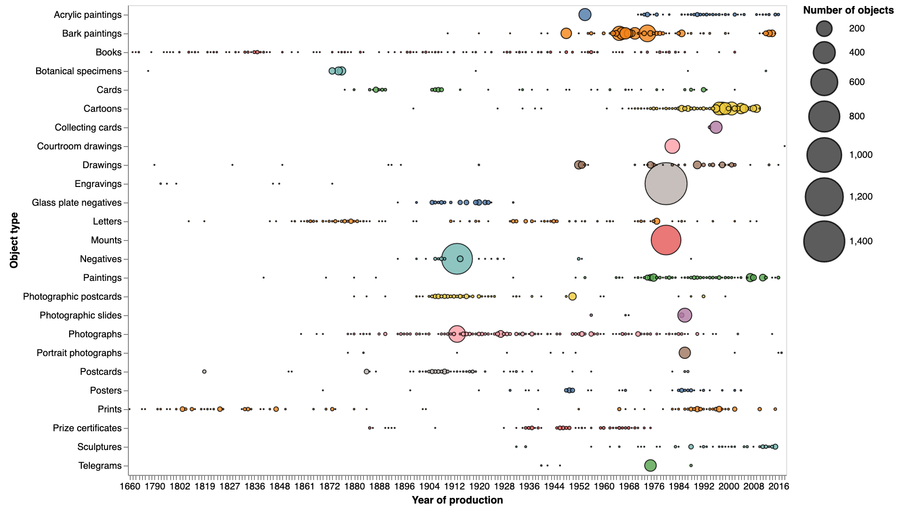

# National Museum of Australia collection

The National Museum of Australia provides access to its [collection data through an API](https://www.nma.gov.au/about/our-collection/our-apis). As well as collection items, data is available for parties, places, media, and more.

You'll need [an API key](https://www.nma.gov.au/about/our-collection/our-apis/register-for-an-api-key) for serious exploration.

## Tips, tools, and examples

### Harvest records from the NMA API

If you're going to do any large-scale analysis of the NMA collection data, you probably want to harvest it all using the API and save it locally. This notebook helps you do just that. It harvests records in the [simple JSON format](https://github.com/NationalMuseumAustralia/Collection-API/wiki/Getting-started#simple-json) and saves them as they are to a file-based database using [TinyDB](https://tinydb.readthedocs.io/en/latest/).

* [Download from GitHub](https://github.com/GLAM-Workbench/national-museum-australia/blob/master/harvest_records.ipynb)
* [View using NBViewer](https://nbviewer.jupyter.org/github/GLAM-Workbench/national-museum-australia/blob/master/harvest_records.ipynb)
* [Run live on Binder](https://mybinder.org/v2/gh/GLAM-Workbench/national-museum-australia/master?urlpath=lab%2Ftree%2Fharvest_records.ipynb)

### Exploring object records

In this notebook we'll have a preliminary poke around in the object data harvested from the NMA Collection API. I'll focus here on the basic shape/stats of the data, with a deeper dive into the `additionalType` and `extent` fields. Can we find the biggest object in the collection?

* [Download from GitHub](https://github.com/GLAM-Workbench/national-museum-australia/blob/master/exploring_object_records.ipynb)
* [View using NBViewer](https://nbviewer.jupyter.org/github/GLAM-Workbench/national-museum-australia/blob/master/exploring_object_records.ipynb)
* [Run live on Binder](https://mybinder.org/v2/gh/GLAM-Workbench/national-museum-australia/master?urlpath=lab%2Ftree%2Fexploring_object_records.ipynb)

### Explore collection objects over time

In this notebook we'll explore the temporal dimensions of the object data. When were objects created, collected, or used? To do that we'll extract the nested temporal data, see what's there, and create a few charts.

* [Download from GitHub](https://github.com/GLAM-Workbench/national-museum-australia/blob/master/explore_collection_object_over_time.ipynb)
* [View using NBViewer](https://nbviewer.jupyter.org/github/GLAM-Workbench/national-museum-australia/blob/master/explore_collection_object_over_time.ipynb)
* [Run live on Binder](https://mybinder.org/v2/gh/GLAM-Workbench/national-museum-australia/master?urlpath=lab%2Ftree%2Fexplore_collection_object_over_time.ipynb)

### Explore places associated with collection objects

In this notebook we'll explore the spatial dimensions of the object data. Where were objects created or collected? To do that we'll extract the nested spatial data, see what's there, and create a few maps.

* [Download from GitHub](https://github.com/GLAM-Workbench/national-museum-australia/blob/master/explore_objects_and_places.ipynb)
* [View using NBViewer](https://nbviewer.jupyter.org/github/GLAM-Workbench/national-museum-australia/blob/master/explore_objects_and_places.ipynb)
* [Run live on Binder](https://mybinder.org/v2/gh/GLAM-Workbench/national-museum-australia/master?urlpath=lab%2Ftree%2Fexplore_objects_and_places.ipynb)

