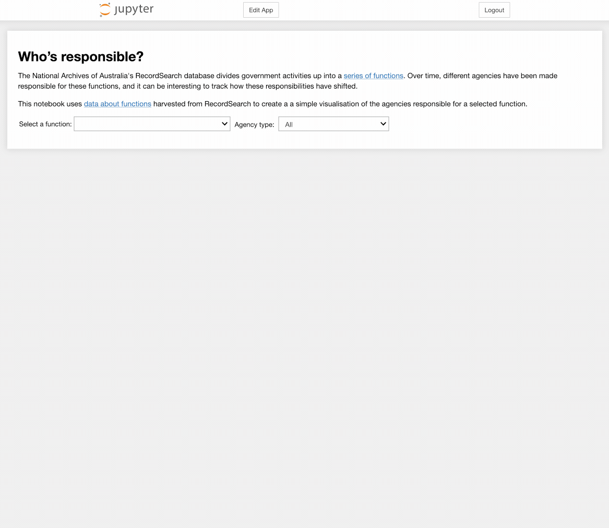
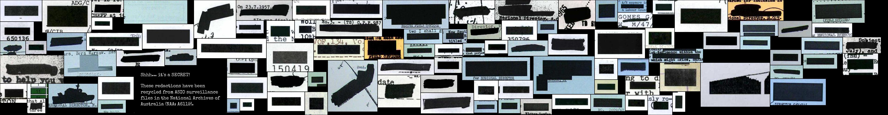

# RecordSearch

{{ git_latest_tag() }}

[RecordSearch](https://recordsearch.naa.gov.au/) is the online collection database of the National Archives of Australia. Based on the [series system](https://www.naa.gov.au/help-your-research/getting-started/commonwealth-record-series-crs-system), RecordSearch provides rich, contextual information about series, items, agencies, and functions.

Unfortunately RecordSearch doesn't provide access to machine-readable data through an API, so we have to resort to screen scraping. The notebooks here make use the [RecordSearch Data Scraper](https://wragge.github.io/recordsearch_data_scraper/) to extract data.

See below for information on [running these notebooks](#run-these-notebooks) in a live computing environment. Or just take them for a spin using Binder.

[](https://binderhub.rc.nectar.org.au/v2/gh/GLAM-Workbench/{{repo_name}}/HEAD?urlpath=lab/tree/index.ipynb)
[](https://mybinder.org/v2/gh/GLAM-Workbench/recordsearch/HEAD?urlpath=lab/tree/index.ipynb)

## Harvesting data

### Harvest items from a search in RecordSearch
Ever searched for items in RecordSearch and wanted to save the results as a CSV file, or in some other machine-readable format? This notebook walks you through the process of creating, managing, and saving item searches – all the way from search terms to downloadable dataset. You can even download all the images from items that have been digitised! And if you want to harvest series with more than 20,000 items, some strategies for this are included as well.

* [Download from GitHub](https://github.com/GLAM-Workbench/recordsearch/blob/master/harvesting_items_from_a_search.ipynb)
* [View using NBViewer](https://nbviewer.jupyter.org/github/GLAM-Workbench/recordsearch/blob/master/harvesting_items_from_a_search.ipynb)
* [Run live on Binder](https://mybinder.org/v2/gh/GLAM-Workbench/recordsearch/master?urlpath=lab/tree/harvesting_items_from_a_search.ipynb)

### Harvest files with the access status of 'closed'  
The National Archives of Australia's RecordSearch database includes some information about files that we're not allowed to see. These files have been through the access examination process and ended up with an access status of 'closed'. While you can search by access status in RecordSearch, you can't explore the reasons, so if you want to dig any deeper you need to harvest the data. This notebook shows you how.

* [Download from GitHub](https://github.com/GLAM-Workbench/recordsearch/blob/master/harvest_closed_files.ipynb)
* [View using NBViewer](https://nbviewer.jupyter.org/github/GLAM-Workbench/recordsearch/blob/master/harvest_closed_files.ipynb)
* [Run live on Binder](https://mybinder.org/v2/gh/GLAM-Workbench/recordsearch/master?urlpath=lab/tree/harvest_closed_files.ipynb)

### Harvest recently digitised files from RecordSearch  
This notebook scrapes data from the 'Newly scanned records' section of RecordSearch, creating a list of recently digitised files. See below for datasets created with this notebook.

* [Download from GitHub](https://github.com/GLAM-Workbench/recordsearch/blob/master/harvest_recently_digitised_files.ipynb)
* [View using NBViewer](https://nbviewer.jupyter.org/github/GLAM-Workbench/recordsearch/blob/master/harvest_recently_digitised_files.ipynb)
* [Run live on Binder](https://mybinder.org/v2/gh/GLAM-Workbench/recordsearch/master?urlpath=lab/tree/harvest_recently_digitised_files.ipynb)

### Harvest details of all series in RecordSearch
This notebook get details of all series registered in RecordSearch, also generates a summary dataset with the total number of items digitised, described and in each access category.

* [Download from GitHub](https://github.com/GLAM-Workbench/recordsearch/blob/master/harvest_series_data.ipynb)
* [View using NBViewer](https://nbviewer.jupyter.org/github/GLAM-Workbench/recordsearch/blob/master/harvest_series_data.ipynb)
* [Run live on Binder](https://mybinder.org/v2/gh/GLAM-Workbench/recordsearch/master?urlpath=lab/tree/harvest_series_data.ipynb)

### Harvesting functions from the RecordSearch interface  
This notebook attempts to extract information from the RecordSearch interface about the hierarchy of functions it uses to describe the work of government agencies. [Previous explorations](https://timsherratt.org/research-notebook/aggregated-archives/notes/naa-functions/) have shown that the NAA's use of functions is rather inconsistent. All I'm doing here is finding out what functions RecordSearch itself says it is using. This may not be complete, but it seems like a useful starting point.

* [Download from GitHub](https://github.com/GLAM-Workbench/recordsearch/blob/master/harvesting_functions_from_recordsearch.ipynb)
* [View using NBViewer](https://nbviewer.jupyter.org/github/GLAM-Workbench/recordsearch/blob/master/harvesting_functions_from_recordsearch.ipynb)
* [Run live on Binder](https://mybinder.org/v2/gh/GLAM-Workbench/recordsearch/master?urlpath=lab/tree/harvesting_functions_from_recordsearch.ipynb)

### Harvest agencies associated with *all* functions  
This notebook loops through the list of functions that were extracted from the RecordSearch interface and saves basic details of the agencies responsible for each function. To keep down the file size and avoid too much duplication it doesn't include the full range of relationships that an agency might have. If you want the full agency data, use the app below to harvest agencies associated with an individual function or hierarchy.

* [Download from GitHub](https://github.com/GLAM-Workbench/recordsearch/blob/master/get_all_agencies_by_function.ipynb)
* [View using NBViewer](https://nbviewer.jupyter.org/github/GLAM-Workbench/recordsearch/blob/master/get_all_agencies_by_function.ipynb)
* [Run live on Binder](https://mybinder.org/v2/gh/GLAM-Workbench/recordsearch/master?urlpath=lab/tree/get_all_agencies_by_function.ipynb)

## Analysing data

### Exploring harvested series data  
Generates some basic statistics about the holdings of the National Archives from the full harvest of registered series.

* [Download from GitHub](https://github.com/GLAM-Workbench/recordsearch/blob/master/series_harvest_basic_stats.ipynb)
* [View using NBViewer](https://nbviewer.jupyter.org/github/GLAM-Workbench/recordsearch/blob/master/series_harvest_basic_stats.ipynb)
* [Run live on Binder](https://mybinder.org/v2/gh/GLAM-Workbench/recordsearch/master?urlpath=lab/tree/series_harvest_basic_stats.ipynb)

### Exploring harvested series data, 2022  
Generates some basic statistics from the harvest of series data in 2022 and compares the results to the previous year.

* [Download from GitHub](https://github.com/GLAM-Workbench/recordsearch/blob/master/series_harvest_basic_stats_2022.ipynb)
* [View using NBViewer](https://nbviewer.jupyter.org/github/GLAM-Workbench/recordsearch/blob/master/series_harvest_basic_stats_2022.ipynb)
* [Run live on Binder](https://mybinder.org/v2/gh/GLAM-Workbench/recordsearch/master?urlpath=lab/tree/series_harvest_basic_stats_2022.ipynb)

### Summary of records digitised in the previous week  
Run this notebook to analyse the most recent dataset of recently digitised files, summarising the results by series.

* [Download from GitHub](https://github.com/GLAM-Workbench/recordsearch/blob/master/recently_digitised_update.ipynb)
* [View using NBViewer](https://nbviewer.jupyter.org/github/GLAM-Workbench/recordsearch/blob/master/recently_digitised_update.ipynb)
* [Run live on Binder](https://mybinder.org/v2/gh/GLAM-Workbench/recordsearch/master?urlpath=lab/tree/recently_digitised_update.ipynb)

### How many of the functions are actually used?
In this notebook we'll import data about functions that we've harvested earlier and search for each of these functions in RecordSearch to see how many are actually used.

* [Download from GitHub](https://github.com/GLAM-Workbench/recordsearch/blob/master/how_many_functions_are_used.ipynb)
* [View using NBViewer](https://nbviewer.jupyter.org/github/GLAM-Workbench/recordsearch/blob/master/how_many_functions_are_used.ipynb)
* [Run live on Binder](https://mybinder.org/v2/gh/GLAM-Workbench/recordsearch/master?urlpath=lab/tree/how_many_functions_are_used.ipynb)

### Who's responsible?
The National Archives of Australia's RecordSearch database divides government activities up into a series of functions. Over time, different agencies have been made responsible for these functions, and it can be interesting to track how these responsibilities have shifted. This notebook uses data about functions harvested from RecordSearch to create a a simple visualisation of the agencies responsible for a selected function.  

* [Download from GitHub](https://github.com/GLAM-Workbench/recordsearch/blob/master/display_agencies_by_function.ipynb)
* [View using NBViewer](https://nbviewer.jupyter.org/github/GLAM-Workbench/recordsearch/blob/master/display_agencies_by_function.ipynb)
* [Run live on Binder in Voila](https://mybinder.org/v2/gh/GLAM-Workbench/recordsearch/master?urlpath=voila/render/display_agencies_by_function.ipynb)



## Useful tools

### DIY Redaction Art Collages  
Redactions are a way of restricting access, of witholding information – they're dead ends. But with this notebook you can recycle redactions into something interesting, something creative, perhaps even something beautiful.



Just set the desired size of your final image and click on the button. A random sample of redactions will be obtained from the dataset and packed into the image dimensions. Once it's finished you'll be able to download both the finished collage, and a CSV dataset containing metadata that describes all the redactions used, including original file references. If you're not happy with the result, try again. Every piece of redaction art is unique!

* [Download from GitHub](https://github.com/GLAM-Workbench/recordsearch/blob/master/diy_redaction_collage.ipynb)
* [View using NBViewer](https://nbviewer.jupyter.org/github/GLAM-Workbench/recordsearch/blob/master/diy_redaction_collage.ipynb)
* [Run live on Binder with Voila](https://mybinder.org/v2/gh/GLAM-Workbench/recordsearch/master?urlpath=voila/render/diy_redaction_collage.ipynb)

### Download the contents of a digitised file  
RecordSearch lets you download a PDF of a digitised file, but sometimes it's more convenient to work with individual images. Just give this app the barcode of a digitised file and it will grab all the images as JPGs, zip them up into a folder, and generate a download link.

* [Download from GitHub](https://github.com/GLAM-Workbench/recordsearch/blob/master/get_images_from_a_digitised_file.ipynb)
* [View using NBViewer](https://nbviewer.jupyter.org/github/GLAM-Workbench/recordsearch/blob/master/get_images_from_a_digitised_file.ipynb)
* [Run live on Binder in Voila](https://mybinder.org/v2/gh/GLAM-Workbench/recordsearch/master?urlpath=voila/render/get_images_from_a_digitised_file.ipynb)

### Get a list of agencies associated with a function
RecordSearch describes the business of government in terms of 'functions'. A function is an area of responsibility assigned to a particular government agency. Over time, functions change and move between agencies. If you're wanting to track particular areas of government activity, such as 'migration' or 'meteorology', it can be useful to start with functions, then follow the trail through agencies, series created by those agencies, and finally items contained within those series. This app makes it easy for you to download a list agencies associated with a particular function.  

* [Download from GitHub](https://github.com/GLAM-Workbench/recordsearch/blob/master/get_agencies_associated_with_function.ipynb)
* [View using NBViewer](https://nbviewer.jupyter.org/github/GLAM-Workbench/recordsearch/blob/master/get_agencies_associated_with_function.ipynb)
* [Run live on Binder in Voila](https://mybinder.org/v2/gh/GLAM-Workbench/recordsearch/master?urlpath=voila/render/get_agencies_associated_with_function.ipynb)

### DFAT Cable Finder
If you ever need to find a file in the National Archives of Australia that contains a specific numbered cable from the Department of Foreign Affairs this is the tool for you! Just give it a cable number and it will look in the series listed below for a file that might contain the cable. For each possible match it returns a link to the file as well as a bit of information about it.  

* [Download from GitHub](https://github.com/GLAM-Workbench/recordsearch/blob/master/Find_cables.ipynb)
* [View using NBViewer](https://nbviewer.jupyter.org/github/GLAM-Workbench/recordsearch/blob/master/Find_cables.ipynb)
* [Run live on Binder in Appmode](https://mybinder.org/v2/gh/GLAM-Workbench/recordsearch/master?urlpath=voila/render/Find_cables.ipynb)


## Data

### Summary data about all series in RecordSearch  
Harvested in May 2021

[CSV file](https://github.com/GLAM-Workbench/recordsearch/blob/master/series_totals_May_2021.csv) (15mb) – containing basic descriptive information about all the series currently registered on RecordSearch as well as the total number of items described, digitised, and in each access category.

### Recently digitised files  
Harvested on 27 March 2020.

[CSV file](https://github.com/GLAM-Workbench/recordsearch/blob/master/data/recently-digitised-20210327) containing details of files digitised between 25 February and 26 March 2020, harvested using the notebook above.

### Recently digitised files – repository of weekly snapshots

[This repository](https://github.com/wragge/naa-recently-digitised) contains weekly harvests of newly digitised files in RecordSearch. The automated scraper is currently scheduled to run each Sunday, saving a list of files that have been digitised in the previous week. The weekly datasets are saved as CSV files in the `data` directory. The date of the harvest is recorded in the file name, so `digitised-week-ending-20210328.csv` was harvested on 28 March 2021.

The CSV files contain the following fields:

* `title`
* `item_id`
* `series`
* `control_symbol`
* `date_range`
* `date_digitised`

## Run these notebooks

There are a number of different ways to use these notebooks. Binder is quickest and easiest, but it doesn't save your data. I've listed a number of options below from easiest to most complicated (requiring more technical knowledge). See the [running Jupyter notebooks](https://glam-workbench.net/running-notebooks/) page for more details and additional options.

### Using Binder

[](https://mybinder.org/v2/gh/GLAM-Workbench/recordsearch/master/?urlpath=lab/tree/index.md)

Click on the button above to launch the notebooks in this repository using the [Binder](https://mybinder.org/) service (it might take a little while to load). This is a free service, but note that sessions will close if you stop using the notebooks, and no data will be saved. Make sure you download any changed notebooks or harvested data that you want to save.

See [Using Binder](https://glam-workbench.net/using-binder/) for more information.

### Using Reclaim Cloud

[](https://app.my.reclaim.cloud/?manifest=https://raw.githubusercontent.com/GLAM-Workbench/recordsearch/master/reclaim-manifest.jps)

[Reclaim Cloud](https://reclaim.cloud/) is a paid hosting service, aimed particularly at supported digital scholarship in the humanities. Unlike Binder, the environments you create on Reclaim Cloud will save your data – even if you switch them off! To run this repository on Reclaim Cloud for the first time:

* Create a [Reclaim Cloud](https://reclaim.cloud/) account and log in.
* Click on the button above to start the installation process.
* A dialogue box will ask you to set a password, this is used to limit access to your Jupyter installation.
* Sit back and wait for the installation to complete!
* Once the installation is finished click on the 'Open in Browser' button of your newly created environment (note that you might need to wait a few minutes before everything is ready).

See [Using Reclaim Cloud](https://glam-workbench.net/using-reclaim-cloud/) for more information.

### Using the Nectar Cloud

{width="600"}

The [Nectar Research Cloud](https://ardc.edu.au/services/nectar-research-cloud/) (part of the Australian Research Data Commons) provides cloud computing services to researchers in Australian and New Zealand universities. Any university-affiliated researcher can log on to Nectar and receive [up to 6 months of free cloud computing time](https://tutorials.rc.nectar.org.au/allocation-management/03-account-and-trial). And if you need more, you can [apply for a specific project allocation](https://tutorials.rc.nectar.org.au/allocation-management/04-allocation-and-projects).

The GLAM Workbench is available in the Nectar Cloud as a pre-configured application. This means you can get it up and going without worrying about the technical infrastructure – just fill in a few details and you're away! To create an instance of this repository in the Nectar Cloud:

* Log in to the [Nectar Dashboard](https://dashboard.rc.nectar.org.au/) using your university credentials.
* From the Dashboard choose **Applications -> Browse Local**.
* Enter 'GLAM' in the filter box and hit Enter, you should see the GLAM Workbench application.
* Click on the GLAM Workbench application's  **Quick Deploy** button.
* Step through the various [configuration options](https://glam-workbench.net/using-nectar/#setting-up-your-own-glam-workbench-repository). Some options are only available if you have a dedicated project allocation.
* When asked to select a GLAM Workbench repository, choose 'Recordsearch' from the dropdown list.
* Complete the configuration and deploy your GLAM Workbench instance.
* The url to access your instance will be displayed once it's ready. Click on the url!

See [Using Nectar](https://glam-workbench.net/using-nectar/) for more information.

### Using Docker

You can use Docker to run a pre-built computing environment on your own computer. It will set up everything you need to run the notebooks in this repository. This is free, but requires more technical knowledge – you'll have to install Docker on your computer, and be able to use the command line.

* Install [Docker Desktop](https://docs.docker.com/get-docker/).
* Create a new directory for this repository and open it from the command line.
* From the command line, run the following command:  
  ```
  docker run -p 8888:8888 --name recordsearch -v "$PWD":/home/jovyan/work quay.io/glamworkbench/recordsearch repo2docker-entrypoint jupyter lab --ip 0.0.0.0 --NotebookApp.token='' --LabApp.default_url='/lab/tree/index.ipynb'
  ```
* It will take a while to download and configure the Docker image. Once it's ready you'll see a message saying that Jupyter Notebook is running.
* Point your web browser to `http://127.0.0.1:8888`

See [Using Docker](https://glam-workbench.net/using-docker/) for more information.

## Contributors

{{ repo_contributors() }}

## Cite as

{{ zenodo_citation() }}
