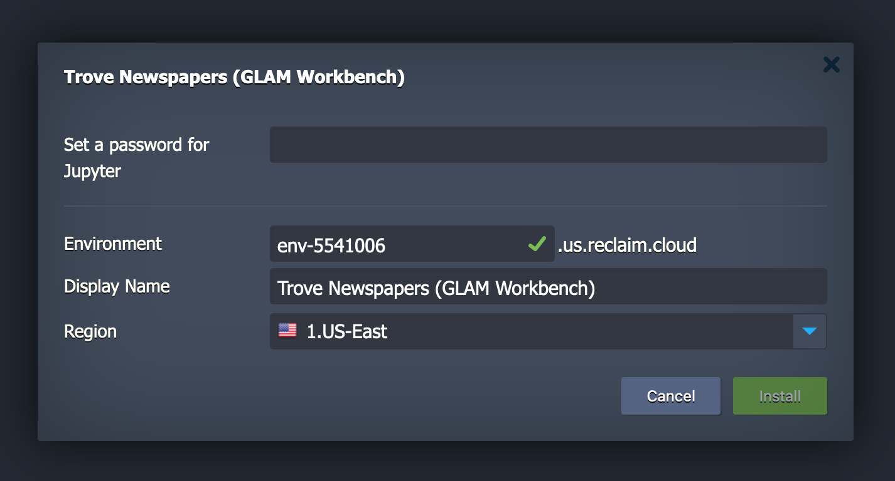
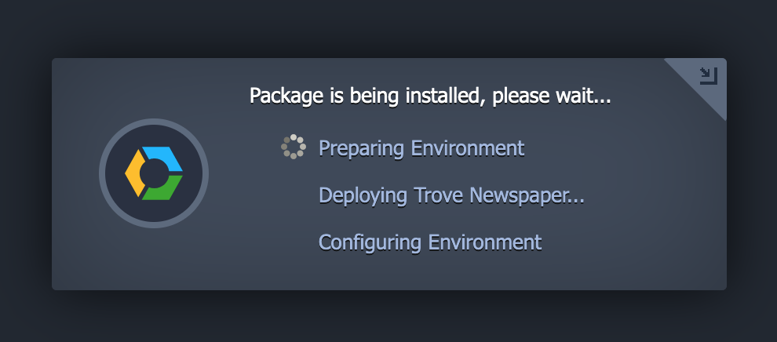
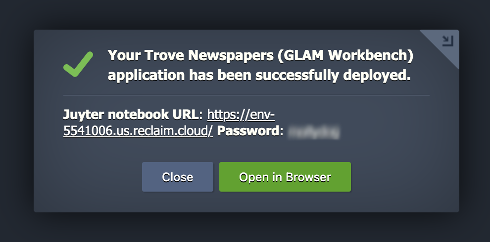
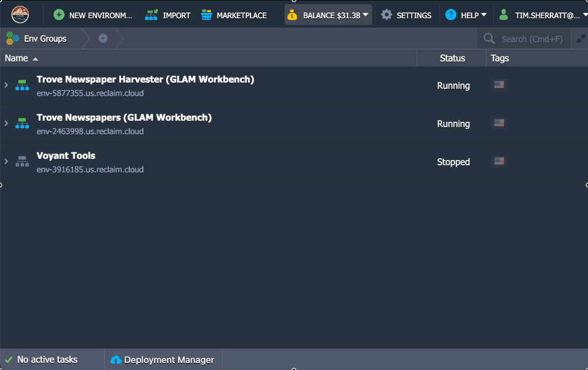
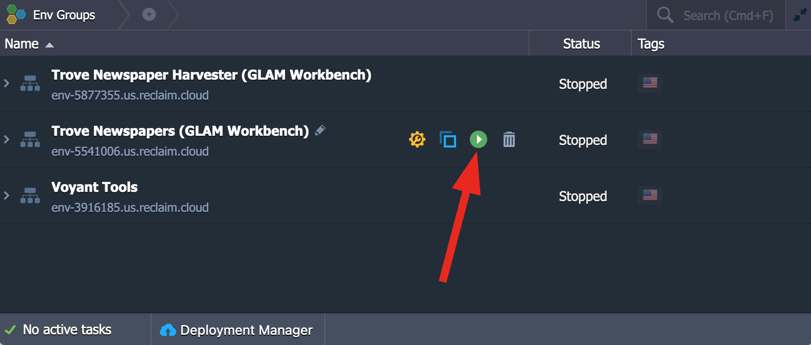
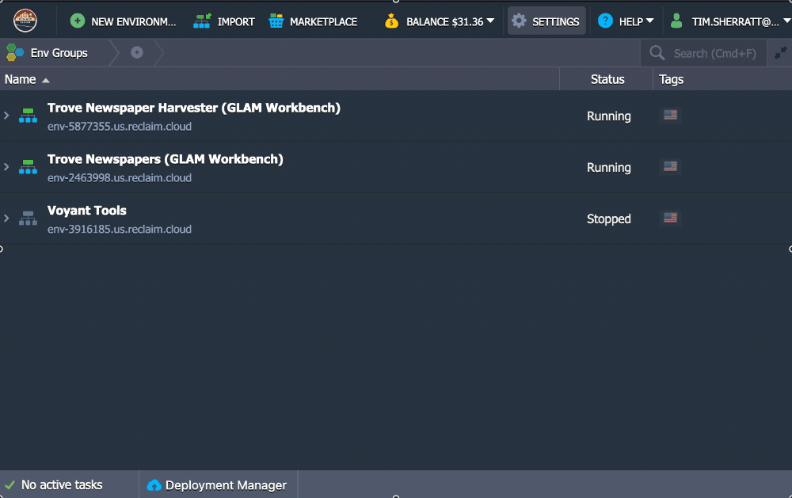
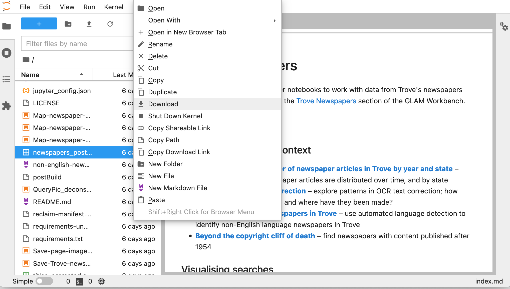
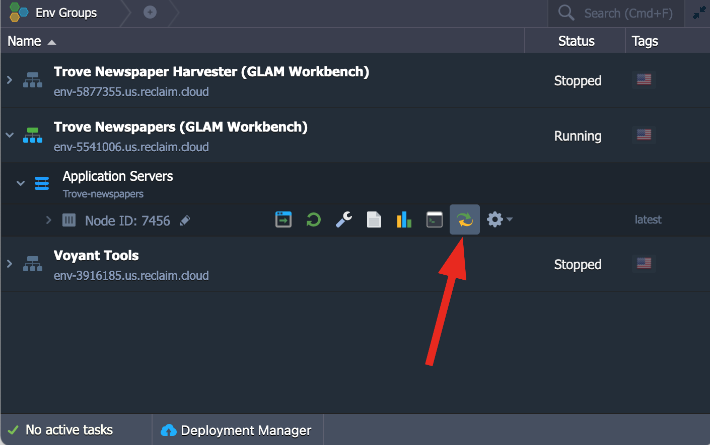
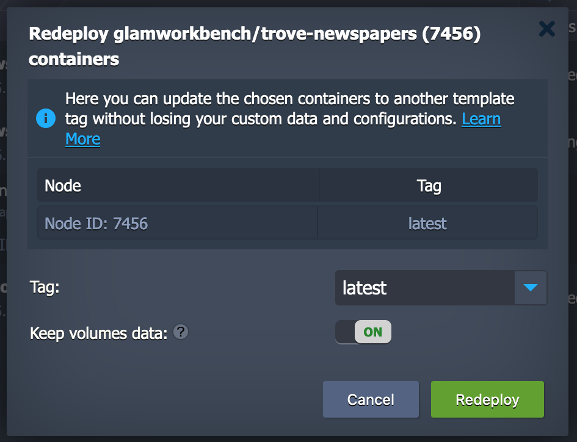

## Using Binder

[Binder](https://mybinder.org/) is a cloud-based service for running Jupyter notebooks.  There are two ways to launch Binder from the GLAM Workbench. Each section in the workbench includes a  button – just click it to start Jupyter in Binder. All the notebooks in that section will be ready to run from the Jupyter interface.

Alternatively, you can click the 'Run using Binder' link underneath each listed notebook. This will also start Jupyter in Binder, but will then open your selected notebook. All the other notebooks in the section will still be available from the Jupyter interface (unless you're running in Appmode).

In both cases, launching Binder will create a customised computing environment loaded with all the software you need to run the notebooks in that section. Binder can sometimes take a little while to get everything ready, so you might be waiting 30 seconds or more. Just be patient! Binder is a free service, but sessions will close if you stop using the notebooks, and no data will be saved. Make sure you download any changed notebooks or harvested data you want to save.

The links to Binder help you get up and running quickly. One click and you're working live with a Jupyter notebook. I often use the Binder links to run notebooks, even though I have all the code on my own machine – it's just so easy. But Binder has limits. If you're doing sustained work using one of the repositories in the GLAM Workbench, you might want to create a persistent environment that saves what you do, as you do it. There are a number of ways of setting that up. They're listed below from easiest to most complicated (ie requiring more technical knowledge).

## Using Reclaim Cloud

[Reclaim Cloud](https://reclaim.cloud/) is a paid hosting service, aimed particularly at supporting digital scholarship in the humanities. Like Binder, you can easily create customised computing environments loaded with all the software you need. But unlike Binder, the environments you create on Reclaim Cloud will save all your data – even if you switch them off!

!!! warning "Under construction"
    I'm still adding the necessary configuration files to all the GLAM Workbench repositories. If you don't see an option to launch on Reclaim Cloud, it means I haven't set that section up yet.

### Quick start

Each section in the GLAM Workbench will eventually include a  button. To create your own version of the repository in Reclaim Cloud:

* Create a [Reclaim Cloud](https://reclaim.cloud/) account and log in.
* Go to the section of the GLAM Workbench you want to run and click on the  button to start the installation process.
* The Reclaim Cloud interface will open, and a dialogue box will ask you to set a password, this is used to limit access to your Jupyter installation so keep the password somewhere safe. You can also change the name and location of your environment if you want. Once you've finished click **Install**.

    

* Now just sit back and wait for the installation to complete!

    

* Once the installation is finished you can click on the **Open in Browser** button of your newly created environment.

    

!!! warning "Error when you click on **Open in browser**"
    There's a bit of a delay between the installation finishing and the environment actually being ready to run. This means that nothing might seem to happen when you click on **Open in browser**, and you might even get an error message. **Don't worry if this happens!** Just wait a few minutes and then try again.

You only need to run the installation process once! Your environment will remain active until you choose to stop or delete it. You can bookmark your new environment's url to come back to it later. You can also access it through the Reclaim Cloud control panel as described below.

### Stopping your Reclaim Cloud environment

Reclaim Cloud only makes you pay for resources that you use, so you can limit what you spend by simply turning off your environments when they're not in use. This is as easy as clicking the **Stop** button. Don't worry, your data will still be there next time you start it up.

* Hover over the name of your environment in the control panel to display the option buttons.
* Click on the **Stop** button.
* Click on **Yes** to confirm.

    

### Restarting your Reclaim Cloud environment

To restart your environment, click the **Start** button!

* Hover over the name of your environment in the control panel to display the option buttons.

    

* Click on the **Start** button.
* Click on **Yes** to confirm.

Once your environment has started, you can then click on the **Open in browser** button to open Jupyter and load up the GLAM Workbench repository. Once again, you might need to wait a few minutes between restarting the environment, and opening the repository.

* Hover over the name of your environment in the control panel to display the option buttons.
* Click on the **Open in browser** button.

    

### Managing your files

Any data you download or changes you make to notebooks will be saved within your environment, even when it's switched off. However, you'll probably want to download files from your Reclaim Cloud environment to your own computer. The easiest way to do this is from within the Jupyter interface. Most of the notebooks in the GLAM Workbench will display download links when you create a new dataset. But you can also just use the file explorer built into Jupyter Lab.

* Right click on a file in the file explorer.
* Select **Download**.

  

Reclaim Cloud gives you 10gb of disk space for free. If you go beyond that, you'll pay per gigabyte/month, even when your environment isn't running. So if you're creating big datasets you'll probably want to download them, and delete them from the environment. Once again, you can use the Jupyter Lab file explorer to delete unwanted files.

### Updating a GLAM Workbench environment

When you create your Reclaim Cloud environment, you grab a copy of a repository in the GLAM Workbench. But what happens when the GLAM Workbench is updated? How do you get the latest version of the repository in your Reclaim Cloud environment?

You have two options.

1. Create an entirely new environment based on the updated repository.
2. Update the Jupyter node within an existing environment.

#### Create an entirely new environment based on the updated repository (easy)

There's no reason why you can't have multiple environments running different versions of the same GLAM Workbench repository. Just follow the 'Quick start' instructions above to install the latest version – changing the name in the installation dialogue box so you can tell the versions apart.

#### Update the Jupyter node within an existing environment

If you've modified or added notebooks, you might prefer to update an existing environment. To do this you need to understand a couple of things. First, Reclaim Cloud environments are essentially wrappers around application 'nodes'. One environment might contain multiple nodes, each running a different application. The GLAM Workbench environments contain a single node that packages up everything you need to run Jupyter and the GLAM Workbench notebooks. It's possible to update this node, without changing the environment.

But if you simply update the node, then all of your changes will be lost. To preserve them between updates you have to move them outside of the Jupyter node. For this reason, the GLAM Workbench installation process creates a special directory called `work`. You'll see it in the Jupyter file explorer. But while you can see `work` from within Jupyter, it's actually sitting outside the node. Anything saved in the `work` directory exists independently of the node.

So, to update a GLAM Workbench repository:

* Copy any modified notebooks or datasets that you want to keep to the `work` directory.
* Click on the **>** arrow next to the environment name to show the node.

    

* Hover over the node name to show the option buttons.
* Click on **Redeploy** button
* A dialogue box will pop up. Make sure 'Keep volumes data' is set to 'ON'.

    

* Click on the **Redeploy** button.
* Click **Yes** to confirm.
* The Reclaim Cloud control panel will let you know when the node has been updated. Once again, you might have to wait a couple of minutes before you can run it in your browser.
* Note that your password, and the url of your Jupyter instance will not have changed, but the notebooks will have been updated.
* You can now copy your modifications back from `work` to the main directory.

### Using SSH and Rsync to save files (advanced)

If you want to maintain a complete backup of the files in your Reclaim Cloud environment on your local computer you can use Rsync. It's not difficult to set up, but you do need to be comfortable using the command line, and have some understanding of things like SSH keys.

* Hover over the name of your environment in the control panel to display the option buttons.
* Click on the **Settings** button. A new box will open at the bottom of the control panel with all the settings options.
* Click on 'SSH Access' in the left hand menu of the settings box.
* If you haven't done so already, you'll need to add a SSH key to your environment. First click on the 'Public Keys tab'.
* Now copy and paste you public key into the 'Key' box. If you don't have a SSH key, or you're not sure how to find it, have a look at [this guide from GitHub](https://docs.github.com/en/github/authenticating-to-github/generating-a-new-ssh-key-and-adding-it-to-the-ssh-agent).
* Click on the **Add** button.
* Now we need to get the configuration details for Rsync. Click on the 'SFTP / Direct SSH Access' tab.
* We need three pieces of information – 'Host', 'Username', and 'Port'. Use these values to construct the Rsync command like this:

    ```
    rsync -avhz -e "ssh -p [PORT]" [USERNAME]@[HOST]:/home/jovyan/ [YOUR LOCAL DIRECTORY]
    ```

* Run this command from the command line to download all the GLAM Workbench files in your Reclaim Cloud environment to a local directory.
* Run this command regularly to keep the files synchronised.


## Using Docker


## Using SWAN


## Using Python on your own computer

It's best to keep your GLAM Workbench repositories in separate virtual environments. This means you can install the software versions that you need without upsetting anything else. For example, if you wanted to set up your own version of the [Trove newspapers](https://glam-workbench.github.io/trove-newspapers/) repository, you'd start by creating a new virtual environment.

``` shell
python3 -m venv trove-newspapers
cd trove-newspapers
source bin/activate
```

You can then clone the GitHub repository into your virtual environment.

``` shell
git clone https://github.com/GLAM-Workbench/trove-newspapers.git
```

!!! tip "Finding the clone url"

    To get the url you need to `clone` one of the GLAM Workbench's GitHub repositories, just do the following:

    * Go to the section of the GLAM Workbench you want to clone.
    * Click on the repository link in the top menu bar (look for the Octocat! <svg viewBox="0 0 24 24" width="20" height="20"><use xlink:href="#__github" width="24" height="24"></use></svg>)
    * Click on the green **Clone or download** button and copy the link.

Each repository in the GLAM Workbench contains a `requirements.txt` file that lists all of the Python packages needed to run the notebooks. Use `cd` to move into the cloned folder and then use `pip` to install everything you need.

``` shell
cd trove-newspapers
pip install -r requirements.txt
```

### Using Anaconda on your own computer

~~~ Coming soon ~~~
