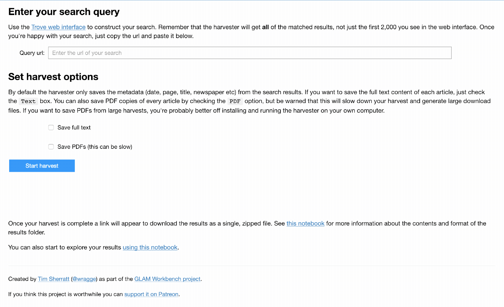

Download large quantities of digitised newspaper articles from Trove using the [Trove Harvester](https://github.com/wragge/troveharvester) tool.

## Tools, tips, and examples

### Using TroveHarvester to get newspaper articles in bulk  
An introduction to the Trove Harvester command line tool. Edit a few cells and you'll be harvesting metadata and full text of thousands of newspaper articles in minutes.

* [Download from GitHub](https://github.com/GLAM-Workbench/trove-newspaper-harvester/blob/master/Using-TroveHarvester-to-get-newspaper-articles-in-bulk.ipynb)
* [View using NBViewer](https://nbviewer.jupyter.org/github/GLAM-Workbench/trove-newspaper-harvester/blob/master/Using-TroveHarvester-to-get-newspaper-articles-in-bulk.ipynb)
* [Run live on Binder](https://mybinder.org/v2/gh/GLAM-Workbench/trove-newspaper-harvester/master?filepath=Using-TroveHarvester-to-get-newspaper-articles-in-bulk.ipynb)

### Trove Harvester web app
A simple web interface to the TroveHarvester, the easiest way to harvest data from Trove.

* [Download from GitHub](https://github.com/GLAM-Workbench/trove-newspaper-harvester/blob/master/newspaper_harvester_app.ipynb)
* [View using NBViewer](https://nbviewer.jupyter.org/github/GLAM-Workbench/trove-newspaper-harvester/blob/master/newspaper_harvester_app.ipynb)
* [Run live on Binder in Appmode](https://mybinder.org/v2/gh/GLAM-Workbench/trove-newspaper-harvester/master?urlpath=%2Fapps%2Fnewspaper_harvester_app.ipynb)

### Exploring your TroveHarvester data
This notebook shows some ways in which you can analyse and visualise the article metadata you've harvested — show the distribution of articles over time and space; find which newspapers published the most articles. (Under construction)

* [Download from GitHub](https://github.com/GLAM-Workbench/trove-newspaper-harvester/blob/master/Exploring-your-TroveHarvester-data.ipynb)
* [View using NBViewer](https://nbviewer.jupyter.org/github/GLAM-Workbench/trove-newspaper-harvester/blob/master/Exploring-your-TroveHarvester-data.ipynb)
* [Run live on Binder](https://mybinder.org/v2/gh/GLAM-Workbench/trove-newspaper-harvester/master?filepath=Exploring-your-TroveHarvester-data.ipynb)

### Exploring harvested text files  
This notebook suggests some ways in which you can aggregate and analyse the individual OCRd text files for each article — look at word frequencies ; calculate TF-IDF values. (Under construction)

* [Download from GitHub](https://github.com/GLAM-Workbench/trove-newspaper-harvester/blob/master/Explore-harvested-text-files.ipynb)
* [View using NBViewer](https://nbviewer.jupyter.org/github/GLAM-Workbench/trove-newspaper-harvester/blob/master/Explore-harvested-text-files.ipynb)
* [Run live on Binder](https://mybinder.org/v2/gh/GLAM-Workbench/trove-newspaper-harvester/master?filepath=Explore-harvested-text-files.ipynb)
