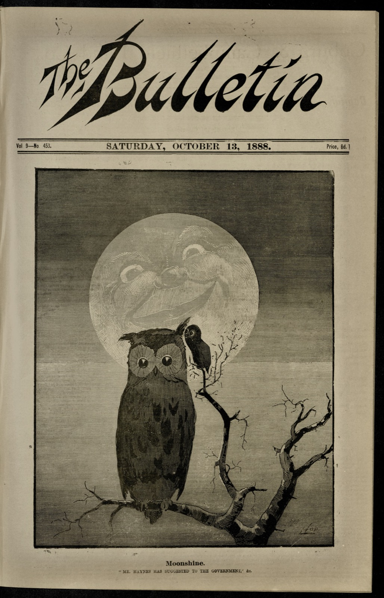

!!! warning

    The language, images, and ideas presented in <i>The Bulletin</i> were often racist, anti-Semitic, and sexist. You won't have to look far within this collection to find something offensive. This was, after all, the journal whose slogan for many years was 'Australia for the white man'.
    
{ width=300 align=right }



