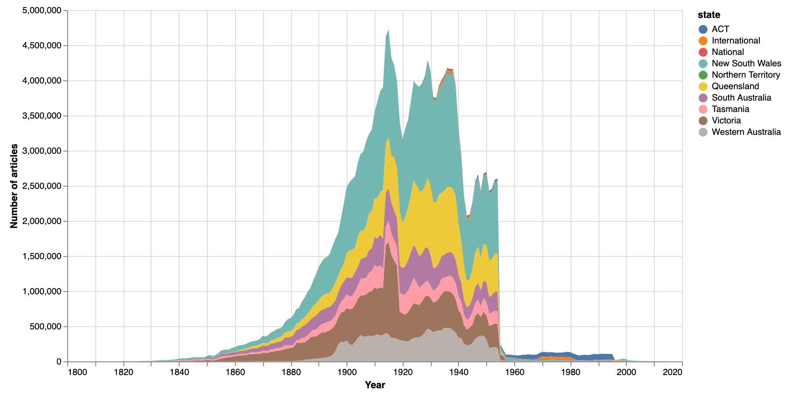
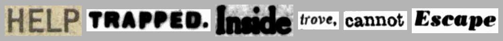

{{ git_latest_tag() }}

Assorted experiments and examples working with Trove’s digitised newspapers.

See below for information on [running these notebooks](#run-these-notebooks) in a live computing environment. Or just take them for a spin using Binder.

[](https://mybinder.org/v2/gh/GLAM-Workbench/trove-newspapers/master?urlpath=lab/tree/index.ipynb)

## Trove newspapers in context

!!! note ""
    Notebooks in this section look at the Trove newspaper corpus as a whole, to try and understand what's there, and what's not.

### Visualise the total number of newspaper articles in Trove by year and state
Trove currently includes more 200 million digitised newspaper articles published between 1803 and 2015. In this notebook we explore how those newspaper articles are distributed over time, and by state.

* [Download from GitHub](https://github.com/GLAM-Workbench/trove-newspapers/blob/master/visualise-total-newspaper-articles-by-state-year.ipynb)
* [View using NBViewer](https://nbviewer.jupyter.org/github/GLAM-Workbench/trove-newspapers/blob/master/visualise-total-newspaper-articles-by-state-year.ipynb)
* [Run live on Binder](https://mybinder.org/v2/gh/GLAM-Workbench/trove-newspapers/master?urlpath=lab/tree/visualise-total-newspaper-articles-by-state-year.ipynb)



### Analyse rates of OCR correction  

The full text of newspaper articles in Trove is extracted from page images using Optical Character Recognition (OCR). The accuracy of the OCR process is influenced by a range of factors including the font and the quality of the images. Many errors slip through. Volunteers have done a remarkable job in correcting these errors, but it's a huge task. This notebook explores the scale of OCR correction in Trove.

* [Download from GitHub](https://github.com/GLAM-Workbench/trove-newspapers/blob/master/Analysing_OCR_corrections.ipynb)
* [View using NBViewer](https://nbviewer.jupyter.org/github/GLAM-Workbench/trove-newspapers/blob/master/Analysing_OCR_corrections.ipynb)
* [Run live on Binder](https://mybinder.org/v2/gh/GLAM-Workbench/trove-newspapers/master?urlpath=lab/tree/Analysing_OCR_corrections.ipynb)

### Finding non-English newspapers in Trove

There are a growing number of non-English newspapers digitised in Trove. However, if you're only searching using English keywords, you might never know that they're there. I thought it would be useful to generate a list of non-English newspapers, but it wasn't quite as straightforward as I thought.

* [Download from GitHub](https://github.com/GLAM-Workbench/trove-newspapers/blob/master/find-non-english-newspapers.ipynb)
* [View using NBViewer](https://nbviewer.jupyter.org/github/GLAM-Workbench/trove-newspapers/blob/master/find-non-english-newspapers.ipynb)
* [Run live on Binder](https://mybinder.org/v2/gh/GLAM-Workbench/trove-newspapers/master?urlpath=lab/tree/find-non-english-newspapers.ipynb)

### Beyond the copyright cliff of death  
Most of the newspaper articles on Trove were published before 1955, but there are some from the later period. Let's find out how many, and which newspapers they were published in.

* [Download from GitHub](https://github.com/GLAM-Workbench/trove-newspapers/blob/master/Beyond_the_copyright_cliff_of_death.ipynb)
* [View using NBViewer](https://nbviewer.jupyter.org/github/GLAM-Workbench/trove-newspapers/blob/master/Beyond_the_copyright_cliff_of_death.ipynb)
* [Run live on Binder](https://mybinder.org/v2/gh/GLAM-Workbench/trove-newspapers/master?urlpath=lab/tree/Beyond_the_copyright_cliff_of_death.ipynb)

### Gathering historical data about the addition of newspaper titles to Trove  
The number of digitised newspapers available through Trove has increased dramatically since 2009. Understanding when newspapers were added is important for historiographical purposes, but there's no data about this available directly from Trove. This notebook uses web archives to extract [lists of newspapers in Trove over time](#csv-formatted-lists-of-newspaper-titles-in-trove), and chart Trove's development.

* [Download from GitHub](https://github.com/GLAM-Workbench/trove-newspapers/blob/master/historical-data-newspaper-titles.ipynb)
* [View using NBViewer](https://nbviewer.jupyter.org/github/GLAM-Workbench/trove-newspapers/blob/master/historical-data-newspaper-titles.ipynb)
* [Run live on Binder](https://mybinder.org/v2/gh/GLAM-Workbench/trove-newspapers/master?urlpath=lab/tree/historical-data-newspaper-titles.ipynb)

## Visualising searches

!!! note ""
    Notebooks in this section demonstrate some ways of visualising searches in Trove newspapers – seeing everything rather than just a list of search results.

### QueryPic
This is the latest iteration of QueryPic with many new features. Use it to visualise searches in Trove's newspapers and gazettes, aggregating the number of results by day, month, or year. Simply copy and paste a url from a Trove web search to get started. QueryPic's charts help you explore patterns and trends, and if you find something interesting you can click on a point to view the results in Trove for that time period.

<iframe width="560" height="315" src="https://www.youtube.com/embed/vdyKNowv9gw" title="YouTube video player" frameborder="0" allow="accelerometer; autoplay; clipboard-write; encrypted-media; gyroscope; picture-in-picture" allowfullscreen></iframe>

* [Download from GitHub](https://github.com/GLAM-Workbench/trove-newspapers/blob/master/querypic.ipynb)
* [View using NBViewer](https://nbviewer.jupyter.org/github/GLAM-Workbench/trove-newspapers/blob/master/querypic.ipynb)
* [Run live on Binder in Voila](https://mybinder.org/v2/gh/GLAM-Workbench/trove-newspapers/master?urlpath=voila/render/querypic.ipynb)

### QueryPic Deconstructed  
[QueryPic](http://dhistory.org/querypic/) is a tool I created many years ago to visualise searches in Trove's digitised newspapers. It shows you the number of articles each year that match your query — instead of a page of search results, you see the complete result set. This is an older version of QueryPic that lets you build queries using keywords, states, or newspapers.

* [Download from GitHub](https://github.com/GLAM-Workbench/trove-newspapers/blob/master/QueryPic_deconstructed.ipynb)
* [View using NBViewer](https://nbviewer.jupyter.org/github/GLAM-Workbench/trove-newspapers/blob/master/QueryPic_deconstructed.ipynb)
* [Run live on Binder in Voila](https://mybinder.org/v2/gh/GLAM-Workbench/trove-newspapers/master?urlpath=voila/render/QueryPic_deconstructed.ipynb)


### Visualise Trove newspaper searches over time
This notebook helps you zoom out and explore how the number of Trove newspaper articles in your search results varies over time by using the `decade` and year `facets`. We then combine this approach with other search facets to see how we can slice a set of results up in different ways to investigate historical changes.

* [Download from GitHub](https://github.com/GLAM-Workbench/trove-newspapers/blob/master/visualise-searches-over-time.ipynb)
* [View using NBViewer](https://nbviewer.jupyter.org/github/GLAM-Workbench/trove-newspapers/blob/master/visualise-searches-over-time.ipynb)
* [Run live on Binder](https://mybinder.org/v2/gh/GLAM-Workbench/trove-newspapers/master?urlpath=lab/tree/visualise-searches-over-time.ipynb)


### Map Trove newspaper results by state
Uses the Trove `state` facet to create a choropleth map that visualises the number of search results per state.  

* [Download from GitHub](https://github.com/GLAM-Workbench/trove-newspapers/blob/master/Map-newspaper-results-by-state.ipynb)
* [View using NBViewer](https://nbviewer.jupyter.org/github/GLAM-Workbench/trove-newspapers/blob/master/Map-newspaper-results-by-state.ipynb)
* [Run live on Binder](https://mybinder.org/v2/gh/GLAM-Workbench/trove-newspapers/master?urlpath=lab/tree/=Map-newspaper-results-by-state.ipynb)

### Map Trove newspaper results by place of publication
Uses the Trove `title` facet to find the number of results per newspaper, then merges the results with a dataset of geolocated newspapers to map where articles were published.

* [Download from GitHub](https://github.com/GLAM-Workbench/trove-newspapers/blob/master/Map-newspaper-results-by-place-of-publication.ipynb)
* [View using NBViewer](https://nbviewer.jupyter.org/github/GLAM-Workbench/trove-newspapers/blob/master/Map-newspaper-results-by-place-of-publication.ipynb)
* [Run live on Binder](https://mybinder.org/v2/gh/GLAM-Workbench/trove-newspapers/master?urlpath=lab/tree/Map-newspaper-results-by-place-of-publication.ipynb)


### Map Trove newspaper results by place of publication over time
Adds a time dimension to the examples in the previous notebook to create an animated heatmap.

* [Download from GitHub](https://github.com/GLAM-Workbench/trove-newspapers/blob/master/Map-newspaper-results-by-place-of-publication-over-time.ipynb)
* [View using NBViewer](https://nbviewer.jupyter.org/github/GLAM-Workbench/trove-newspapers/blob/master/Map-newspaper-results-by-place-of-publication-over-time.ipynb)
* [Run live on Binder](https://mybinder.org/v2/gh/GLAM-Workbench/trove-newspapers/master?urlpath=lab/tree/Map-newspaper-results-by-place-of-publication-over-time.ipynb)


## Harvesting data

!!! note ""
    Notebooks in this section help you harvest data relating to Trove's newspapers. To harvest all the newspaper articles from a search, see the [Trove Newspaper and Gazette Harvester](/trove-harvester/).

### Harvest information about newspaper issues
When you search Trove's newspapers, you find articles – these articles are grouped by page, and all the pages from a particular date make up an issue. But how do you find out what issues are available? On what dates were newspapers published? This notebook shows how you can get information about issues from the Trove API.

* [Download from GitHub](https://github.com/GLAM-Workbench/trove-newspapers/blob/master/harvest_newspaper_issues.ipynb)
* [View using NBViewer](https://nbviewer.jupyter.org/github/GLAM-Workbench/trove-newspapers/blob/master/harvest_newspaper_issues.ipynb)
* [Run live on Binder](https://mybinder.org/v2/gh/GLAM-Workbench/trove-newspapers/master?urlpath=lab/tree/harvest_newspaper_issues.ipynb)

### Harvest the issues of a newspaper as PDFs
This notebook harvests issues of a newspaper as PDFs – one PDF per issue. If the newspaper has an long print run, this will consume large amounts of time and disk space, so you might want to limit your harvest by date range.

* [Download from GitHub](https://github.com/GLAM-Workbench/trove-newspapers/blob/master/harvest_newspaper_issues_as_pdfs.ipynb)
* [View using NBViewer](https://nbviewer.jupyter.org/github/GLAM-Workbench/trove-newspapers/blob/master/harvest_newspaper_issues_as_pdfs.ipynb)
* [Run live on Binder](https://mybinder.org/v2/gh/GLAM-Workbench/trove-newspapers/master?urlpath=lab/tree/harvest_newspaper_issues_as_pdfs.ipynb)

### Harvest Australian Women's Weekly covers (or the front pages of any newspaper)
Somewhat confusingly, the *Australian Women's Weekly* is in with Trove's digitised newspapers and not the rest of the magazines. There are notebooks in the GLAM Workbench's journals section to help harvest all of a journal's covers as images, so I thought I should do the same for the Weekly. This notebook can be easily adjusted to download the front pages of any digitised newspaper.

* [Download from GitHub](https://github.com/GLAM-Workbench/trove-newspapers/blob/master/harvest-aww-covers-and-newspaper-front-pages.ipynb)
* [View using NBViewer](https://nbviewer.jupyter.org/github/GLAM-Workbench/trove-newspapers/blob/master/harvest-aww-covers-and-newspaper-front-pages.ipynb)
* [Run live on Binder](https://mybinder.org/v2/gh/GLAM-Workbench/trove-newspapers/master?urlpath=lab/tree/harvest-aww-covers-and-newspaper-front-pages.ipynb)


## Useful tools

!!! note ""
    Notebooks in this section provide useful tools that extend or enhance the Trove web interface and API.

### Save a Trove newspaper article as an image
Sometimes you want to be able to save a Trove newspaper article as an image. Unfortunately, the Trove web interface doesn't make this easy. The 'Download JPG' option actually loads an HTML page, and while you could individually save the images embedded in the HTML page, often articles are sliced up in ways that make the whole thing hard to read and use. This notebook grabs the page on which an article was published, and then crops the page image to the boundaries of the article. The result is a complete, intact image which presents the article as it was originally published. And if the article is split across multiple pages, you'll get one image per page.

* [Download from GitHub](https://github.com/GLAM-Workbench/trove-newspapers/blob/master/Save-Trove-newspaper-article-as-image.ipynb)
* [View using NBViewer](https://nbviewer.jupyter.org/github/GLAM-Workbench/trove-newspapers/blob/master/Save-Trove-newspaper-article-as-image.ipynb)
* [Run live on Binder](https://mybinder.org/v2/gh/GLAM-Workbench/trove-newspapers/master?urlpath=lab/tree/Save-Trove-newspaper-article-as-image.ipynb)
* [Run as an app using Voila](https://trove-newspaper-apps.uw.r.appspot.com/voila/render/Save-Trove-newspaper-article-as-image.ipynb) (the easiest, no code option!)


### Download a page image  
The Trove web interface doesn’t provide a way of getting high-resolution page images from newspapers. This simple app lets you download page images as complete, high-resolution JPG files.

* [Download from GitHub](https://github.com/GLAM-Workbench/trove-newspapers/blob/master/Save-page-image.ipynb)
* [View using NBViewer](https://nbviewer.jupyter.org/github/GLAM-Workbench/trove-newspapers/blob/master/Save-page-image.ipynb)
* [Run as an app using Voila](https://trove-newspaper-apps.uw.r.appspot.com/voila/render/Save-page-image.ipynb)


### Generate an article thumbnail
Generate a nice square thumbnail image for a newspaper article.

* [Download from GitHub](https://github.com/GLAM-Workbench/trove-newspapers/blob/master/Get-article-thumbnail.ipynb)
* [View using NBViewer](https://nbviewer.jupyter.org/github/GLAM-Workbench/trove-newspapers/blob/master/Get-article-thumbnail.ipynb)
* [Run as an app using Voila](https://trove-newspaper-apps.uw.r.appspot.com/voila/render/Get-article-thumbnail.ipynb)

### Upload Trove newspaper articles to Omeka-S
This notebook steps through the process of uploading Trove newspaper articles to your own Omeka-S instance via the API. As well as uploading the article metadata, it attaches image(s) and PDFs of the articles, and creates a linked record for the publishing newspaper. The source of the articles can be a Trove search, a Trove list, a Zotero collection, or just a list of article ids.

* [Download from GitHub](https://github.com/GLAM-Workbench/trove-newspapers/blob/master/Upload-Trove-newspapers-to-Omeka.ipynb)
* [View using NBViewer](https://nbviewer.jupyter.org/github/GLAM-Workbench/trove-newspapers/blob/master/Upload-Trove-newspapers-to-Omeka.ipynb)
* [Run live on Binder](https://mybinder.org/v2/gh/GLAM-Workbench/trove-newspapers/master?urlpath=lab/tree/Upload-Trove-newspapers-to-Omeka.ipynb)


## Tips and tricks

!!! note ""
    Notebooks in this section provide some useful hints to use with the Trove API.

### Today’s news yesterday
Uses the `date` index and the `firstpageseq` parameter to find articles from exactly 100 years ago that were published on the front page. It then selects one of the articles at random and downloads and displays an image of the front page.

* [Download from GitHub](https://github.com/GLAM-Workbench/trove-newspapers/blob/master/Todays-news-yesterday.ipynb)
* [View using NBViewer](https://nbviewer.jupyter.org/github/GLAM-Workbench/trove-newspapers/blob/master/Todays-news-yesterday.ipynb)
* [Run live on Binder](https://mybinder.org/v2/gh/GLAM-Workbench/trove-newspapers/master?urlpath=lab/tree/Todays-news-yesterday.ipynb)

### Create a Trove OCR corrections ticker
Uses the `has:corrections` parameter to get the total number of newspaper articles with OCR corrections, then displays the results, updating every five seconds.

* [Download from GitHub](https://github.com/GLAM-Workbench/trove-newspapers/blob/master/Create-a-Trove-corrections-ticker.ipynb)
* [View using NBViewer](https://nbviewer.jupyter.org/github/GLAM-Workbench/trove-newspapers/blob/mastea-Trove-corrections-ticker.ipynb)
* [Run live on Binder](https://mybinder.org/v2/gh/GLAM-Workbench/trove-newspapers/master?urlpath=lab/tree/Create-a-Trove-corrections-ticker.ipynb)


### Get a list of Trove newspapers that doesn't include government gazettes
The Trove API includes an option to retrieve details of digitised newspaper titles. Version 2 of the API added a separate option to get details of government gazettes. However the original `newspaper/titles` requests actually returns both the newspaper and gazette titles, so there's no way of getting just the newspaper titles. This notebook explains the problem and provides a simple workaround.

* [Download from GitHub](https://github.com/GLAM-Workbench/trove-newspapers/blob/master/Get_newspaper_titles_not_including_gazettes.ipynb)
* [View using NBViewer](https://nbviewer.jupyter.org/github/GLAM-Workbench/trove-newspapers/blob/master/Get_newspaper_titles_not_including_gazettes.ipynb)
* [Run live on Binder](https://mybinder.org/v2/gh/GLAM-Workbench/trove-newspapers/master?urlpath=lab/tree/Get_newspaper_titles_not_including_gazettes.ipynb)

### Get the page coordinates of a digitised newspaper article from Trove
This notebook demonstrates how to find the coordinates of a newspaper article on a digitised page.

* [Download from GitHub](https://github.com/GLAM-Workbench/trove-newspapers/blob/master/trove-newspapers-get-coordinates-of-articles.ipynb)
* [View using NBViewer](https://nbviewer.jupyter.org/github/GLAM-Workbench/trove-newspapers/blob/master/trove-newspapers-get-coordinates-of-articles.ipynb)
* [Run live on Binder](https://mybinder.org/v2/gh/GLAM-Workbench/trove-newspapers/master?urlpath=lab/tree/trove-newspapers-get-coordinates-of-articles.ipynb)

## Get creative

!!! note ""
    Notebooks in this section look at ways you can use data from Trove newspapers in creative ways.

### Make composite images from lots of Trove newspaper thumbnails
This notebook starts with a search in Trove's newspapers. It uses the Trove API to work its way through the search results. For each article it creates a thumbnail image using the code from this notebook. Once this first stage is finished, you have a directory full of lots of thumbnails. The next stage takes all those thumbnails and pastes them one by one into a BIG image to create a composite, or mosaic.

* [Download from GitHub](https://github.com/GLAM-Workbench/trove-newspapers/blob/master/Composite-thumbnails.ipynb)
* [View using NBViewer](https://nbviewer.jupyter.org/github/GLAM-Workbench/trove-newspapers/blob/master/Composite-thumbnails.ipynb)
* [Run live on Binder](https://mybinder.org/v2/gh/GLAM-Workbench/trove-newspapers/master?urlpath=lab/tree/Composite-thumbnails.ipynb)

<iframe allowfullscreen="true" src="https://easyzoom.com/embed/139535" width="800" height="400"></iframe>

### Create 'scissors and paste' messages from Trove newspaper articles



When you search for a term in Trove's digitised newspapers and click on individual article, you'll see your search terms are highlighted. If you look at the code you'll see the highlighted box around the word includes its page coordinates. That means that if we search for a word, we can find where it appears on a page, and by cropping the page to those coordinates we can create an image of an individual word. By combining these images we can create scissors and paste style messages!

* [Download from GitHub](https://github.com/GLAM-Workbench/trove-newspapers/blob/master/trove-newspapers-scissors-and-paste.ipynb)
* [View using NBViewer](https://nbviewer.jupyter.org/github/GLAM-Workbench/trove-newspapers/blob/master/trove-newspapers-scissors-and-paste.ipynb)
* [Run live on Binder in Voila](https://mybinder.org/v2/gh/GLAM-Workbench/trove-newspapers/master?urlpath=voila/render/trove-newspapers-scissors-and-paste.ipynb)

### Create large composite images from snipped words


This is a variation of the 'scissors & paste' notebook that extracts words from Trove newspaper images and compiles them into messages. In this notebook, you can harvest multiple versions of a list of words and compile them all into one big image.

* [Download from GitHub](https://github.com/GLAM-Workbench/trove-newspapers/blob/master/trove-newspapers-create-composite-from-words.ipynb)
* [View using NBViewer](https://nbviewer.jupyter.org/github/GLAM-Workbench/trove-newspapers/blob/master/trove-newspapers-create-composite-from-words.ipynb)
* [Run live on Binder](https://mybinder.org/v2/gh/GLAM-Workbench/trove-newspapers/master?urlpath=lab/tree/trove-newspapers-create-composite-from-words.ipynb)

## Data and images

### Total number of issues per year for every newspaper in Trove
Harvested 18 October 2021

CSV formatted dataset containing the number of newspaper issues available on Trove, totalled by title and year – comprises 27,615 rows with the fields:

* `title` – newspaper title
* `title_id` – newspaper id
* `state` – place of publication
* `year` – year published
* `issues` – number of issues

Download from Cloudstor: [newspaper_issues_totals_by_year_20211018.csv](https://cloudstor.aarnet.edu.au/plus/s/e4IdDT8Zbg0A27S) (2.1mb)

### Complete list of issues for every newspaper in Trove
Harvested 18 October 2021

CSV formatted dataset containing a complete list of newspaper issues available on Trove – comprises 2,655,664 rows with the fields:

* `title` – newspaper title
* `title_id` – newspaper id
* `state` – place of publication
* `issue_id` – issue identifier
* `issue_date` – date of publication (YYYY-MM-DD)

To keep the file size down, I haven't included an `issue_url` in this dataset, but these are easily generated from the `issue_id`. Just add the `issue_id` to the end of `http://nla.gov.au/nla.news-issue`. For example: http://nla.gov.au/nla.news-issue495426. Note that when you follow an issue url, you actually get redirected to the url of the first page in the issue.

Download from Cloudstor: [newspaper_issues_20211018.csv](https://cloudstor.aarnet.edu.au/plus/s/YjKNqjWqCYkdInI) (222mb)

### CSV formatted lists of newspaper titles in Trove

Data showing when newspaper titles were (approximately) added to Trove, extracted from web archive captures. See [this notebook](#gathering-historical-data-about-the-addition-of-newspaper-titles-to-trove) for more information.

* [trove_newspaper_titles_2009_2021.csv](https://github.com/GLAM-Workbench/trove-newspapers/blob/master/trove_newspaper_titles_2009_2021.csv) – complete dataset of captures and titles
* [trove_newspaper_titles_first_appearance_2009_2021.csv](https://github.com/GLAM-Workbench/trove-newspapers/blob/master/trove_newspaper_titles_first_appearance_2009_2021.csv) – filtered dataset, showing only the first appearance of each title / place / date range combination

There is also an [alphabetical list of newspaper titles](https://gist.github.com/wragge/7d80507c3e7957e271c572b8f664031a), showing approximately when they first appeared in Trove.

### CSV formatted list of Australian Women's Weekly issues, 1933 to 1982
Harvested: 26 July 2020

[This file](https://github.com/GLAM-Workbench/trove-newspapers/blob/58307d3ccae4d2c939ecb6aff59944f27d213842/data/aww-issues.csv) includes metadata for 2,566 issues of the Australian Women's Weekly from 1933 to 1982. Fields:

* `issue_id`: issue identifier
* `date`: issue date (YYYY-MM-DD)
* `url`: issue url
* `page_id`: identifier of the first page in this issue
* `image_file`: file name of downloaded image of front page.

### Australian Women's Weekly front covers, 1933 to 1982
Harvested: 26 July 2020

Using the notebook above, images of the front covers of Australian Women's Weekly issues on Trove were downloaded. Harvest details:

* 2,566 images were downloaded.
* The full set of images is [available from Cloudstor](https://cloudstor.aarnet.edu.au/plus/s/NaKjoKNFOGXXDNN).
* For easy browsing, I've compiled the images into a set of PDF files, one for each decade, available from Dropbox:
  * [1933 to 1939](https://www.dropbox.com/s/0j6zpeuw6tbey5k/aww-1933-1939.pdf?dl=0)
  * [1940 to 1949](https://www.dropbox.com/s/y1he8dd6h655weu/aww-1940-1949.pdf?dl=0)
  * [1950 to 1959](https://www.dropbox.com/s/i9gp9i51nofmlqo/aww-1950-1959.pdf?dl=0)
  * [1960 to 1969](https://www.dropbox.com/s/2of63tovcnphijo/aww-1960-1969.pdf?dl=0)
  * [1970 to 1979](https://www.dropbox.com/s/f2yxpg8u4dx5uf2/aww-1970-1979.pdf?dl=0)
  * [1980 to 1982](https://www.dropbox.com/s/xanohtas1fi7eu4/aww-1980-1982.pdf?dl=0)

### Trove newspapers with non-English language content

Updated: 27 April 2021

Markdown formatted [list of newspapers with non-English content](https://gist.github.com/wragge/9aa385648cff5f0de0c7d4837896df97), created using the notebook above.

### Trove newspapers with articles published after 1954

Updated: 27 April 2021

[CSV file](https://github.com/GLAM-Workbench/trove-newspapers/blob/master/newspapers_post_54.csv) containing a list of digitised newspapers in Trove with articles published after 1954 (the copyright cliff of death).

## Run these notebooks

There are a number of different ways to use these notebooks. Binder is quickest and easiest, but it doesn't save your data. I've listed a number of options below from easiest to most complicated (requiring more technical knowledge). See the [running Jupyter notebooks](https://glam-workbench.net/running-notebooks/) page for more details and additional options.

### Using Binder

[](https://mybinder.org/v2/gh/GLAM-Workbench/trove-newspapers/master/?urlpath=lab)

Click on the button above to launch the notebooks in this repository using the [Binder](https://mybinder.org/) service (it might take a little while to load). This is a free service, but note that sessions will close if you stop using the notebooks, and no data will be saved. Make sure you download any changed notebooks or harvested data that you want to save.

See [Using Binder](https://glam-workbench.net/using-binder/) for more information.

### Using Reclaim Cloud

[](https://app.my.reclaim.cloud/?manifest=https://raw.githubusercontent.com/GLAM-Workbench/trove-newspapers/master/reclaim-manifest.jps)

[Reclaim Cloud](https://reclaim.cloud/) is a paid hosting service, aimed particularly at supported digital scholarship in the humanities. Unlike Binder, the environments you create on Reclaim Cloud will save your data – even if you switch them off! To run this repository on Reclaim Cloud for the first time:

* Create a [Reclaim Cloud](https://reclaim.cloud/) account and log in.
* Click on the button above to start the installation process.
* A dialogue box will ask you to set a password, this is used to limit access to your Jupyter installation.
* Sit back and wait for the installation to complete!
* Once the installation is finished click on the 'Open in Browser' button of your newly created environment (note that you might need to wait a few minutes before everything is ready).

See [Using Reclaim Cloud](https://glam-workbench.net/using-reclaim-cloud/) for more information.

### Using the Nectar Cloud

{width="600"}

The [Nectar Research Cloud](https://ardc.edu.au/services/nectar-research-cloud/) (part of the Australian Research Data Commons) provides cloud computing services to researchers in Australian and New Zealand universities. Any university-affiliated researcher can log on to Nectar and receive [up to 6 months of free cloud computing time](https://tutorials.rc.nectar.org.au/allocation-management/03-account-and-trial). And if you need more, you can [apply for a specific project allocation](https://tutorials.rc.nectar.org.au/allocation-management/04-allocation-and-projects).

The GLAM Workbench is available in the Nectar Cloud as a pre-configured application. This means you can get it up and going without worrying about the technical infrastructure – just fill in a few details and you're away! To create an instance of this repository in the Nectar Cloud:

* Log in to the [Nectar Dashboard](https://dashboard.rc.nectar.org.au/) using your university credentials.
* From the Dashboard choose **Applications -> Browse Local**.
* Enter 'GLAM' in the filter box and hit Enter, you should see the GLAM Workbench application.
* Click on the GLAM Workbench application's  **Quick Deploy** button.
* Step through the various [configuration options](https://glam-workbench.net/using-nectar/#setting-up-your-own-glam-workbench-repository). Some options are only available if you have a dedicated project allocation.
* When asked to select a GLAM Workbench repository, choose 'Trove newspapers' from the dropdown list.
* Complete the configuration and deploy your GLAM Workbench instance.
* The url to access your instance will be displayed once it's ready. Click on the url!

See [Using Nectar](https://glam-workbench.net/using-nectar/) for more information.

### Using Docker

You can use Docker to run a pre-built computing environment on your own computer. It will set up everything you need to run the notebooks in this repository. This is free, but requires more technical knowledge – you'll have to install Docker on your computer, and be able to use the command line.

* Install [Docker Desktop](https://docs.docker.com/get-docker/).
* Create a new directory for this repository and open it from the command line.
* From the command line, run the following command:  
  ```
  docker run -p 8888:8888 --name trove-newspapers -v "$PWD":/home/jovyan/work quay.io/glamworkbench/trove-newspapers repo2docker-entrypoint jupyter lab --ip 0.0.0.0 --NotebookApp.token='' --LabApp.default_url='/lab/tree/index.ipynb'
  ```
* It will take a while to download and configure the Docker image. Once it's ready you'll see a message saying that Jupyter Notebook is running.
* Point your web browser to `http://127.0.0.1:8888`

See [Using Docker](https://glam-workbench.net/using-docker/) for more information.

## Contributors

{{ repo_contributors() }}

## Cite as

{{ zenodo_citation() }}
