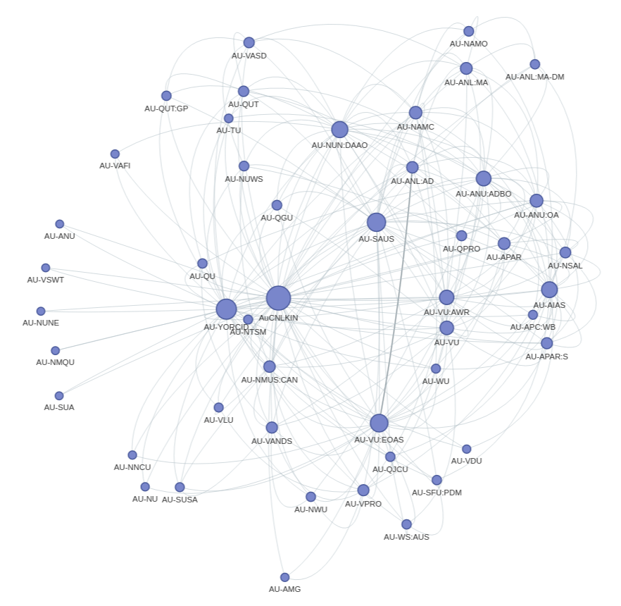

{{ description }}

[Run live on Binder](https://mybinder.org/v2/gh/GLAM-Workbench/{{repo_name}}/master?urlpath=lab%2Ftree%2F{{notebook}}){ .md-button .md-button--primary }

### Other options

* [Download from GitHub](https://github.com/GLAM-Workbench/{{repo_name}}/blob/master/{{notebook}})
* [View using NBViewer](https://nbviewer.jupyter.org/github/{{repo_name}}/blob/master/{{notebook}})

### Additional documentation

* [Run these notebooks](../#run-these-notebooks)

--8<-- "help.md"

## Cite as

{{ zenodo_citation() }}