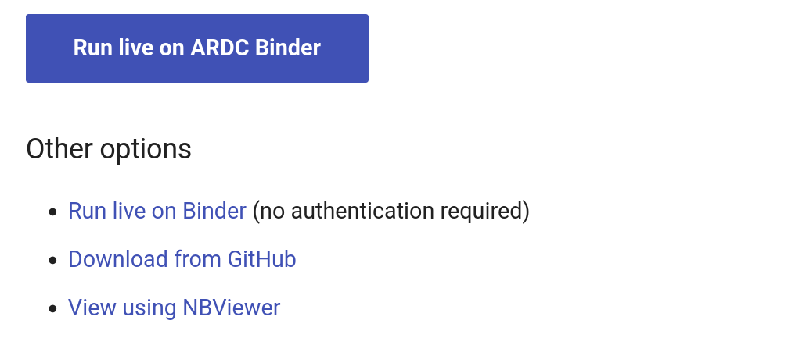
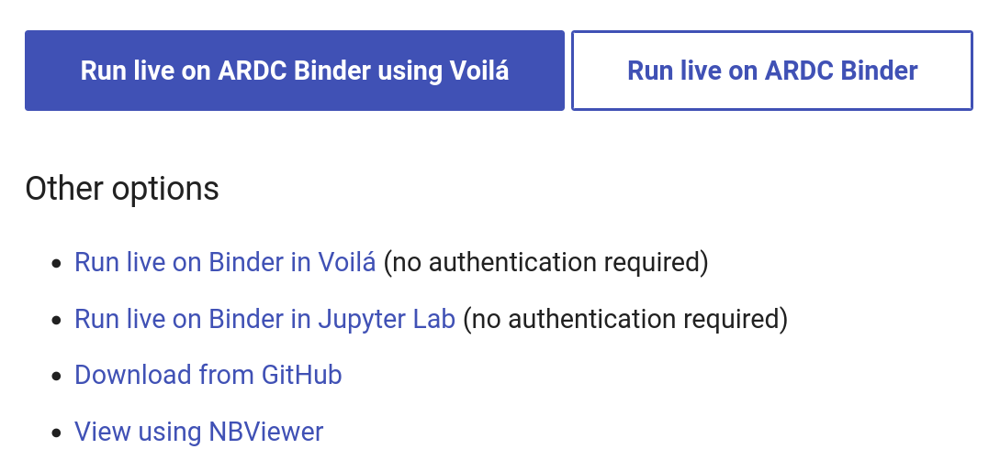
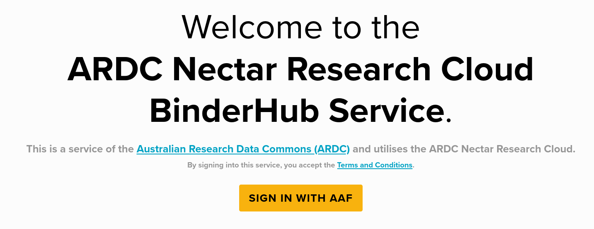

[ARDC BinderHub](https://binderhub.rc.nectar.org.au/) is a cloud-based service for running Jupyter notebooks. It uses the same software as the public service at [mybinder.org](https://mybinder.org), but requires authentication using the Australian Access Federation. It's free to use for researchers in Australian universities and other research agencies. Read more about it in the [ARDC Nectar Support Centre](https://support.ehelp.edu.au/support/solutions/articles/6000264526).

!!! note ""
    The service at [mybinder.org](https://mybinder.org) is currently experiencing [capacity problems](https://blog.jupyter.org/mybinder-org-reducing-capacity-c93ccfc6413f). If you have an account with an Australian university, I'd strongly suggest you try the ARDC BinderHub first.

The ARDC BinderHub service is quick, convenient, and easy to use, but it has important limits. Use it for exploration, workshops, and short-running tasks.

There are two ways to launch ARDC Binder from the GLAM Workbench. Most sections in the workbench include a  button – just click it to start up Jupyter in the ARDC BinderHub service. All the notebooks in that GLAW Workbench section will be ready to run from the Jupyter Lab interface.

Alternatively, you can find your way to a specific notebook and click on the 'Run live on ARDC Binder' button. This will also start Jupyter in the ARDC BinderHub service, but will then open your selected notebook. All the other notebooks in the section will still be available from the Jupyter Lab interface.

<figure markdown>
  { width="600" }
  <figcaption>Just click the ARDC Binder button!</figcaption>
</figure>

Some notebooks are designed to run using Voilá – a Jupyter extension that hides all the code. In that case you'll see two ARDC buttons – one to run the notebook in Voilá and the other to use the standard Jupyter Lab interface. Running in Jupyter Lab will expose all the code and give you access to the other notebooks in the section.

<figure markdown>
  { width="600" }
  <figcaption>Select either Voilá or Jupyter Lab</figcaption>
</figure>

In all cases, launching ARDC BinderHub will create a customised computing environment loaded with all the software you need to run the notebooks in that section. Binder can sometimes take a little while to get everything ready, so just be patient!

## Logging in with AAF

The first time you try to access the ARDC BinderHub service by clicking on one of the GLAM Workbench buttons you'll be asked to sign in using AAF.

<figure markdown>
  { width="600" }
  <figcaption>Sign in using your university log in!</figcaption>
</figure>

Just click on the 'Sign in' button and follow the instructions to supply your institutional login details. Once you're logged in, you'll be redirected back to BinderHub where your Jupyter instance will be launched.

## Limits of the BinderHub service

You can only run one Jupyter instance at a time. So if you click on one of the ARDC Binder buttons in the Trove Newspapers section, then decide you want to run the Trove Journals notebooks instead, you'll probably get an error message reminding you that you already have a running server. You need to stop the first server before launching a new Jupyter instance. Go to the [BinderHub Control Panel](https://binder.rc.nectar.org.au/hub/home) to stop your server.

It's probably a good idea to stop your server when you've finished with it. From the Jupyter Lab interface you can select the **File > Control Panel** menu item, then click the button to stop the server.

**Inactive servers will shutdown automatically** after a certain length of time. So if you stop using the notebooks your session will close and you'll lose any active data. Make sure you download any changed notebooks or harvested data you want to save before you wander off. Most of the notebooks in the GLAM Workbench will display download links when you create a new dataset. But you can also just use the file explorer built into Jupyter Lab.

* Right click on a file in the file explorer.
* Select **Download**.

  

If you're doing sustained work using one of the repositories in the GLAM Workbench, you might want to create a persistent environment that saves what you do, such as [Reclaim Cloud](/using-reclaim-cloud/), [Nectar](/using-nectar/), or [Docker](/using-docker/).
