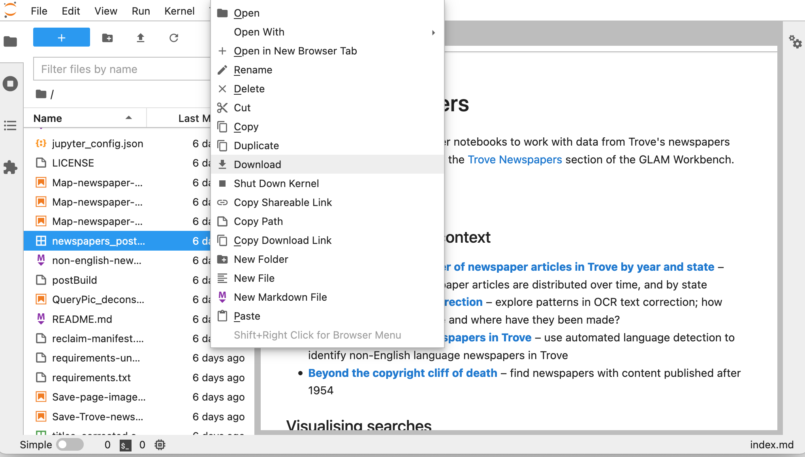

[Binder](https://mybinder.org/) is a cloud-based service for running Jupyter notebooks. It's free and easy to use, but it has important limits. Use it for exploration, workshops, and short-running tasks.

There are two ways to launch Binder from the GLAM Workbench. Each section in the workbench includes a  button – just click it to start Jupyter in Binder. All the notebooks in that section will be ready to run from the Jupyter interface.

Alternatively, you can click the 'Run using Binder' link underneath each listed notebook. This will also start Jupyter in Binder, but will then open your selected notebook. All the other notebooks in the section will still be available from the Jupyter interface (unless you're running in Appmode).

In both cases, launching Binder will create a customised computing environment loaded with all the software you need to run the notebooks in that section. Binder can sometimes take a little while to get everything ready, so you might be waiting 30 seconds or more. Just be patient!

Binder is a free service, but sessions will close if you stop using the notebooks, and no data will be saved. Make sure you download any changed notebooks or harvested data you want to save. Most of the notebooks in the GLAM Workbench will display download links when you create a new dataset. But you can also just use the file explorer built into Jupyter Lab.

* Right click on a file in the file explorer.
* Select **Download**.

  

The links to Binder help you get up and running quickly. One click and you're working live with a Jupyter notebook. I often use the Binder links to run notebooks, even though I have all the code on my own machine – it's just so easy. But Binder has limits. If you're doing sustained work using one of the repositories in the GLAM Workbench, you might want to create a persistent environment that saves what you do, such as [Reclaim Cloud](/using-reclaim-cloud/) or [Docker](/using-docker/).
