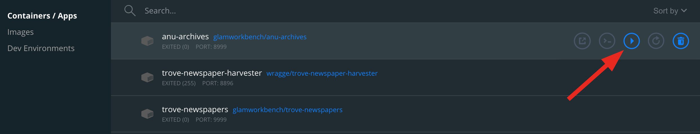

You can use Docker to run a pre-built computing environment on your own computer. It will set up everything you need to run the notebooks in the GLAM Workbench. This is free, but requires more technical knowledge than Binder or Reclaim Cloud – you'll have to install Docker on your computer, and be able to use the command line.

!!! warning "Under construction"
    I'm still adding the necessary configuration files to all the GLAM Workbench repositories. If you don't see an option to use Docker, it means I haven't set that section up yet.

## Quick start

The GLAM Workbench repositories are stored as pre-built 'Images' on [Docker Hub](https://hub.docker.com/u/glamworkbench). To download and run one of these images for the first time, you need to:

* Install [Docker Desktop](https://docs.docker.com/get-docker/).
* Create a new directory to contain your local files, and open it from the command line. This directory will be named `work` in the Jupyter interface.
* From the command line, run the following command, replacing `[REPOSITORY NAME]` with the name of a GLAM Workbench repository, for example, 'trove-newspapers':  
  ```
  docker run -p 8888:8888 --name [REPOSITORY NAME] -v "$PWD":/home/jovyan/work glamworkbench/[REPOSITORY NAME] repo2docker-entrypoint jupyter lab --ip 0.0.0.0 --NotebookApp.token='' --LabApp.default_url='/lab/tree/index.md'
  ```
* It will take a while to download and configure the Docker image. Once it's ready you'll see a message saying that Jupyter Notebook is running.
* Point your web browser to `http://127.0.0.1:8888`
* To stop the container hit ++ctrl+c++, or use one of the methods described below.

## Understanding the `docker run` command

In case you're wondering what all the options after the `docker run` command actually do, I've listed them below.

* `-p 8888:8888` – Sets the port number that you use to access the Jupyter server. If you already have an application using the '8888' port you can change the first value to something else, like '9999'. You'd then access Jupyter at `http://127.0.0.1:9999`.
* `--name [REPOSITORY NAME]` – When you use `docker run` to download and run an image, you create a 'container' that wraps around the image, saving its files and configuration. The `name` value sets the name of this container. You can then use this value to manage the container. You can set the name to anything you want, but naming it after the GLAM Workbench repository seems to make sense.
*  `-v "$PWD":/home/jovyan/work` – This links your current directory to a directory named `work` in the Jupyter interface. This makes it easy to move files between Jupyter and your local filesystem. This is particularly useful if you want to update the underlying Docker image.
* `glamworkbench/[REPOSITORY NAME]` – This is the name of the image you want to install from Docker Hub.
* `repo2docker-entrypoint jupyter lab --ip 0.0.0.0` – This is the command to start up Jupyter Lab. Setting the IP address to '0.0.0.0' ensures that the Jupyter server will be accessible from outside the container.
* `--NotebookApp.token=''` – Because you're running Jupyter locally, there's no reason to secure it with a token or password. This just says that no token is needed.
* `--LabApp.default_url='/lab/tree/index.md'` – This sets a default landing page for Jupyter Lab. You could change this to point to a specific notebook, or just leave it out.

## Restarting an existing container

The first time you download and run a Docker image you use `docker run` as above. But if you try to restart the image with this command, you'll just end up creating another container! To restart an existing container:

* Enter `docker start [YOUR CONTAINER NAME]` at the command line.

Alternatively you can use the Docker app dashboard.

* Click on the Docker icon and select 'Dashboard'.
* Click on the 'Containers' tab.
* Hover over the container you want to restart to show the controls.

    

* Click on the 'Start' button.

Once the container is running:

* Open the Jupyter url in your browser – `http://127.0.0.1:8888` (unless you've changed the port number).

## Stopping a running container

* Enter `docker stop [YOUR CONTAINER NAME]` at the command line.

Alternatively you can use the Docker app dashboard.

* Click on the Docker icon and select 'Dashboard'.
* Click on the 'Containers' tab.
* Hover over the container you want to stop to show the controls.
* Click on the 'Stop' button.

## Managing your files

With the exception of the `work` directory, you can't access files in the Docker container from your local filesystem. So to use files outside of the GLAM Workbench container, you either need to download them from Jupyter, or move them to the `work` directory.

Most of the notebooks in the GLAM Workbench will display download links when you create a new dataset. But you can also just use the file explorer built into Jupyter Lab.

* Right click on a file in the file explorer.
* Select **Download**.

  

To move a file to the `work` folder, just drag and drop it in the Jupyter file explorer.

The `work` directory corresponds to the directory in your local filesystem from which you ran the `docker run` command to download the image and create the container.

## Updating a GLAM Workbench image

When GLAM Workbench repositories are updated, a new Docker image is saved in Docker Hub. How can you update your container to use the latest image?

* First make sure that any modified notebooks or datasets that you want to keep have been copied to the `work` directory. Updating the image will reset the repository, so any changes you've made will be lost unless you save them outside of the container.
* Stop the container if it's running.
* At the command line enter `docker rm [YOUR CONTAINER NAME]` to delete the container.
* If there's an existing image, `docker run` won't download an update. So you first have to enter `docker pull [REPOSITORY NAME]` at the command line. This will download the latest image of the repository.
* Make sure you're in the the `work` directory you created for this repository, and then  use the `docker run` command as you did when you first downloaded the repository:

```
docker run -p 8888:8888 --name [REPOSITORY NAME] -v "$PWD":/home/jovyan/work glamworkbench/[REPOSITORY NAME] repo2docker-entrypoint jupyter lab --ip 0.0.0.0 --NotebookApp.token='' --LabApp.default_url='/lab/tree/index.md'
```

## Need help?

There's more details than you would ever want in the official [Docker docs](https://docs.docker.com/).
