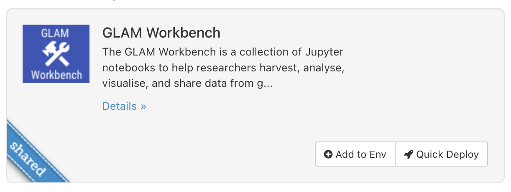
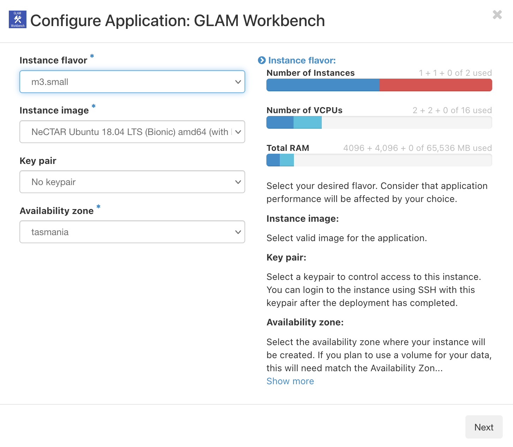
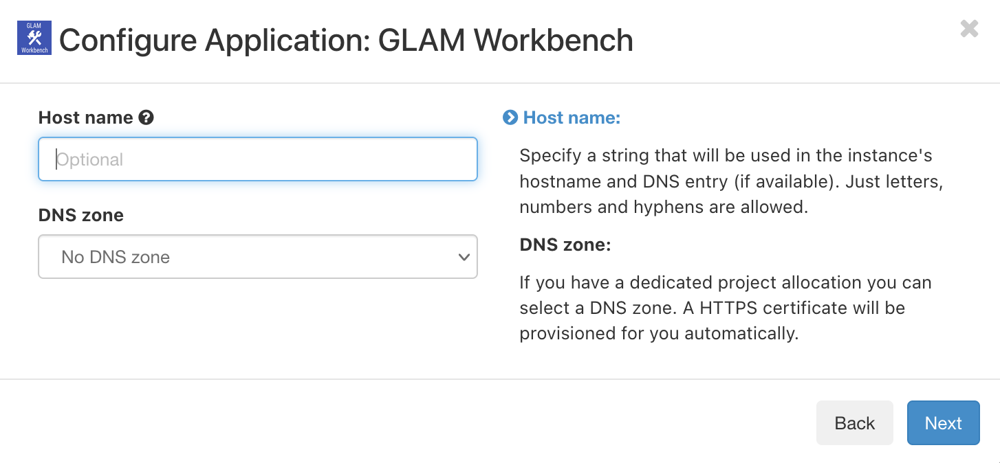
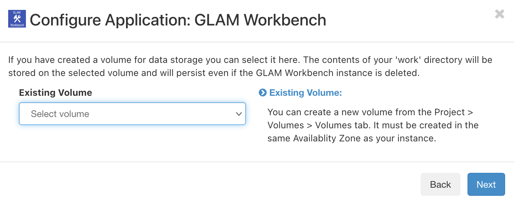
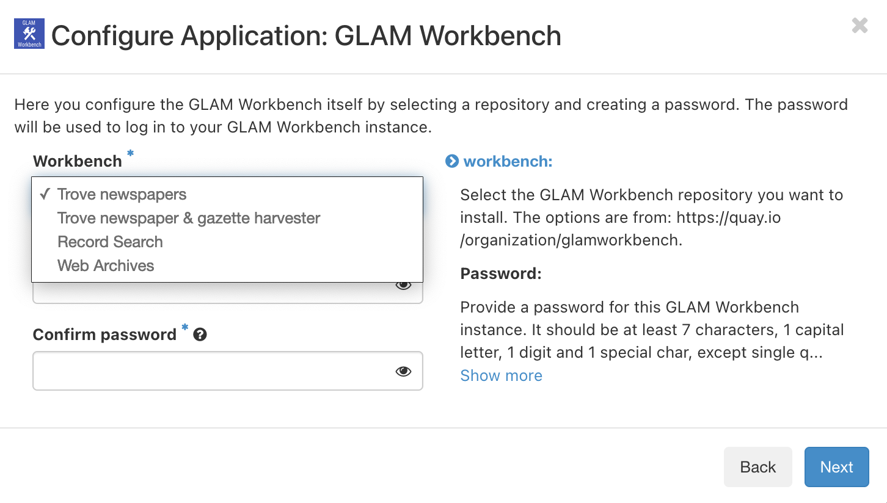
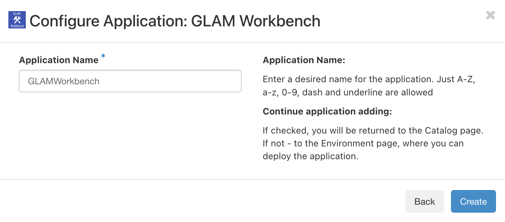
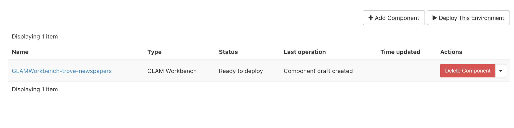
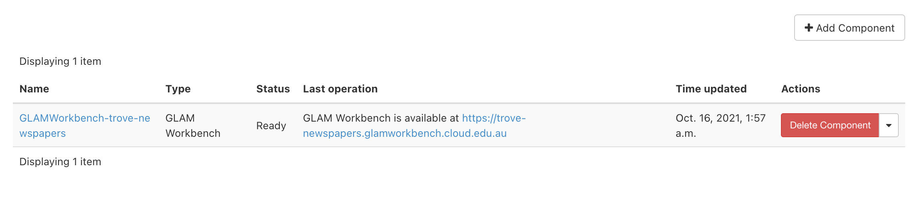
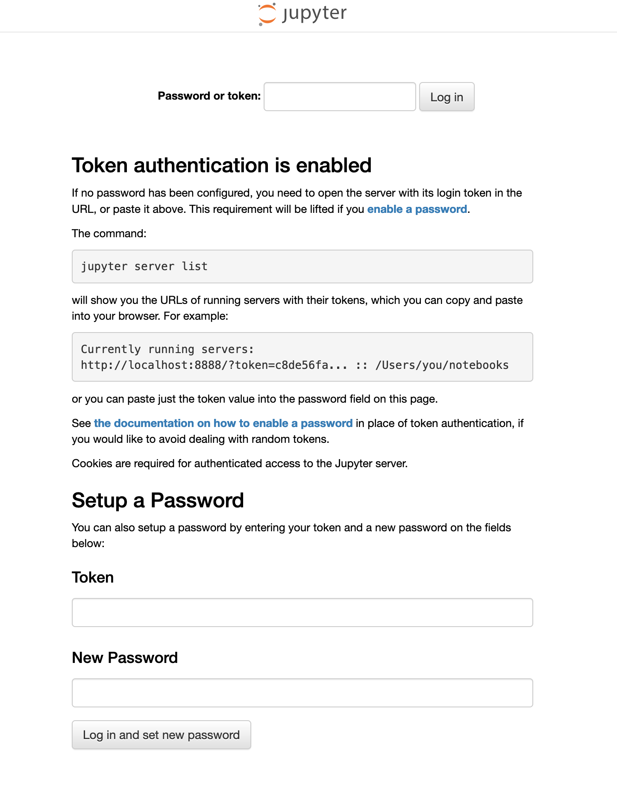

The [Nectar Research Cloud](https://ardc.edu.au/services/nectar-research-cloud/) (part of the Australian Research Data Commons) provides cloud computing services to researchers in Australian and New Zealand universities. Any university-affiliated researcher can log on to Nectar and receive [up to 6 months of free cloud computing time](https://tutorials.rc.nectar.org.au/allocation-management/03-account-and-trial). And if you need more, you can [apply for a specific project allocation](https://tutorials.rc.nectar.org.au/allocation-management/04-allocation-and-projects).

The GLAM Workbench is available in the Nectar Cloud as a pre-configured application. This means you can get it up and going without worrying about the technical infrastructure – just fill in a few details and you're away!

By setting up your own GLAM Workbench repositories in the Nectar Cloud, you can undertake long-running data harvests or manipulate large datasets without worrying about the limits of services such as Binder.

!!! warning "Under construction"
    I'm still adding the necessary configuration files to all the GLAM Workbench repositories. If you don't see an option to launch in the Nectar Cloud, it means I haven't set that section up yet.

See also [Nectar Applications - GLAM workbench](https://support.ehelp.edu.au/support/solutions/articles/6000253108-nectar-applications-glam-workbench) on the ARDC Nectar Research Cloud Support site.

## Setting up your own GLAM Workbench repository

1. Log in to the [Nectar Dashboard](https://dashboard.rc.nectar.org.au/) using your university credentials.
2. From the Dashboard choose **Applications -> Browse Local**.
3. Enter 'GLAM' in the filter box and hit Enter, you should see the GLAM Workbench application.
    {.image-in-list width="600"}
4. Click on the GLAM Workbench application's  **Quick Deploy** button.
5. The first configuration screen sets the details of the computing 'instance' that the GLAM Workbench will run in.
    {.image-in-list width="600"}
    * **Instance flavour** – set to 'm3.small' ([see below](#instance-flavours) for details)
    * **Key pair** – if you've set up an SSH key pair, select it here ([see below](#ssh-key-pairs) for details)
    * Leave the other fields with their default values and click on **Next** to proceed.
6. The second screen changes how your GLAM Workbench repository is accessed via the web. This option is only available if have a dedicated project allocation, so if you're using your 6 month free trial just click **Next** to skip it.
    {.image-in-list width="600"}
    * **Host name** – this is the this is the subdomain that will be used to access your GLAM Workbench instance on the web, it can be anything you want, but only use letters, numbers, and hyphens. For example, if you're installing the Trove Newspaper & Gazette Harvester you might set this to 'trove-harvester'.
    * **DNS zone** – if you select a DNS zone will enable you to access your GLAM Workbench instance on the web using it's domain name and HTTPS. If you have a project allocation, you should see a DNS zone based on your project's name in the dropdown list. Just select this value and click **Next** to proceed.
7. The third configuration screen lets you attach volume storage to your GLAM Workbench instance. This is optional. If you're using your 6 month trial you won't have any volume storage to select. [See below](#persistent-volume-storage) for more details. Click **Next** to proceed.
    {.image-in-list width="600"}
8. The fourth configuration screen sets your GLAM Workbench options.
    {.image-in-list width="600"}
    * **Workbench** – choose the GLAM Workbench repository you want to install from the dropdown list. The options correspond to sections of the GLAM Workbench such as [Trove newspapers](https://glam-workbench.net/trove-newspapers/), [Trove newspaper & gazette harvester](https://glam-workbench.net/trove-harvester/), and [Web archives](https://glam-workbench.net/web-archives/). This list will grow as more sections of the GLAM Workbench are integrated with Nectar.
    * **Password** – this is the password that you'll use to log in to your GLAM Workbench instance, so keep it safe!
9. The final configuration screen sets the name of your new instance. This is the internal name used by the Nectar Control Panel. You might set it to something like  
'GLAMWorkbench-Trove-Harvester'.
    {.image-in-list width="600"}
10. Click **Create** to save your configuration details.
11. You'll see your new instance listed with the status 'Ready to deploy'. Click on the **Deploy this environment** button to start it up.  
    {.image-in-list}
12. Once your instance is ready, you'll see a message saying it's available and a url that points to your very own GLAM Workbench repository. Click on the link to launch it!
    {.image-in-list}
13. The first time you access your GLAM Workbench repository you'll be asked for the password you set in step 8. Enter it in the box at the top of the page.
    {.image-in-list width="600"}
14. Jupyter Lab will now launch and display the available GLAM Workbench notebooks.

## Advanced options

### Instance flavours

Nectar instances come in different shapes and sizes. I've suggested you use 'm3.small' in the setup instructions above because it should have enough resources for the GLAM Workbench, and will extend your free trial period for as long as possible. However, if you find you're hitting the computing limits of your instance, you might want to select something with more oomph. There's a [list of the available instance flavours](https://support.ehelp.edu.au/support/solutions/articles/6000055380-resources-available-to-you) and details of [how to resize your instance](https://tutorials.rc.nectar.org.au/changing-instances/03-resizing) in the Nectar documentation.

### SSH Key Pairs

An SSH Key Pair is a way of authenticating yourself. Setting up a SSH Key Pair will enable you to access your instance from the command line, and make it easier to move your data around. You need to create your key pair before you set up your instance. There's [detailed instructions](https://tutorials.rc.nectar.org.au/keypairs/01-overview) in the Nectar help documentation.

### Persistent volume storage

When you apply to Nectar for a project allocation you can request volume storage. This is basically disk space that lives outside of any application. Any data you save to your volume storage will be preserved, even if you delete or change your instances. You can attach your volume storage to a GLAM Workbench instance by selecting it at step 7 above. Within the Jupyter interface, your volume storage will be accessible through the `work` directory. See the Nectar documentation for [information](https://tutorials.rc.nectar.org.au/volume-storage/01-overview) on managing your volume storage.

## Managing your files

Any data you download or changes you make to notebooks will be saved within your GLAM Workbench instance. However, you'll probably want to download files to your own computer. The easiest way to do this is from within the Jupyter interface. Most of the notebooks in the GLAM Workbench will display download links when you create a new dataset. But you can also just use the file explorer built into Jupyter Lab.

* Right click on a file in the file explorer.
* Select **Download**.

  

## Using SSH and Rsync to move files (advanced)

When you start up Jupyter Lab you'll see a folder called `work` in the file explorer. This is a special folder, because it's a link between your Jupyter environment and the Nectar instance that's wrapped around it. Anything you copy into `work` will be visible from the Nectar instance. So you can use `work` to move or save your data.

If you've set up an SSH Key Pair as described above, you can use a number of tools to move data between your computer and your Nectar instance. The Nectar documentation describes how you can [use `scp` and FileZilla to move data](https://tutorials.rc.nectar.org.au/moving-data/01-overview).

If you want to maintain a complete backup of the files in your `work` folder on your local computer you can use `rsync`. All you need is the full domain name of your GLAM Workbench instance.

```
rsync -avh ubuntu@[your instance domain]:work/ [yourlocaldirectory]
```

* Run this command from the command line to download all the GLAM Workbench files in your `work` folder to a local directory.
* Run this command regularly to keep the files synchronised.

## Need help?

For more information on using the Nectar Cloud see their [help documentation](http://support.nectar.org.au//support/solutions/folders/6000190150) and [tutorials](https://tutorials.rc.nectar.org.au/).
