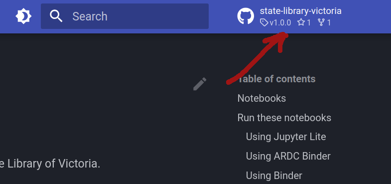
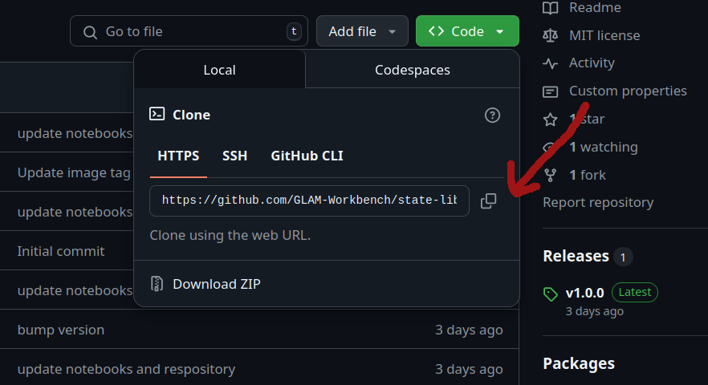

# Using Python on your own computer

To run one of the GLAM Workbench repositories within a dedicated Python environment on your own computer, you need to set up the necessary software. This approach requires familiarity with the command line and the ability to install and manage new software. You will, however, have full control over your working environment.

## Setting up your local environment

I use [pyenv](https://github.com/pyenv/pyenv), [pyenv-virtualenv](https://github.com/pyenv/pyenv-virtualenv), and [pip-tools](https://github.com/jazzband/pip-tools) to create and manage Python versions and environments. If you prefer other tools for managing Python environments, adjust the steps below as required.

GLAM Workbench repositories currently use Python 3.10.12, but later versions should be ok. You can install multiple Python versions using pyenv:
```
pyenv install 3.10.12
```
Go to the GitHub repository of the GLAM Workbench section you're interested in. There's a link to the repository in the top-right navigation bar of each GLAM Workbench section.



Click on the repository's green **Code** button and copy the web url used for cloning.



In a terminal, use `git clone` command to create a local version of the GLAM Workbench repository:
```
git clone https://github.com/GLAM-Workbench/[REPO NAME].git`
```

For example:
```
git clone https://github.com/GLAM-Workbench/state-library-victoria.git`
```

Use `cd` to move into the newly-cloned folder:
```
cd [REPO NAME]
```

For example:
```
cd state-library-victoria
```

Create and activate a Python virtual environment (I find it easiest to name the environment after the repository):
```
pyenv virtualenv 3.10.12 [YOUR ENVIRONMENT NAME]
pyenv local
```

For example:
```
pyenv virtualenv 3.10.12 state-library-victoria
pyenv local
```

Install [pip-tools](https://github.com/jazzband/pip-tools) in the new virtual environment:
```
pip install pip-tools
```

Install all the required Python packages using `pip-sync`:
```
pip-sync requirements.txt dev-requirements.txt
```

## Running Jupyter Lab

* On the command line, run `jupyter lab` – to start Jupyter.
* A browser window should open automatically. If not, copy and paste the url from the command line to your web browser.
* To shut down your Jupyter Lab session hit ++ctrl+c++ on the command line.

## Going further

If you'd like to to modify notebooks and contribute the code back to the GLAM Workbench, see [Contribute code](get-involved/contribute-code.md).

if you'd like to develop your own GLAM Workbench repositories, see [Develop a new repository](get-involved/developing-repositories.md).