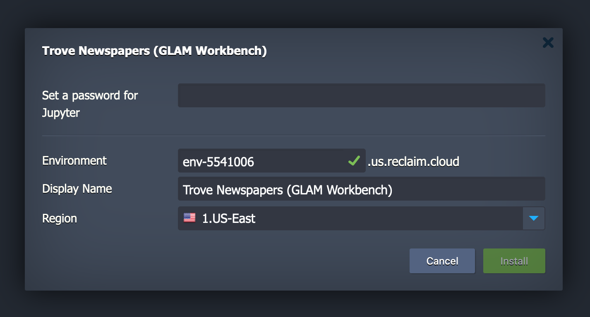
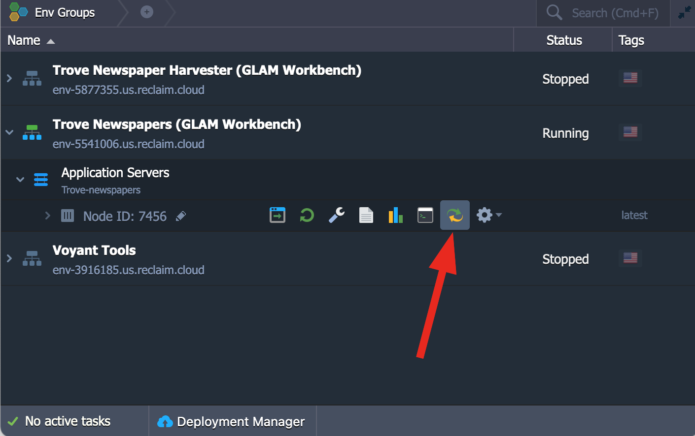

[Reclaim Cloud](https://reclaim.cloud/) is a paid hosting service, aimed particularly at supporting digital scholarship in the humanities. Like Binder, you can easily create customised computing environments loaded with all the software you need. But unlike Binder, the environments you create on Reclaim Cloud will save all your data – even if you switch them off!

!!! warning "Under construction"
    I'm still adding the necessary configuration files to all the GLAM Workbench repositories. If you don't see an option to launch on Reclaim Cloud, it means I haven't set that section up yet.

## Quick start

Each section in the GLAM Workbench will eventually include a  button. To create your own version of the repository in Reclaim Cloud:

* Create a [Reclaim Cloud](https://reclaim.cloud/) account and log in.
* Go to the section of the GLAM Workbench you want to run and click on the  button to start the installation process.
* The Reclaim Cloud interface will open, and a dialogue box will ask you to set a password, this is used to limit access to your Jupyter installation so keep the password somewhere safe. You can also change the name and location of your environment if you want. Once you've finished click **Install**.

    

* Now just sit back and wait for the installation to complete!

    

* Once the installation is finished you can click on the **Open in Browser** button of your newly created environment.

    

!!! warning "Error when you click on **Open in browser**"
    There's a bit of a delay between the installation finishing and the environment actually being ready to run. This means that nothing might seem to happen when you click on **Open in browser**, and you might even get an error message. **Don't worry if this happens!** Just wait a few minutes and then try again.

You only need to run the installation process once! Your environment will remain active until you choose to stop or delete it. You can bookmark your new environment's url to come back to it later. You can also access it through the Reclaim Cloud control panel as described below.

## Stopping your Reclaim Cloud environment

Reclaim Cloud only makes you pay for resources that you use, so you can limit what you spend by simply turning off your environments when they're not in use. This is as easy as clicking the **Stop** button. Don't worry, your data will still be there next time you start it up.

* Hover over the name of your environment in the control panel to display the option buttons.
* Click on the **Stop** button.
* Click on **Yes** to confirm.

    

## Restarting your Reclaim Cloud environment

To restart your environment, click the **Start** button!

* Hover over the name of your environment in the control panel to display the option buttons.

    

* Click on the **Start** button.
* Click on **Yes** to confirm.

Once your environment has started, you can then click on the **Open in browser** button to open Jupyter and load up the GLAM Workbench repository. Once again, you might need to wait a few minutes between restarting the environment, and opening the repository.

* Hover over the name of your environment in the control panel to display the option buttons.
* Click on the **Open in browser** button.

    

## Managing your files

Any data you download or changes you make to notebooks will be saved within your environment, even when it's switched off. However, you'll probably want to download files from your Reclaim Cloud environment to your own computer. The easiest way to do this is from within the Jupyter interface. Most of the notebooks in the GLAM Workbench will display download links when you create a new dataset. But you can also just use the file explorer built into Jupyter Lab.

* Right click on a file in the file explorer.
* Select **Download**.

  

Reclaim Cloud gives you 10gb of disk space for free. If you go beyond that, you'll pay per gigabyte/month, even when your environment isn't running. So if you're creating big datasets you'll probably want to download them, and delete them from the environment. Once again, you can use the Jupyter Lab file explorer to delete unwanted files.

## Updating a GLAM Workbench environment

When you create your Reclaim Cloud environment, you grab a copy of a repository in the GLAM Workbench. But what happens when the GLAM Workbench is updated? How do you get the latest version of the repository in your Reclaim Cloud environment?

You have two options.

1. Create an entirely new environment based on the updated repository.
2. Update the Jupyter node within an existing environment.

### Create an entirely new environment based on the updated repository (easy)

There's no reason why you can't have multiple environments running different versions of the same GLAM Workbench repository. Just follow the 'Quick start' instructions above to install the latest version – changing the name in the installation dialogue box so you can tell the versions apart.

### Update the Jupyter node within an existing environment

If you've modified or added notebooks, you might prefer to update an existing environment. To do this you need to understand a couple of things. First, Reclaim Cloud environments are essentially wrappers around application 'nodes'. One environment might contain multiple nodes, each running a different piece of software. The GLAM Workbench environments contain a single node that packages up everything you need to run the GLAM Workbench notebooks using Jupyter. It's possible to update this node, without changing the environment.

However, updating the node will replace all your files, so any changes will be lost. To preserve your changes between updates you first have to move them outside of the Jupyter node. To help with this, the GLAM Workbench installation process creates a special directory called `work`. You'll see it in the Jupyter file explorer. But while you can see `work` from within Jupyter, it's actually sitting outside the node. Anything you save in the `work` directory won't be replaced when you update the Jupyter node.

So, to update a GLAM Workbench repository:

* Copy any modified notebooks or datasets that you want to keep to the `work` directory.
* Click on the **>** arrow next to the environment name to show the node.

    

* Hover over the node name to show the option buttons.
* Click on **Redeploy** button
* A dialogue box will pop up. Make sure 'Keep volumes data' is set to 'ON'.

    

* Click on the **Redeploy** button.
* Click **Yes** to confirm.
* The Reclaim Cloud control panel will let you know when the node has been updated. Once again, you might have to wait a couple of minutes before you can run it in your browser.
* Note that your password, and the url of your Jupyter instance will not have changed, but the notebooks will have been updated.
* You can now copy your modifications back from `work` to the main directory.

## Resetting your Jupyter password

The Jupyter password you set when you create your Reclaim Cloud environment is stored in the environment's configuration settings. To change it, you need to create a new hashed password, then insert this into the command used to start up Jupyter.

* Hover over the name of your environment in the control panel to display the option buttons.
* Click on the **Settings** button. A new box will open at the bottom of the control panel with all the settings options.

    

* Click on 'SSH Access' in the left hand menu of the settings box.
* Click on the 'SSH Connection' tab.
* Under 'Web SSH' click on the **Connect** button and select the default node.
* A terminal session will open. At the command line enter the following, replacing `[YOUR NEW PASSWORD]` with your new password:

```
python3 -c "from notebook.auth import passwd; print(passwd('[YOUR NEW PASSWORD]', 'sha1'))"
```

* The command will produce a long string of letters and numbers starting with `sha1:`. This is the 'hashed' or encrypted version of your password. Copy the string (including the `sha1:`).
* Now go back to your environment's options buttons and click on 'Change Network Topology'.

    

* From the network topology dialogue box, click on the **More** button.

    

* Select 'CMD / Entry Point' from the menu.

    

* In the 'Run command' box, look for the parameter that starts with `--NotebookApp.password=` and replace the value of this parameter with your newly hashed password.
* Click **Apply** to save your change, and **Apply** again to update the network topology.

## Using SSH and Rsync to save files (advanced)

If you want to maintain a complete backup of the files in your Reclaim Cloud environment on your local computer you can use Rsync. It's not difficult to set up, but you do need to be comfortable using the command line, and have some understanding of things like SSH keys.

* Hover over the name of your environment in the control panel to display the option buttons.
* Click on the **Settings** button. A new box will open at the bottom of the control panel with all the settings options.

    

* Click on 'SSH Access' in the left hand menu of the settings box.
* If you haven't done so already, you'll need to add a SSH key to your environment. First click on the 'Public Keys tab'.

    

* Now copy and paste you public key into the 'Key' box. If you don't have a SSH key, or you're not sure how to find it, have a look at [this guide from GitHub](https://docs.github.com/en/github/authenticating-to-github/generating-a-new-ssh-key-and-adding-it-to-the-ssh-agent).

    

* Click on the **Add** button.
* Now we need to get the configuration details for Rsync. Click on the 'SFTP / Direct SSH Access' tab.

    

* We need three pieces of information – 'Host', 'Username', and 'Port'. Use these values to construct the Rsync command like this:

    ```
    rsync -avhz -e "ssh -p [PORT]" [USERNAME]@[HOST]:/home/jovyan/ [YOUR LOCAL DIRECTORY]
    ```

* Run this command from the command line to download all the GLAM Workbench files in your Reclaim Cloud environment to a local directory.
* Run this command regularly to keep the files synchronised.

## Need help?

For general Reclaim Cloud questions check out the [community forum](https://community.reclaimhosting.com/c/cloud/36).
