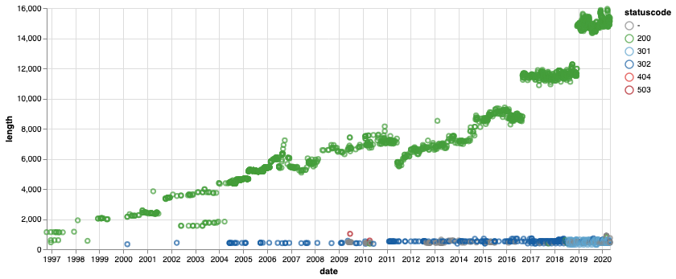

# Web Archives

We tend to think of a web archive as a site we go to when links are broken – a useful fallback, rather than a source of new research data. But web archives don't just store old web pages, they capture multiple versions of web resources over time. Using web archives we can observe change – we can ask historical questions. This collection of notebooks is intended to help historians, and other researchers, frame those questions by revealing what sort of data is available, how to get it, and what you can do with it.

Web Archives share systems and standards, making it much easier for researchers wanting to get their hands on useful data. These notebooks focus on four particular web archives: the [UK Web Archive](https://www.webarchive.org.uk/), the [Australian Web Archive](https://trove.nla.gov.au/website) (National Library of Australia ), the [New Zealand Web Archive](https://natlib.govt.nz/collections/a-z/new-zealand-web-archive) (National Library of New Zealand), and the [Internet Archive](https://archive.org/web/). However, the tools and approaches here could be easily extended to other web archives.

Web archives are huge, and access is often limited for legal reasons. These notebooks focus on data that is readily accessible and able to be used without the need for special equipment. They use existing APIs to get data in manageable chunks. But many of the examples demonstrated can also be scaled up to build substantial datasets for analysis – you just have to be patient!

These notebooks are a starting point that I hope will encourage researchers to investigate the possibilities of web archives in more detail. They're intended to compliment the fabulous work being by projects such as [Archives Unleashed](https://archivesunleashed.org/) to open web archives to new research uses.

The development of these notebooks was supported by the International Internet Preservation Consortium's [Discretionary Funding Programme 2019-2020](http://netpreserve.org/projects/), with the participation of the British Library, the National Library of Australia, and the National Library of New Zealand. Thanks all!

For more information on web archives projects, training, technologies, and standards see the [Awesome Web Archiving](https://github.com/iipc/awesome-web-archiving) list.

----

## Types of data

As noted, we're focusing here on on web archive data that's freely available through APIs. There's also data available through data dumps, such as the [JISC UK Web Domain Dataset (1996-2013)](https://doi.org/10.5259/ukwa.ds.2/1) and the annual web harvests from [Common Crawl](https://commoncrawl.org/), but they tend to be huge.

### Timegates, Timemaps, and Mementos  

*Works with AWA, NZWA, IA, & UKWA*

Systems supporting the Memento protocol provide machine-readable information about web archive captures, even if other APIs are not available. In this notebook we'll look at the way the Memento protocol is supported across four web archive repositories – the UK Web Archive, the National Library of Australia, the National Library of New Zealand, and the Internet Archive.

* [Download from GitHub](https://github.com/GLAM-Workbench/web-archives/blob/master/memento.ipynb)
* [View using NBViewer](https://nbviewer.jupyter.org/github/GLAM-Workbench/web-archives/blob/master/memento.ipynb)
* [Run live on Binder](https://mybinder.org/v2/gh/GLAM-Workbench/web-archives/master?urlpath=/lab/tree/memento.ipynb)

### Exploring the Internet Archive's CDX API

*Works with IA*

Some web archives provide indexes of the web pages they've archived through an API. These CDX APIs can be queried by a number of fields including capture date, url, and mimetype. This notebook looks in detail at the data provided by the Internet Archive's CDX API.

* [Download from GitHub](https://github.com/GLAM-Workbench/web-archives/blob/master/exploring_cdx_api.ipynb)
* [View using NBViewer](https://nbviewer.jupyter.org/github/GLAM-Workbench/web-archives/blob/master/exploring_cdx_api.ipynb)
* [Run live on Binder](https://mybinder.org/v2/gh/GLAM-Workbench/web-archives/master?urlpath=/lab/tree/exploring_cdx_api.ipynb)

### Comparing CDX APIs

*Works with AWA, IA, & UKWA*

This notebook documents differences between the Internet Archive's Wayback CDX API and the PyWb CDX API, such as those available from the UK Web Archive, and the Australian Web Archive.

* [Download from GitHub](https://github.com/GLAM-Workbench/web-archives/blob/master/comparing_cdx_apis.ipynb)
* [View using NBViewer](https://nbviewer.jupyter.org/github/GLAM-Workbench/web-archives/blob/master/comparing_cdx_apis.ipynb)
* [Run live on Binder](https://mybinder.org/v2/gh/GLAM-Workbench/web-archives/master?urlpath=/lab/tree/comparing_cdx_apis.ipynb)

### Timemaps vs CDX APIs

*Works with IA*

Both Timemaps and CDX APIs can give us a list of captures from a particular web page, so I was wondering what the difference was. The answer, from looking at the Internet Archive, is not much.

* [Download from GitHub](https://github.com/GLAM-Workbench/web-archives/blob/master/getting_all_snapshots_timemap_vs_cdx.ipynb)
* [View using NBViewer](https://nbviewer.jupyter.org/github/GLAM-Workbench/web-archives/blob/master/getting_all_snapshots_timemap_vs_cdx.ipynb)
* [Run live on Binder](https://mybinder.org/v2/gh/GLAM-Workbench/web-archives/master?urlpath=/lab/tree/getting_all_snapshots_timemap_vs_cdx.ipynb)

----

## Harvesting data and creating datasets

### Get the archived version of a page closest to a particular date

*Works with AWA, NZWA, IA, & UKWA*

To get the archived version of a page closest to a particular date we can use the Memento API. The functions in this notebook smooth out these variations to provide a (mostly) consistent interface to the UK Web Archive, Australian Web Archive, New Zealand Web Archive, and the Internet Archive. They could be easily modified to work with other Memento-compliant repositories.

* [Download from GitHub](https://github.com/GLAM-Workbench/web-archives/blob/master/get_a_memento.ipynb)
* [View using NBViewer](https://nbviewer.jupyter.org/github/GLAM-Workbench/web-archives/blob/master/get_a_memento.ipynb)
* [Run live on Binder](https://mybinder.org/v2/gh/GLAM-Workbench/web-archives/master?urlpath=/lab/tree/get_a_memento.ipynb)

### Find all the archived versions of a web page

*Works with AWA, NZWA, IA, & UKWA*

You can find all the archived versions of a web page by requesting a Timemap from a Memento-compliant repository. If the repository has a CDX API, you can get much the same data by doing an exact url search. This code and examples in this notebook help you to work with both.

* [Download from GitHub](https://github.com/GLAM-Workbench/web-archives/blob/master/find_all_captures.ipynb)
* [View using NBViewer](https://nbviewer.jupyter.org/github/GLAM-Workbench/web-archives/blob/master/find_all_captures.ipynb)
* [Run live on Binder](https://mybinder.org/v2/gh/GLAM-Workbench/web-archives/master?urlpath=/lab/tree/find_all_captures.ipynb)

### Harvesting collections of text from archived web pages

*Works with AWA, NZWA, IA, & UKWA*

This notebook helps you assemble datasets of text extracted from all available captures of archived web pages. You can then feed these datasets to the text analysis tool of your choice to analyse changes over time.

* [Download from GitHub](https://github.com/GLAM-Workbench/web-archives/blob/master/getting_text_from_web_pages.ipynb)
* [View using NBViewer](https://nbviewer.jupyter.org/github/GLAM-Workbench/web-archives/blob/master/getting_text_from_web_pages.ipynb)
* [Run live on Binder](https://mybinder.org/v2/gh/GLAM-Workbench/web-archives/master?urlpath=/lab/tree/getting_text_from_web_pages.ipynb)

### Harvesting data about a domain using the IA CDX API

*Works with IA*

In this notebook we'll look at how we can get domain level data from the IA CDX API. In most other notebooks using the CDX API we've harvested data into memory and then saved to disk later on. Because we're potentially harvesting much larger quantities of data, we're going to reverse this and save harvested data to disk as we download it.

* [Download from GitHub](https://github.com/GLAM-Workbench/web-archives/blob/master/harvesting_domain_data.ipynb)
* [View using NBViewer](https://nbviewer.jupyter.org/github/GLAM-Workbench/web-archives/blob/master/harvesting_domain_data.ipynb)
* [Run live on Binder](https://mybinder.org/v2/gh/GLAM-Workbench/web-archives/master?urlpath=/lab/tree/harvesting_domain_data.ipynb)

### Find and explore Powerpoint presentations from a specific domain

*Works with IA*

This notebook helps you find, download, and explore all the presentation files captured from a particular domain, like `defence.gov.au`. It includes a series of processing steps to: harvest capture data; remove duplicates from capture data and download files; convert Powerpoint files to PDFs; extract screenshots and text from the PDFs; save metadata, screenshots, and text into an SQLite database; open the SQLite db in Datasette for exploration. Here's an [example of the SQLite database](https://defencegovau-powerpoints.glitch.me/) created by harvesting Powerpoint files from the `defence.gov.au` domain, running in Datasette on Glitch.

* [Download from GitHub](https://github.com/GLAM-Workbench/web-archives/blob/master/explore_presentations.ipynb)
* [View using NBViewer](https://nbviewer.jupyter.org/github/GLAM-Workbench/web-archives/blob/master/explore_presentations.ipynb)
* [Run live on Binder](https://mybinder.org/v2/gh/GLAM-Workbench/web-archives/master?urlpath=/lab/tree/explore_presentations.ipynb)

### Exploring subdomains in the whole of gov.au

*Works with IA*

Most of the notebooks in this repository work with small slices of web archive data. In this notebook we'll scale things up a bit to try and find all of the subdomains that have existed in the gov.au domain. As in other notebooks, we'll obtain the data by querying the Internet Archive's CDX API. The only real difference is that it will take some hours to harvest all the data. Once we have the data we'll do some analysis, and visualise the domain hierarchy as a dendrogram.

* [Download from GitHub](https://github.com/GLAM-Workbench/web-archives/blob/master/harvesting_gov_au_domains.ipynb)
* [View using NBViewer](https://nbviewer.jupyter.org/github/GLAM-Workbench/web-archives/blob/master/harvesting_gov_au_domains.ipynb)
* [Run live on Binder](https://mybinder.org/v2/gh/GLAM-Workbench/web-archives/master?urlpath=/lab/tree/harvesting_gov_au_domains.ipynb)

----

## Exploring change over time

### Compare two versions of an archived web page

*Works with AWA, NZWA, IA, & UKWA*

This notebook demonstrates a number of different ways of comparing versions of archived web pages. Just choose a repository, enter a url, and select two dates to see comparisons based on: page metadata, basic statistics such as file size and number of words, numbers of internal and external links, cosine similarity of text, line by line differences in text or code, and screenshots.

* [Download from GitHub](https://github.com/GLAM-Workbench/web-archives/blob/master/show_diffs.ipynb)
* [View using NBViewer](https://nbviewer.jupyter.org/github/GLAM-Workbench/web-archives/blob/master/show_diffs.ipynb)
* [Run live in Appmode on Binder](https://mybinder.org/v2/gh/GLAM-Workbench/web-archives/master?urlpath=/apps/show_diffs.ipynb)

### Observing change in a web page over time

This notebook explores what we can find when you look at all captures of a single page over time.

* [Download from GitHub](https://github.com/GLAM-Workbench/web-archives/blob/master/change_in_a_page_over_time.ipynb)
* [View using NBViewer](https://nbviewer.jupyter.org/github/GLAM-Workbench/web-archives/blob/master/change_in_a_page_over_time.ipynb)
* [Run live on Binder](https://mybinder.org/v2/gh/GLAM-Workbench/web-archives/master?urlpath=/lab/tree/change_in_a_page_over_time.ipynb)

### Create and compare full page screenshots from archived web pages

*Works with AWA, NZWA, IA, & UKWA*

This notebook makes it easy to create a full page screenshot from an archived web page. You can add additional screenshots to compare captures, versions, and pages.

* [Download from GitHub](https://github.com/GLAM-Workbench/web-archives/blob/master/save_screenshot.ipynb)
* [View using NBViewer](https://nbviewer.jupyter.org/github/GLAM-Workbench/web-archives/blob/master/save_screenshot.ipynb)
* [Run live in Appmode on Binder](https://mybinder.org/v2/gh/GLAM-Workbench/web-archives/master?urlpath=/apps/save_screenshot.ipynb)

### Using screenshots to visualise change in a page over time

*Works with AWA, NZWA, IA, & UKWA*

This notebook helps you visualise changes in a web page by generating full page screenshots for each year from the captures available in an archive. You can then combine the individual screenshots into a single composite image.

* [Download from GitHub](https://github.com/GLAM-Workbench/web-archives/blob/master/screenshots_over_time_using_timemaps.ipynb)
* [View using NBViewer](https://nbviewer.jupyter.org/github/GLAM-Workbench/web-archives/blob/master/screenshots_over_time_using_timemaps.ipynb)
* [Run live on Binder](https://mybinder.org/v2/gh/GLAM-Workbench/web-archives/master?urlpath=/lab/tree/screenshots_over_time_using_timemaps.ipynb)

### Display changes in the text of an archived web page over time

*Works with AWA, NZWA, IA, & UKWA*

This notebook displays changes in the text content of a web page over time. It retrieves a list of available captures from a Memento Timemap, then compares each capture with its predecessor, displaying changes side-by-side.

* [Download from GitHub](https://github.com/GLAM-Workbench/web-archives/blob/master/display-text-changes-from-timemap.ipynb)
* [View using NBViewer](https://nbviewer.jupyter.org/github/GLAM-Workbench/web-archives/blob/master/display-text-changes-from-timemap.ipynb)
* [Run live in Appmode on Binder](https://mybinder.org/v2/gh/GLAM-Workbench/web-archives/master?urlpath=apps/display-text-changes-from-timemap.ipynb)

### Find when a piece of text appears in an archived web page

*Works with AWA, NZWA, IA, & UKWA*

This notebook helps you find when a particular piece of text appears in, or disappears from, a web page. Using Memento Timemaps, it gets a list of available captures from the selected web archive. It then searches each capture for the desired text, displaying the results. You can select the direction in which the notebook searches:

* First occurrence – find the first capture in which the text appears (start from the first capture and come forward in time)
* Last occurrence – find the last capture in which the text appears (start from present and go backwards in time)
* All occurrences – find all matches (start from the first capture and continue until the last)

If you select 'All occurrences' the notebook will generate a simple chart showing how the number of matches changes over time.

* [Download from GitHub](https://github.com/GLAM-Workbench/web-archives/blob/master/find-text-in-page-from-timemap.ipynb)
* [View using NBViewer](https://nbviewer.jupyter.org/github/GLAM-Workbench/web-archives/blob/master/find-text-in-page-from-timemap.ipynb)
* [Run live in Appmode on Binder](https://mybinder.org/v2/gh/GLAM-Workbench/web-archives/master?urlpath=apps/find-text-in-page-from-timemap.ipynb)

## Cite as

Sherratt, Tim, & Jackson, Andrew. (2020, June 15). GLAM-Workbench/web-archives (Version 0.1.1). Zenodo. <http://doi.org/10.5281/zenodo.3894079>

