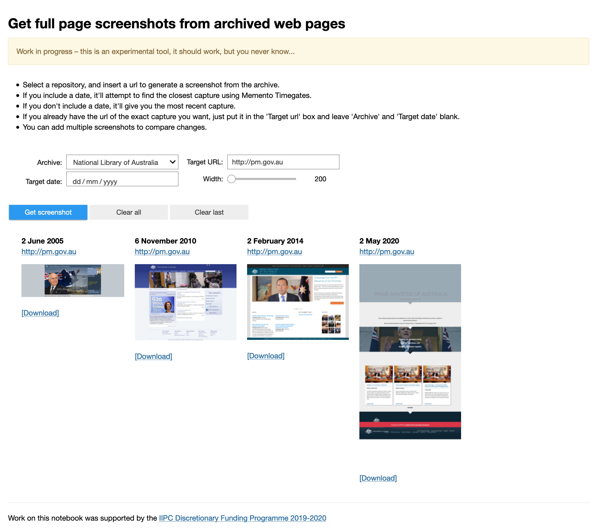

*Works with AWA, IA, NLNZ, UKWA, & UKGWA*

This notebook makes it easy to create a full page screenshot from an archived web page. You can add additional screenshots to compare captures, versions, and pages.

[Run live in Voila on Binder](https://mybinder.org/v2/gh/GLAM-Workbench/web-archives/master?urlpath=/voila/render/save_screenshot.ipynb){ .md-button .md-button--primary }

### Other options

* [Download from GitHub](https://github.com/GLAM-Workbench/web-archives/blob/master/save_screenshot.ipynb)
* [View using NBViewer](https://nbviewer.jupyter.org/github/GLAM-Workbench/web-archives/blob/master/save_screenshot.ipynb)

### Additional documentation

* [Run these notebooks](../#run-these-notebooks)

--8<-- "help.md"

## Cite as

{{ zenodo_citation() }}

--8<-- "web-archives-sponsor.md"