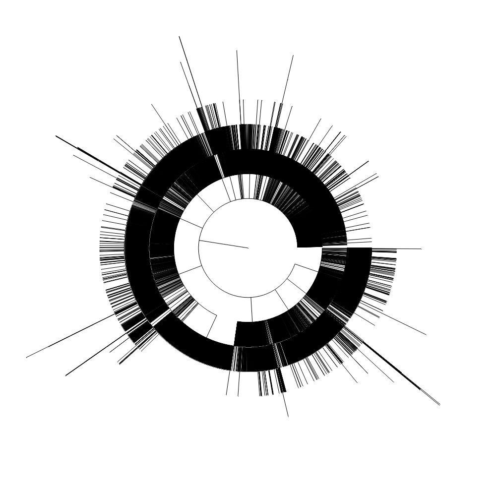

*Works with IA*

Most of the notebooks in this repository work with small slices of web archive data. In this notebook we'll scale things up a bit to try and find all of the subdomains that have existed in the gov.au domain. As in other notebooks, we'll obtain the data by querying the Internet Archive's CDX API. The only real difference is that it will take some hours to harvest all the data. Once we have the data we'll do some analysis, and visualise the domain hierarchy as a dendrogram.

[Run live on Binder](https://mybinder.org/v2/gh/GLAM-Workbench/web-archives/master?urlpath=/lab/tree/harvesting_gov_au_domains.ipynb){ .md-button .md-button--primary }

### Other options

* [Download from GitHub](https://github.com/GLAM-Workbench/web-archives/blob/master/harvesting_gov_au_domains.ipynb)
* [View using NBViewer](https://nbviewer.jupyter.org/github/GLAM-Workbench/web-archives/blob/master/harvesting_gov_au_domains.ipynb)

### Related resources

* [Harvest of unique urls from the gov.au domain](harvest-of-govau-subdomains.md)
* [Unique subdomains of gov.au split into components](govau-subdomains-split.md)
* [Unique subdomains of gov.au in SURT format](govau-subdomains-surt.md)
* [Circular dendrograms of gov.au subdomains](govau-subdomains-visualisations.md)

### Additional documentation

* [Run these notebooks](../#run-these-notebooks)

--8<-- "help.md"

## Cite as

{{ zenodo_citation() }}

--8<-- "web-archives-sponsor.md"