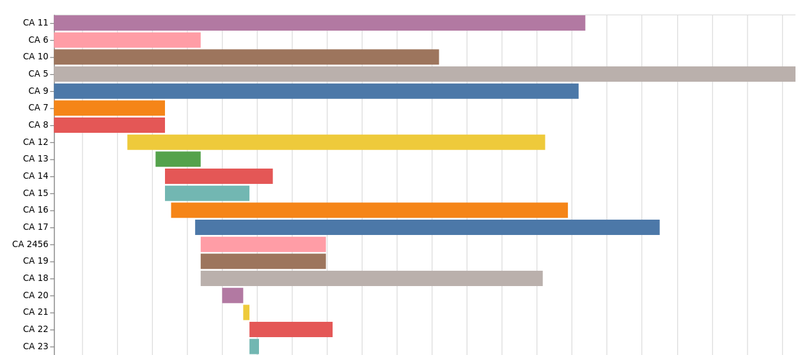

This notebook creates a Gannt-style chart showing the creation and dissolution dates of Australian government departments.

You can [view the Wikidata SPARQL query](https://w.wiki/5tXN) used for this visualisation using the Wikidata Query Service.

[Run live on Binder](https://mybinder.org/v2/gh/GLAM-Workbench/wikidata/master?urlpath=lab/tree/agencies-gannt-timeline.ipynb){ .md-button .md-button--primary }

### Other options

* [View the interactive chart](examples/agencies-gannt-timeline.html)
* [Download from GitHub](https://github.com/GLAM-Workbench/wikidata/blob/master/agencies-gannt-timeline.ipynb)
* [View using NBViewer](https://nbviewer.jupyter.org/github/GLAM-Workbench/wikidata/blob/master/agencies-gannt-timeline.ipynb)

### Additional documentation

* [Run these notebooks](../#run-these-notebooks)

--8<-- "help.md"

## Cite as

{{ zenodo_citation() }}

