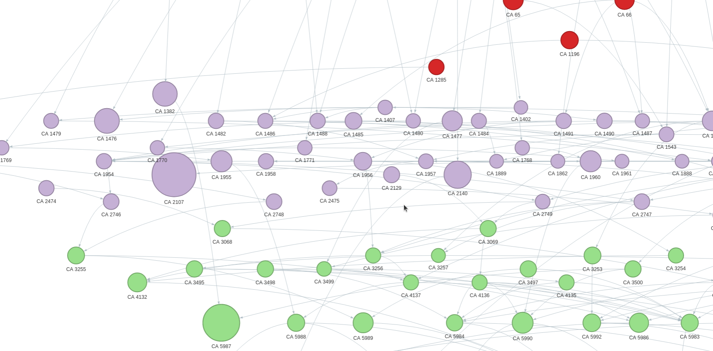

This notebook visualises changes in Australian government departments over time, using data from Wikidata. It creates a hierarchically-ordered network graph where each agency is represented as a node whose position and colour is determined by the decade in which the agency was created. The size of the node indicates how long the agency was in existence, while edges between nodes connect agencies to their successors. Earliest agencies will be at the top of the graph.

You can [view the query](https://w.wiki/5tVh) used to generate this graph using the Wikidata Query Service.

[Run live on Binder](https://mybinder.org/v2/gh/GLAM-Workbench/wikidata/master?urlpath=lab/tree/govt-agencies-network.ipynb){ .md-button .md-button--primary }

### Other options

* [View the interactive graph](examples/govt-agencies-network.html)
* [Download from GitHub](https://github.com/GLAM-Workbench/wikidata/blob/master/govt-agencies-network.ipynb)
* [View using NBViewer](https://nbviewer.jupyter.org/github/GLAM-Workbench/wikidata/blob/master/govt-agencies-network.ipynb)

### Additional documentation

* [Run these notebooks](../#run-these-notebooks)

--8<-- "help.md"

## Cite as

{{ zenodo_citation() }}

